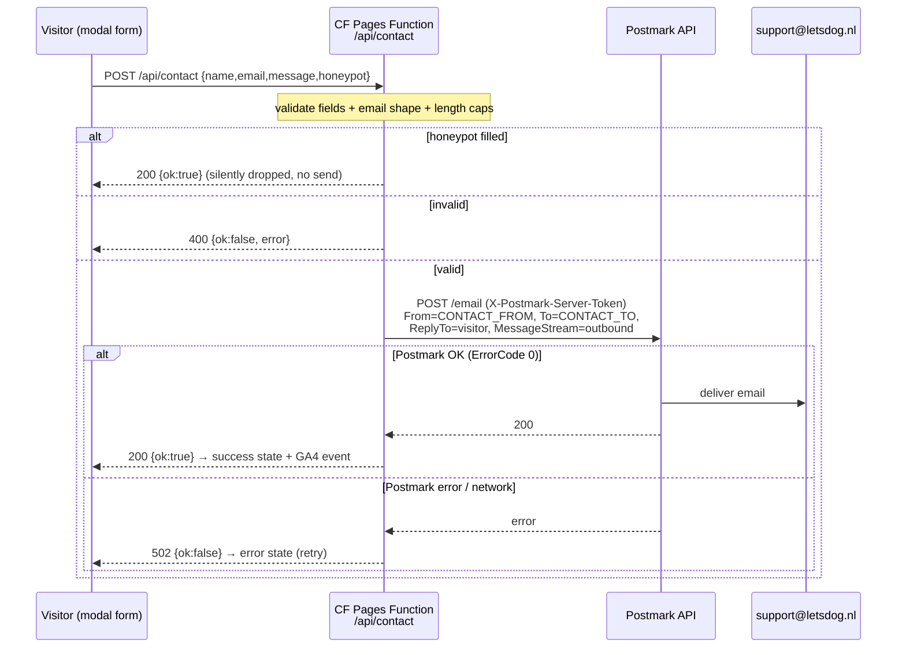

# feat: Contact page redesign + working contact form (Postmark via Cloudflare Function)

## Summary

Redesign `/contact` to the supplied mockup (beige split hero, restyled consult card, a 3-card "Direct bereikbaar" block) and replace the current **fake** inline form with a real, accessible **popup modal** that actually delivers mail. Because the site is a static export with no backend, the form POSTs to a new **Cloudflare Pages Function** (`functions/api/contact.ts`) that relays the message to `support@letsdog.nl` via the **Postmark** API — the first server-side code in this repo. Bundled in the same PR: two pre-approved HANDOFF chores (privacy email `.com`→`.nl`, a 512px responsive-image variant). The `*.pages.dev` noindex item is explicitly **out of scope**.

---

## Problem Frame

The contact page today (`app/contact/contact-content.tsx`) renders a form whose submit handler only sets a local `sent` flag — **no message is ever delivered**. A visitor who fills it in believes they've reached us; they haven't. Separately, the page's visual design predates the current beige split-hero pattern used on `/rassenkeuze` and `/prijzen`, and the "Stuur een bericht" CTA in the mockup is meant to open the form as a focused modal rather than scrolling to an inline block.

The constraint that shapes everything: **static export, no SSR/API routes** (`output: "export"`). A working form therefore needs an out-of-band sender. The owner has a Postmark account, and the project already sanctioned adding a `functions/` directory (HANDOFF open item #4), so a Cloudflare Pages Function holding the Postmark token server-side is the right seam — it keeps the secret off the client and the static build unchanged.

---

## Requirements

| ID | Requirement | Unit |
|----|-------------|------|
| R1 | `/contact` matches the mockup: beige split hero with peach H1 accent, subhead, two status pills, two CTAs (primary opens the form modal; secondary = WhatsApp), hero image with peach overlay pill | U5 |
| R2 | Consult card retained and lightly restyled (white card, "PERSOONLIJK ADVIES" badge, €39,50 incl. BTW, external "Boek een consult") | U5 |
| R3 | "Direct bereikbaar" shows three cards — E-mail, Telefoon, WhatsApp; inline Instagram/TikTok buttons removed (socials live in footer) | U5 |
| R4 | Clicking "Stuur een bericht" opens an accessible modal containing the contact form; inline form section removed | U4, U5 |
| R5 | Submitting the form delivers an email to `support@letsdog.nl` with the visitor as `ReplyTo` | U3, U4 |
| R6 | Form has idle / submitting / success / error states and basic spam protection (honeypot) | U4 |
| R7 | Postmark token is never exposed to the browser | U3 |
| R8 | GA4 `contact_form_submitted` fires on successful send | U4 |
| R9 | Privacy contact email corrected `privacy@letsdog.com` → `privacy@letsdog.nl` | U1 |
| R10 | 512px responsive image variant added to the build pipeline (HANDOFF #3) | U2 |
| R11 | Docs/config updated (env var, CLAUDE.md server-side caveat, CUTOVER env list, HANDOFF ticks) | U6 |

---

## Scope Boundaries

**In scope:** the contact page redesign, the modal form, the Cloudflare Function + Postmark integration, the two bundled chores (R9, R10), and the doc/config updates — all in one feature branch → one PR.

**Out of scope (explicit):**
- `*.pages.dev` noindex middleware (HANDOFF #4) — owner said skip.
- National2 → WOFF2 (HANDOFF #2) — waiting on owner-supplied files.
- Navbar / footer / other pages — untouched.

### Deferred to Follow-Up Work
- **Cloudflare Turnstile** (or hCaptcha) on the form — stronger spam defense than the honeypot. Add only if honeypot proves insufficient in production.
- **Dedicated contact hero photo** — U5 ships with a swappable existing photo; owner can drop the exact mockup image into `public/images/` later (then `npm run optimize:images`).
- **Reusable `<Modal>` primitive** — if a second modal is ever needed, extract the dialog shell from U4. Not worth abstracting for one use.

---

## Key Technical Decisions

**KTD1 — Cloudflare Pages Function + Postmark (not a third-party form service, not `mailto:`).**
The owner has Postmark; a Pages Function keeps delivery first-party and the token server-side. `mailto:` was rejected (poor UX, no real send); a third-party form backend was rejected (extra dependency when Postmark already exists). This introduces `functions/` — already anticipated by the project (HANDOFF #4). The static `next build` → `out/` is unchanged; Cloudflare auto-detects `functions/` and serves it alongside the static assets.

**KTD2 — Token & addresses via Function env, never `NEXT_PUBLIC_*`.**
`POSTMARK_SERVER_TOKEN` (secret) plus `CONTACT_TO` (default `support@letsdog.nl`) and `CONTACT_FROM` (default `noreply@letsdog.nl`, must be a Postmark-verified sender) are read from the Function runtime env (`context.env`). `NEXT_PUBLIC_*` is inlined into the client bundle at build time — wrong for a secret. The Function is the only code that touches the token.

**KTD3 — Modal owns submission; page owns open/close state.**
`app/contact/contact-content.tsx` (client) holds `isModalOpen` and renders the triggers + the modal. `app/contact/contact-form-modal.tsx` (client) is the accessible dialog: focus trap, `Esc`, backdrop-click, scroll-lock, return-focus, Framer Motion enter/exit, the form, and the `fetch('/api/contact')` lifecycle. Co-located in `app/contact/` because contact is the only consumer (see Deferred).

**KTD4 — Reuse existing validation + brand patterns.**
Keep the current client-side validation logic (name/email/message). Mirror the beige split-hero from `app/rassenkeuze/page.tsx` and the pill/badge/card idioms already in `contact-content.tsx`. Brand colors inline (no Tailwind config). All copy stays Dutch.

**KTD5 — Honeypot for v1 spam defense.**
A visually-hidden, `aria-hidden`, `tabindex=-1` field (e.g. `company`/`website`); if filled, the Function silently returns `200` without sending. Cheap, no third-party. Turnstile deferred.

**KTD6 — No CSP change required.**
`public/_headers` `/*` sets only `Content-Security-Policy: frame-ancestors 'self'` — there is no `default-src`/`connect-src`, so a same-origin `fetch('/api/contact')` is unrestricted. Postmark is called server-side from the Function, so it never appears in a browser connection. If a full content-CSP is ever added, it must include `connect-src 'self'`.

---

## High-Level Technical Design

Contact form submission crosses three trust boundaries (browser → Cloudflare edge Function → Postmark). Sequence:

Token never leaves the Function. The browser only ever sees `{ok}` JSON.

---

## Implementation Units

> Project reality: **no automated test suite** (HANDOFF). "Verification" below is manual/preview/curl-based. The big caveat — `functions/` does **not** run under `next dev` (the preview tool), so `/api/contact` 404s locally; the live send is verified on the Cloudflare branch-preview after the owner sets the Preview-scoped token. See Verification Strategy.

### U1. Privacy contact email `.com` → `.nl`
- **Goal:** Fix the `privacy@letsdog.com` typo (R9).
- **Requirements:** R9
- **Dependencies:** none
- **Files:** `content/privacybeleid.md` (~line 55, section "11. Contact en klachten")
- **Approach:** Change both the visible link text **and** the `mailto:` target to `privacy@letsdog.nl`. Pure content; renders through the existing legal-page markdown pipeline.
- **Verification:** `grep -n "letsdog.com" content/privacybeleid.md` returns nothing; rendered `/privacybeleid/` link points to `mailto:privacy@letsdog.nl`. Test expectation: none — content-only.

### U2. 512px responsive image variant
- **Goal:** Close the ~28 KB mobile over-delivery Lighthouse flagged (HANDOFF #3) by adding a 512px step to the image pipeline (R10).
- **Requirements:** R10
- **Dependencies:** none
- **Files:** `scripts/optimize-images.mjs` (the `WIDTHS` array), plus generated `public/images/optimized/*-512.avif` + `*-512.webp` (committed)
- **Approach:** `WIDTHS = [384, 768, 1280]` → `[384, 512, 768, 1280]`. Run `npm run optimize:images`; commit the new variants. `OptimizedImage`'s `<picture>` srcset picks up 512 automatically — no component change. **macOS xattr gotcha** (HANDOFF gotcha #9) does not apply (variants are generated, not Finder-dropped), but confirm `npm run build` still succeeds locally.
- **Verification:** new `*-512.{avif,webp}` exist for each source; `npm run build` green; srcset in built HTML includes the 512 width. Test expectation: none — build-asset generation.

### U3. Cloudflare Pages Function — `functions/api/contact.ts`
- **Goal:** Server-side endpoint that validates a submission and sends it via Postmark to `support@letsdog.nl` (R5, R7).
- **Requirements:** R5, R7
- **Dependencies:** none (but U4 calls it)
- **Files:** `functions/api/contact.ts` (new)
- **Approach:**
  - Export `onRequestPost` (Pages Functions handler). Reject non-POST implicitly (only POST handler defined) — optionally add `onRequest` returning 405 for other methods.
  - Parse JSON body; validate: `name`, `email`, `message` non-empty; `email` matches a basic shape; enforce length caps (e.g. name ≤ 100, email ≤ 200, message ≤ 5000) to bound abuse; **honeypot** field present & non-empty → return `200 {ok:true}` without sending (KTD5).
  - Read `context.env.POSTMARK_SERVER_TOKEN`, `CONTACT_TO` (default `support@letsdog.nl`), `CONTACT_FROM` (default `noreply@letsdog.nl`). If token missing → `500 {ok:false}` (and log) so misconfig is visible on preview.
  - `POST https://api.postmarkapp.com/email` with headers `Accept: application/json`, `Content-Type: application/json`, `X-Postmark-Server-Token: <token>`; body `{ From, To, ReplyTo: <visitor email>, Subject: "Nieuw contactbericht via de website — <naam>", TextBody, HtmlBody, MessageStream: "outbound" }`. Treat Postmark `ErrorCode === 0` (HTTP 200) as success; anything else → `502 {ok:false}`.
  - Always respond JSON with `Cache-Control: no-store`. Never echo the token or Postmark internals to the client.
  - **Verify the exact Postmark request/response shape against current docs (context7 / postmarkapp.com) at implementation time** before finalizing field names.
- **Patterns to follow:** Web-standard `Request`/`Response` + `fetch` (Workers runtime) — no Node APIs, no npm deps. The HANDOFF #4 snippet shows the `onRequest(context)` shape.
- **Verification scenarios (curl against the branch-preview once token is set):**
  - Happy path: valid JSON → `200 {ok:true}`; email arrives at support@; `ReplyTo` is the visitor.
  - Validation: missing/empty field or malformed email → `400 {ok:false}`; no email sent.
  - Honeypot: honeypot filled → `200 {ok:true}`; **no** email sent.
  - Misconfig: token unset → `500`; surfaced clearly (so we know Preview env wasn't set).
  - Postmark failure: simulate (bad From / unverified sender) → `502 {ok:false}`; client shows error state.
  - Secret hygiene: token never appears in any client payload or response body.

### U4. Contact form modal — `app/contact/contact-form-modal.tsx`
- **Goal:** Accessible popup dialog containing the form, with full submission lifecycle (R4, R5, R6, R8).
- **Requirements:** R4, R5, R6, R8
- **Dependencies:** U3 (endpoint)
- **Files:** `app/contact/contact-form-modal.tsx` (new, `"use client"`)
- **Approach:**
  - Props: `open: boolean`, `onClose: () => void`. Render nothing when closed (or animate via Framer Motion `AnimatePresence`).
  - **A11y:** `role="dialog"`, `aria-modal="true"`, `aria-labelledby` (title) + `aria-describedby` (subhead); focus moves to the dialog/first field on open; **focus trap** within the dialog; `Esc` closes; backdrop click closes; **body scroll lock** while open; **return focus** to the trigger on close.
  - **Form:** Naam, E-mailadres (type=email), Bericht (textarea), all required; reuse current validation (`lib/`-style inline). Hidden **honeypot** input (visually hidden, `tabindex=-1`, `autocomplete=off`, `aria-hidden`).
  - **States:** idle → submitting (button disabled + spinner, inputs locked) → success (replace form body with "Bericht ontvangen" confirmation) / error (inline message + retry, form values preserved).
  - **Submit:** `fetch('/api/contact', { method:'POST', headers:{'Content-Type':'application/json'}, body: JSON.stringify(payload) })`; on `{ok:true}` → success + `trackEvent('contact_form_submitted')` (from `lib/analytics.ts`); else → error.
  - **Footer line:** "We antwoorden binnen 1 werkdag. Je gegevens worden nooit gedeeld."
  - **Visuals:** match the mockup card (cream/beige rounded panel, brand-green full-width "Verstuur bericht" with paper-plane icon). Reuse field styling from the current `contact-content.tsx` form.
- **Patterns to follow:** existing form markup/validation in `app/contact/contact-content.tsx`; Framer Motion already a dependency; `trackEvent` in `lib/analytics.ts`.
- **Verification scenarios (preview tool / browser):**
  - Open via "Stuur een bericht"; focus lands in dialog; `Tab` cycles within; `Esc` and backdrop close; focus returns to trigger.
  - Validation errors show inline; first invalid field focused.
  - Submitting state disables the button (no double-submit).
  - Success state replaces the form; error state (force via failing/404 endpoint locally) shows retry and preserves input.
  - Honeypot is invisible and not tab-reachable.
  - Mobile + desktop layout; dark-ish backdrop; no body scroll behind modal.
  - GA4 `contact_form_submitted` fires once on success (verify in console/network).

### U5. Contact page redesign — `app/contact/contact-content.tsx`
- **Goal:** Rebuild the page to the mockup and wire the modal triggers (R1, R2, R3, R4).
- **Requirements:** R1, R2, R3, R4
- **Dependencies:** U4 (modal)
- **Files:** `app/contact/contact-content.tsx` (rewrite); `app/contact/page.tsx` (only if metadata copy needs a tweak — likely unchanged)
- **Approach:**
  - Hold `isModalOpen` state; render `<ContactFormModal open={…} onClose={…}/>`.
  - **Hero (beige split):** mirror `app/rassenkeuze/page.tsx`. H1 "Neem **contact** op" with "contact" in peach `#FFA580`; subhead ("Vragen over puppytraining, je lidmaatschap of welk ras bij je past? Stel ze gerust — onze gecertificeerde gedragstherapeuten denken graag met je mee."); two pills ("Antwoord binnen 1 werkdag" green dot, "Persoonlijk contact" peach dot); two CTAs — primary "Stuur een bericht" (solid green, paper-plane, `onClick`→ open modal) and "App via WhatsApp" (outline, WhatsApp icon → existing wa.me link/`whatsapp-button` pattern). Right: `OptimizedImage` placeholder (e.g. `training.jpeg` or `kid-dog.jpeg`) with a peach overlay pill "We helpen je graag verder".
  - **Consult card:** keep + light restyle to mockup (white card, "PERSOONLIJK ADVIES" badge, €39,50 incl. BTW, "Boek een consult" → `app.letsdog.nl/consult/`, image `problem.jpeg`).
  - **"Direct bereikbaar":** three cards — E-mail (`mailto:mail@letsdog.nl`), Telefoon (`tel:0857444161`), WhatsApp ("Start een chat — direct antwoord", existing wa.me link). **Remove** the inline Instagram/TikTok buttons.
  - **Remove** the inline form `<SectionWrapper>` entirely (now in modal).
  - Keep `OptimizedImage` for all photos; keep Dutch copy; brand colors inline.
- **Patterns to follow:** `app/rassenkeuze/page.tsx` (beige split hero, pills, badge), existing card/icon markup in `contact-content.tsx`, `whatsapp-button.tsx` for the WhatsApp link/number.
- **Verification scenarios (preview tool):**
  - Hero, consult card, and 3-card block match the mockup at mobile + desktop.
  - "Stuur een bericht" (hero) opens the modal; WhatsApp button opens the correct wa.me link.
  - No inline form or social buttons remain on the page.
  - `npm run build` green; `/contact/` renders; no console errors.

### U6. Docs & config
- **Goal:** Record the new server-side seam, env vars, and chore completion (R11).
- **Requirements:** R11
- **Dependencies:** U1, U2, U3 (describes what they introduced)
- **Files:** `.env.example`, `CLAUDE.md`, `docs/CUTOVER.md`, `HANDOFF.md`
- **Approach:**
  - `.env.example`: add `POSTMARK_SERVER_TOKEN` (server secret — **not** `NEXT_PUBLIC`, set in Cloudflare Pages), plus optional `CONTACT_TO` / `CONTACT_FROM` with defaults documented.
  - `CLAUDE.md`: soften "Static export: no server-side features" → "no Next.js SSR/API routes; **one** Cloudflare Pages Function (`functions/api/contact.ts`) for the contact form"; document `POSTMARK_SERVER_TOKEN` in the env-vars list; note the contact form is the first server-side piece.
  - `docs/CUTOVER.md`: add `POSTMARK_SERVER_TOKEN` to the env-vars-to-set list (Production **and** Preview).
  - `HANDOFF.md`: tick item #1 (privacy email) and #3 (512px variant) as done in this PR; note #4 (`*.pages.dev` noindex) **deliberately skipped**; add a session-log line for the contact redesign + Postmark function (security model: first server-side code, secret held in Function env, honeypot anti-spam, no auth-adjacent data).
- **Verification:** docs read correctly; `.env.example` documents the secret without committing a value. Test expectation: none — docs.

---

## Owner Configuration Dependencies (cannot be done in-repo)

These must be done by the owner for end-to-end email to work; flag them in the PR:

1. **Set `POSTMARK_SERVER_TOKEN`** in Cloudflare Pages → Settings → Variables and Secrets, scoped to **both Production and Preview** (Preview is required so the branch-preview deploy can actually send during verification). Optionally set `CONTACT_TO` / `CONTACT_FROM`.
2. **Verify the `CONTACT_FROM` sender** (`noreply@letsdog.nl` or chosen address) as a Postmark Sender Signature / verified domain, or sends will fail. Confirm the desired From with the owner.

---

## Risks & Dependencies

| Risk | Likelihood | Mitigation |
|------|-----------|------------|
| Postmark `From` not verified → sends fail | Med | Owner verifies sender signature/domain (dep #2); U3 returns `502` and the UI shows a retry, so failures are visible not silent |
| Preview-scoped token not set → form errors on preview | Med | Document clearly (U6); U3 returns explicit `500` on missing token; verify token is set before E2E test |
| `functions/` doesn't run under `next dev` → can't fully test locally | High (expected) | Verify UI/states locally (mock/error path); verify real send on Cloudflare branch-preview; optional `npx wrangler pages dev out` + `.dev.vars` for local E2E |
| `trailingSlash: true` interfering with `/api/contact` routing | Low | CF Functions match exact paths (Next trailingSlash only affects static HTML); POST to `/api/contact`; verify no 308 redirect on the endpoint via curl |
| Spam through public endpoint | Low-Med | Honeypot v1 (KTD5); length caps; Turnstile deferred if needed |
| Adding `functions/` changes deploy behavior | Low | Project already sanctioned it (HANDOFF #4); static `out/` build unchanged; CF auto-detects Functions |

**Dependency:** Framer Motion, `OptimizedImage`, `trackEvent`, the WhatsApp link/number — all already in the repo.

---

## Verification Strategy

No automated test suite exists. Layered verification:

1. **Local (preview tool / `next dev`):** U5 layout + U4 modal behavior, a11y, validation, and **error** state (endpoint 404s locally, which exercises the error branch). Brand/responsive/dark checks via the preview workflow.
2. **Build:** `npm run build` green after U2 (new variants) and U5 (page rewrite); `/contact/` in `out/`.
3. **Cloudflare branch-preview (after owner sets Preview token):** end-to-end — submit the form, confirm `200 {ok:true}`, the email lands at `support@letsdog.nl` with correct `ReplyTo`, and Postmark Activity shows the send. Run the U3 curl scenarios (happy/validation/honeypot/misconfig).
4. **Optional local E2E:** `npm run build` then `npx wrangler pages dev out` with a `.dev.vars` containing `POSTMARK_SERVER_TOKEN`.
5. **Preview-first discipline:** verify on `<branch>.website-letsdog.pages.dev` before merge (project convention).

---

## Sources & Research

- Codebase (read directly): `app/contact/contact-content.tsx`, `app/contact/page.tsx`, `components/sections/hero.tsx`, `app/rassenkeuze/page.tsx` (beige-hero pattern), `scripts/optimize-images.mjs`, `app/manifest.ts`, `public/_headers`, `next.config.ts`, `lib/analytics.ts`, `package.json`.
- `HANDOFF.md` — open items #1 (privacy email), #3 (512px variant, with the exact one-line fix), #4 (`*.pages.dev` noindex, skipped; also confirms `functions/` is sanctioned).
- `docs/solutions/conventions/cloudflare-redirects-for-renamed-urls.md` — confirms `trailingSlash: true` behavior (informs the `/api/contact` routing risk).
- External (defer to implementation time): Postmark `POST /email` request/response shape — verify via context7 / postmarkapp.com before finalizing U3 field names.
- Owner decisions (this session): Postmark + Cloudflare Function approach confirmed; 512px = the responsive-photo fix (PWA icon already exists); skip `*.pages.dev` noindex.
