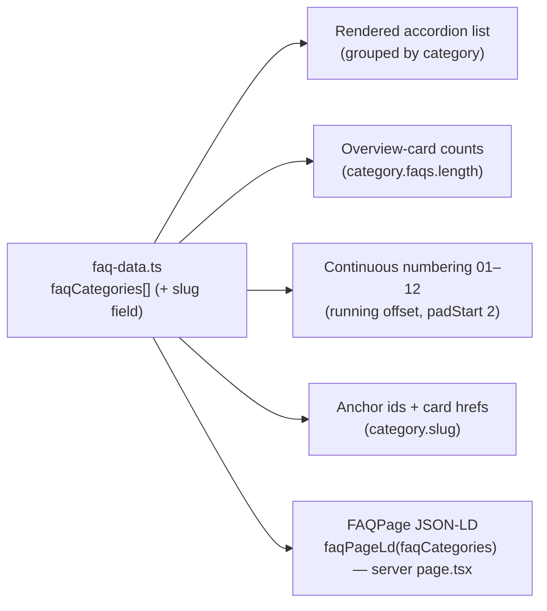

# feat: Over ons + FAQ page redesign

## Summary

Redesign `/over-ons` and `/veelgestelde-vragen` to the two supplied mockups, moving both off the legacy green-band hero onto the **beige split-hero** pattern already shipped on `/contact` and `/rassenkeuze` (inline-copied per page, not abstracted). Over ons gains a split hero (Elien photo + 3 certification badges + dual CTAs), a "Mijn verhaal" story section with a peach pull-quote, a **new 4-card "Onze methode" grid**, restyled horizontal certification cards, and a two-button closing CTA. FAQ gains a split hero with a **clickable category-overview card** (counts derived from data) and a **continuously-numbered 01–12 accordion** grouped under the existing four categories. A one-line global `scroll-padding-top` makes the in-page jump-links land correctly under the fixed navbar; `faq-data.ts` stays the single source for the list, counts, numbering, slugs, and FAQPage JSON-LD. The real "Plan een consult" product URL is an owner action — wired to an interim destination and recorded in `HANDOFF.md`.

---

## Problem Frame

These two pages are the **last on the old green-band hero** (`bg-[#75876D] pt-32 … flex items-end`); contact, rassenkeuze, and prijzen already moved to the beige split-hero, so over-ons and FAQ now read as out of step. Beyond the hero, both pages under-deliver against the mockups: over-ons buries its four method principles as checkmark bullets inside the story block (the mockup promotes them to a first-class **"Onze methode"** card grid and adds a pull-quote + a second CTA), and FAQ is a wayfinding-free stacked accordion (the mockup adds a **category-overview card** that doubles as jump-navigation and **continuous numbering** so 12 questions read as a curated set).

The binding constraints (all confirmed in repo + `HANDOFF.md`): **static export, no SSR**; inline Tailwind with hard-coded brand hex; Dutch copy; **no automated test suite** → verify via `npm run build` + the Cloudflare branch-preview (preview-first discipline); every page must **end on a light section** so the dark-sage footer's `rounded-t` + `-mt-10` transition reveals a light band; and the navbar is `fixed` (`h-16 lg:h-20`), so any in-page anchor needs a scroll offset or its heading hides under the navbar.

See origin: `docs/brainstorms/2026-05-31-over-ons-faq-redesign-requirements.md`.

---

## Requirements

| ID | Requirement | Unit |
|----|-------------|------|
| R1 | Both pages replace the green-band hero with the beige split-hero (mirror `app/rassenkeuze/page.tsx` / `app/contact/contact-content.tsx`); Dutch copy, brand hex inline | U3, U4 |
| R2 | Both pages end on a light (`#EFE8E4`) section so the footer transition renders correctly | U3, U4 |
| R3 | "Start vandaag" CTAs link to `/prijzen` (sitewide convention) via `next/link`; external app links use `app.letsdog.nl` | U3 |
| R4 | SEO/asset infra preserved: `Person` JSON-LD on over-ons, `FAQPage` JSON-LD on FAQ (both in the server `page.tsx`), `pageMetadata()`, `OptimizedImage` for photos | U3, U4 |
| R5 | Over-ons hero: peach-accent H1, founder subhead, 3 cert badges, Elien photo + "Elien · oprichtster" tag, CTAs "Start vandaag" (→`/prijzen`) + "Lees haar verhaal" (anchors to story) | U3 |
| R6 | "Mijn verhaal" story section with eyebrow, H2, story paragraphs, and a peach left-border pull-quote; carries the `#verhaal` anchor target | U3 |
| R7 | New "Onze methode" section: eyebrow + H2 + subhead + 4 principle cards (icon + title + description) | U3 |
| R8 | Certifications restyled to horizontal cards (NVGH + Raad van Beheer) + retained logo | U3 |
| R9 | Closing CTA card "Klaar om te beginnen?" with two buttons: "Start vandaag" (→`/prijzen`) + "Plan een consult" (→ consult product, interim URL; OA1) | U3 |
| R10 | FAQ hero: peach-accent H1, subhead, "Stel je vraag" CTA (→`/contact`), and a category-overview card | U4 |
| R11 | Overview-card rows show a live per-category count (derived, not hardcoded) and are clickable anchors that smooth-scroll to each category section | U2, U4 |
| R12 | FAQ list grouped by the four categories (category label + anchor `id` + scroll offset); accordion retained; numbered continuously 01–12 across categories | U1, U2, U4 |
| R13 | `app/veelgestelde-vragen/faq-data.ts` stays the single source for the list, counts, numbering, slugs, and FAQPage JSON-LD | U2, U4 |

---

## Key Technical Decisions

KTD1 — **Inline-copy the beige split-hero per page; do not extract a shared component** (carries origin KD1). Matches the project's inline-Tailwind, copy-the-pattern convention (rassenkeuze and contact each inline their own hero) and the owner's explicit instruction. The four inline copies differ enough (pills vs. badges vs. a category card; CTA vs. anchor vs. modal-trigger) that abstraction would be awkward; extraction is deferred (see Scope Boundaries).

KTD2 — **One global `scroll-padding-top` in `app/globals.css`, not per-target `scroll-mt-*`** (supersedes origin KD2's per-target `scroll-margin-top`). The navbar is `fixed` `h-16 lg:h-20` (64/80px) and **no scroll offset exists today** — the lone `#quiz` anchor on rassenkeuze has none. A single `html { scroll-padding-top: 6rem }` (96px = navbar + breathing room) makes *every* in-page anchor land below the navbar, on both click and **cold-load deep-link** (the failure mode click-testing misses — smooth-scroll does not reliably apply to load-time hash navigation, so the offset, not the smoothness, must carry correctness). Bonus: it retroactively fixes `#quiz` and the `#main-content` skip-link. Sits under the existing `scroll-behavior: smooth` (which already flips to `auto` under `prefers-reduced-motion`). **This explicitly supersedes the origin's KD2** (which named per-target `scroll-margin-top`): the global property is chosen because it additionally covers cold-load deep-links that `scroll-margin-top` does not reliably handle. Caveat: `scroll-padding-top` on `html` is correct here because the document root is the scroll container; if a future ancestor ever gets its own `overflow: auto/scroll`, the offset would need to move to that container.

KTD3 — **Add a `slug` field to each `FaqCategory` in `faq-data.ts`**, used for both the section `id` and the overview-card `href`. `"Abonnement & betaling"` cannot be a raw `id`, and an inferred slugify rule risks an `href`/`id` mismatch that silently no-ops. An explicit `slug` keeps the id↔href mapping deterministic and inside the single source of truth (R13).

KTD4 — **Counts, continuous numbering, and category sections are all derived from `faqCategories` at render** (origin KD3). Count badge = `category.faqs.length`; the 01–12 number = a running offset summed across prior categories, formatted `padStart(2, "0")`. **Empty categories (`faqs.length === 0`) are filtered out** of both the list and the overview card so a future content edit can't ship a dead jump-link or an empty section; numbering stays gapless.

KTD5 — **Accordion stays a plain conditional render (no `AnimatePresence`), multiple-open, with an a11y upgrade.** Keeping the current `{open && …}` approach sidesteps the documented framer-motion stable-key unmount bug and matches the no-scroll-reveal convention every sibling page follows (`Reveal` is unused repo-wide). Upgrade: real `<button>` (already present) + `aria-controls`/panel `id` + `role="region" aria-labelledby`; the decorative leading number is `aria-hidden`. Open state is per-item, not persisted across navigation and not synced to the URL hash (a deep-link scrolls to the section; it does not auto-open an item).

KTD6 — **"Plan een consult" wires to the interim `https://app.letsdog.nl/consult/`** (matching the contact page's "Boek een consult"), pending the owner's real purchasable consult product URL — an owner action (OA1), not a code blocker.

KTD7 — **Whitespace guard on number-adjacent text.** Per the documented SWC/Turbopack collapse of `{expr} text`, render counts and item numbers with an explicit `{" "}` (e.g. `{count}{" "}vragen`, `{n}.{" "}{question}`) — the space is otherwise dropped in the built DOM.

---

## High-Level Technical Design

`faq-data.ts` is the single source feeding five derived surfaces — the diagram makes R13 / KTD3–KTD4 legible at a glance. Edits happen in one place; the rendered list, the overview-card counts, the continuous numbering, the anchor slugs, and the FAQPage JSON-LD all follow.

---

## Implementation Units

> Project reality: **no automated test suite** (HANDOFF). "Verification" below is build- + preview-based (`npm run build`, then the Cloudflare branch-preview per preview-first discipline). Keep the branch name short — the preview alias truncates at **28 chars** (slugified); `feat/over-ons-faq-redesign` → `feat-over-ons-faq-redesign` (26) is safe.
>
> **Model — build on Sonnet.** Run `/model sonnet` at the start of the build session. U1–U5 are pattern-following implementation against a finalized, approved design (Opus-level planning, research, and review are already banked), so Sonnet is the right cost/quality fit for execution. Switch back to Opus only if a genuinely non-obvious problem surfaces mid-build.

### U1. Global in-page anchor scroll offset
- **Goal:** Make every in-page `#anchor` land below the fixed navbar, for both click and cold-load deep-link (R12; underpins AE1, AE4, AE5).
- **Requirements:** R12
- **Dependencies:** none
- **Files:** `app/globals.css`
- **Approach:** Add `scroll-padding-top: 6rem;` to the existing `html` rule that already sets `scroll-behavior: smooth` (~L52). 96px clears the 80px desktop navbar + breathing room; 64px mobile navbar is comfortably cleared. No per-target `scroll-mt-*` needed (KTD2). Leave the reduced-motion block (~L104, `scroll-behavior: auto`) untouched — the padding offset applies regardless of motion preference, which is what we want.
- **Patterns to follow:** existing `html { scroll-behavior: smooth }` block in `app/globals.css`.
- **Test scenarios (preview):**
  - Click a FAQ category row → target category heading sits fully below the navbar (desktop 80px + mobile 64px). Covers AE1.
  - Cold-load deep-link `…/veelgestelde-vragen/#training` and `#technisch` on wide + narrow viewports → heading not clipped under navbar. Covers AE1.
  - Regression (the global change has a site-wide blast radius): grep the codebase for in-page `#` anchors — today `#quiz` (rassenkeuze) and the `#main-content` skip-link — and confirm each still lands correctly with the new global offset (they previously had none); flag any that need a compensating local override.
- **Verification:** the four FAQ anchors + `#verhaal` + `#quiz` all land with the heading visible below the navbar on click and on cold load.

### U2. FAQ data: add `slug` per category
- **Goal:** Give each category a deterministic slug for the id↔href mapping, inside the single source of truth (R11, R13).
- **Requirements:** R11, R13
- **Dependencies:** none
- **Files:** `app/veelgestelde-vragen/faq-data.ts`
- **Approach:** Extend the `FaqCategory` type with `slug: string` and add a slug to each of the four entries — e.g. `over-de-app`, `training`, `abonnement-betaling`, `technisch`. Hand-authored (four stable values), not computed, so a copy edit to a category `name` never silently changes an anchor. Counts remain derived from `faqs.length` (no count field). No JSON-LD change — `faqPageLd` ignores `slug`.
- **Patterns to follow:** the existing `FaqCategory`/`FaqEntry` types and `faqCategories` array in the same file.
- **Test scenarios:**
  - `npm run build` green (type change compiles; `faqPageLd(faqCategories)` still typechecks). Test expectation: none beyond build — pure data/type addition, behavior is exercised in U4.
- **Verification:** each category has a unique, URL-safe `slug`; build passes; FAQPage JSON-LD output unchanged.

### U3. Over-ons page redesign
- **Goal:** Rebuild `/over-ons` to the mockup: beige split hero, "Mijn verhaal" + pull-quote, "Onze methode" 4-card grid, horizontal cert cards + logo, two-button closing CTA — ending light (R1–R9).
- **Requirements:** R1, R2, R3, R4, R5, R6, R7, R8, R9
- **Dependencies:** U1 (for the `#verhaal` anchor offset)
- **Files:** `app/over-ons/page.tsx` (rewrite)
- **Approach:**
  - **Hero (beige split):** mirror `app/contact/contact-content.tsx` / `app/rassenkeuze/page.tsx` — `bg-[#EFE8E4] pt-32 … overflow-hidden` → `max-w-7xl` 2-col grid. H1 "Expertise én empathie. Niet **één van de twee.**" with the second line in `text-[#FFA580]`. Founder subhead: *"Let's Dog is opgericht door Elien, gecertificeerd hondengedragstherapeut. Na honderden eigenaren te hebben begeleid bouwde ze een methode die aansluit bij hoe honden écht leren — zonder dwang, zonder schuldgevoel."* Three cert **badges** as `bg-white/70` rounded pills with colored dots: "Gecertificeerd gedragstherapeut" / "NVGH-erkend" / "Geen dwang — nooit". CTAs: "Start vandaag" (solid green `bg-[#75876D]` `Link` → `/prijzen`) + "Lees haar verhaal" (outline `border-[#75876D]` → `#verhaal`). Image column: `OptimizedImage` `fill` of `/images/elien.jpeg` in a `relative … aspect-[…] overflow-hidden` wrapper + a floating `bg-[#FFA580]` "Elien · oprichtster" tag.
  - **"Mijn verhaal" (white section, `id="verhaal"` + scroll handled globally by U1):** eyebrow "Mijn verhaal", H2 "Ik heb gezien wat er mis kan gaan. Dat hoeft niet.", the two existing story paragraphs (with the "ze hadden niet het juiste hulpmiddel op het juiste moment" emphasis), then a **peach left-border pull-quote** built inline (`border-l-4 border-[#FFA580] pl-6 … font-heading text-2xl md:text-3xl italic`): *"Je pup leert niet sneller als jij harder je best doet. Hij leert sneller als jij begrijpt wat hij nodig heeft."* Optional Elien photo in a side column (reuse `/images/elien.jpeg`).
  - **"Onze methode" (`bg-[#EFE8E4]`):** eyebrow "Onze methode" + H2 "Waar Let's Dog op gebouwd is" + subhead *"Vier principes die bij alles wat we maken het uitgangspunt zijn — van de puppyagenda tot het persoonlijke advies."* + a **4-card grid** cloned from `components/sections/problem.tsx` (`bg-white/60 backdrop-blur-sm rounded-2xl p-8 border …` cards, `bg-[#DFF0C3]` icon tiles), grid `grid-cols-1 sm:grid-cols-2 lg:grid-cols-4 gap-6`. Cards (copy from mockup, Lucide icons): *Geen fysieke correcties — nooit* (ShieldCheck) / *Welzijn van hond én eigenaar centraal* (Heart) / *Wetenschappelijk onderbouwd* (BookOpen) / *Toegankelijk voor elk ras* (Search). The four checkmark values currently in the story block move here.
  - **Certifications:** retain the section but restyle the two cards to **horizontal** (icon left, text right) under "Erkend. Wetenschappelijk. Betrouwbaar." with the subhead *"Let's Dog is opgezet door een erkend professional en aangesloten bij de toonaangevende Nederlandse instanties."*; keep the `NVGH Logo.jpeg` logo via `next/image` + `asset()` (space in filename tolerated — not in a srcset).
  - **Closing CTA (`bg-[#EFE8E4]`, ends light per R2):** bordered rounded card "Klaar om te beginnen?" + subhead + two buttons: "Start vandaag" (solid green → `/prijzen`) and "Plan een consult" (outline → interim `https://app.letsdog.nl/consult/`, `target="_blank"` — KTD6/OA1).
  - **Preserve** `<JsonLd data={personLd()} />` at the top (server component). `personLd()` hard-codes Elien's name/jobTitle/description in `lib/structured-data.ts` — only update those literals if the visible founder title actually changes (it doesn't here).
- **Patterns to follow:** `app/contact/contact-content.tsx` + `app/rassenkeuze/page.tsx` (beige hero, pills, floating tag, CTA pair); `components/sections/problem.tsx` (4-card grid + icon tiles); `components/sections/final-cta.tsx` (closing-CTA idiom, ends `#EFE8E4`); `components/shared/optimized-image.tsx` (parent owns `relative aspect-[…] overflow-hidden`, raw `src`, `sizes="(max-width: 1024px) 100vw, 50vw"`).
- **Test scenarios (preview):**
  - Hero, story+pull-quote, 4-card methode grid, horizontal cert cards, and closing CTA all match the mockup at mobile + desktop.
  - "Start vandaag" (hero + closing) → `/prijzen`; "Plan een consult" → opens `app.letsdog.nl/consult/` in a new tab.
  - "Lees haar verhaal" → smooth-scrolls to the "Mijn verhaal" section, heading below the navbar. Covers AE4.
  - Page **ends on a light section** — footer's rounded corners reveal a light band (no clip). Covers AE-style R2 check.
  - `npm run build` green; `/over-ons/` renders; Person JSON-LD present in the built HTML; no console errors.
- **Verification:** visual match on preview at both breakpoints; both CTAs route correctly; story anchor works on click + cold load (`/over-ons/#verhaal`); footer transition reads light.

### U4. FAQ page redesign
- **Goal:** Rebuild `/veelgestelde-vragen` to the mockup: beige split hero + clickable category-overview card + continuously-numbered, grouped, accessible accordion — keeping `faq-data.ts` as the single source (R1, R2, R4, R10–R13).
- **Requirements:** R1, R2, R4, R10, R11, R12, R13
- **Dependencies:** U1 (anchor offset), U2 (slugs)
- **Files:** `app/veelgestelde-vragen/faq-content.tsx` (rewrite, `"use client"`); `app/veelgestelde-vragen/page.tsx` (only if metadata/JsonLd wiring needs a touch — JsonLd must stay here, server-side)
- **Approach:**
  - **Hero (beige split):** `bg-[#EFE8E4]` 2-col grid. H1 "Vragen? Wij hebben de **antwoorden.**" (second word `text-[#FFA580]`). Subhead *"Alles wat je wilt weten over Let's Dog — van onze trainingsmethode tot je abonnement."* "Stel je vraag" CTA (solid green → `/contact`). Second column: the **category-overview card** (white, `rounded-2xl`, shadow) — one row per category: small icon tile + `name` + count badge, each row an `<a href={"#"+slug}>`. Each row is a **≥44px touch target** (`min-h-[44px]` + comfortable padding — it's the primary jump-nav affordance, especially on mobile where the card stacks above the list; WCAG 2.5.5). Count rendered `{category.faqs.length}` (with `{" "}` guard if adjacent to a word — KTD7). On mobile the columns stack, so the card sits above the list (natural order — acceptable).
  - **FAQ list:** map `faqCategories` (filtered to `faqs.length > 0` — KTD4) to category sections; each section carries `id={category.slug}` (offset handled globally by U1). Category label as a green eyebrow/pill (e.g. "OVER DE APP"). Compute a **running offset** across categories so item numbers run 01–12 continuously; display `String(globalIndex).padStart(2, "0")` in peach, before the question, with an explicit `{" "}` separator (KTD7). Keep the `FaqItem` accordion (`useState`, `{open && …}` panel, chevron rotate) — **multiple-open**, no AnimatePresence (KTD5).
  - **A11y upgrade (KTD5):** each item gets stable, slug-safe ids derived from `category.slug` + local index — e.g. `${category.slug}-${localIndex}-btn` / `-panel` (extend `FaqItem`, currently `{ q, a }`, to receive them). **Do not** derive ids from the question text — spaces/special chars produce invalid `id`s and a broken `aria-controls` link (a silent a11y failure). The toggle `<button>` gets `aria-expanded` (present today) + `aria-controls={panelId}`; the panel gets `id={panelId}` + `role="region"` + `aria-labelledby={buttonId}`. The decorative leading number is `aria-hidden`. The global `:focus-visible` ring already covers focus.
  - **"Stel je vraag" footer card** ("Staat je vraag er niet bij?") retained, on a `bg-[#EFE8E4]` `SectionWrapper` so the page **ends light** (R2).
  - **Preserve** `<JsonLd data={faqPageLd(faqCategories)} />` in the server `page.tsx` — do not move it into the client content (R4, R13). Because both the list and `faqPageLd` consume the same `faqCategories`, they stay in sync for free.
- **Patterns to follow:** `app/contact/contact-content.tsx` (beige hero); existing `FaqItem` in `app/veelgestelde-vragen/faq-content.tsx` (accordion + chevron); `components/shared/section-wrapper.tsx` (`id` + `scroll-mt` via `className` if ever needed — not needed here given U1); the current footer "Stel je vraag" card.
- **Test scenarios (preview):**
  - Hero + overview card + grouped numbered accordion match the mockup at mobile + desktop.
  - Overview-card counts read 3 / 3 / 4 / 2 and **derive from data** — adding a Q to `faq-data.ts` updates the count + numbering with no other edit. Covers AE2.
  - Numbering runs **01–12 continuously** across categories (Over de app 01–03, Training 04–06, Abonnement & betaling 07–10, Technisch 11–12) — no per-category restart, no `12vragen`-style collapsed space. Covers AE3.
  - Clicking each overview row jumps to its section below the navbar (click + cold-load `/#abonnement-betaling`). Covers AE1.
  - Accordion: open/close/reopen each item; multiple open at once; `aria-expanded` flips; panel is a labelled region; decorative number not announced; keyboard + focus ring work.
  - Reduced-motion (OS setting): jumps are instant and still land correctly under the navbar; panels expand instantly. Covers AE5.
  - Empty-category guard: temporarily set a category's `faqs` to `[]` → its section and overview row disappear, numbering stays gapless (then revert).
  - `npm run build` green; FAQPage JSON-LD present in built HTML and mirrors the visible Q&A; page ends light.
- **Verification:** visual match; jump-nav works on click + cold load + reduced-motion; counts/numbering derived and gapless; JSON-LD intact and in sync; page ends light.

### U5. Docs — record the consult owner action
- **Goal:** Capture OA1 (consult product URL) and the session outcome so it isn't lost (R9 follow-through).
- **Requirements:** R9 (owner-action capture)
- **Dependencies:** U3 (which introduces the interim wiring)
- **Files:** `HANDOFF.md`; `CLAUDE.md` (only if a convention note is warranted)
- **Approach:**
  - `HANDOFF.md`: add an **open item** — *"'Plan een consult' (over-ons) needs a real purchasable consult product/checkout URL"* — noting the interim `app.letsdog.nl/consult/`, the tie-in to the existing pricing-tier WooCommerce-SKU open item, and that it's an owner action. Add a session-log line for the over-ons + FAQ redesign (security model: unchanged — static, client-only, presentational + one global CSS line).
  - `CLAUDE.md`: optionally note the new global `scroll-padding-top` convention if it's worth codifying for future in-page anchors (light touch; skip if it adds noise).
- **Patterns to follow:** existing "⚡ Next session — open items" and "Session log" entries in `HANDOFF.md`.
- **Test scenarios:** none — docs only. Test expectation: none (documentation).
- **Verification:** `HANDOFF.md` records the consult owner action + session log; docs read correctly.

---

## Scope Boundaries

**In scope:** the two page redesigns (U3, U4), the shared anchor-offset + slug groundwork (U1, U2), and the docs/owner-action capture (U5) — one feature branch → one PR.

### Deferred to Follow-Up Work
- **Dedicated / exact hero photography** — both pages reuse `public/images/elien.jpeg`; the owner can drop the exact mockup photo into `public/images/` later (then `npm run optimize:images` + commit variants — and only if a new render width is introduced, edit the **two width lists that must stay in sync**: `WIDTHS` in `scripts/optimize-images.mjs` and `VARIANT_WIDTHS` in `components/shared/optimized-image.tsx`).
- **Extracting a shared `<BeigeSplitHero>` component** — four inline copies exist after this work; revisit only if a fifth consumer appears (KTD1).
- **Animating the accordion** (framer-motion) — intentionally not done; if added later, give each `AnimatePresence` child a stable `key` (documented bug).

### Out of scope
- Navbar, footer, and all other pages — untouched (except the single shared `globals.css` line in U1).
- **Creating the consult WooCommerce product itself** — owner action OA1.
- The standing optional follow-ups (National2 → WOFF2; contact-hero photo swap) and the skipped `*.pages.dev` noindex item.

---

## Owner Configuration Dependencies (cannot be done in-repo)

1. **Real "Plan een consult" destination URL (OA1).** The CTA ships wired to the interim `https://app.letsdog.nl/consult/`. The owner must create/confirm the real purchasable consult product — most likely a WooCommerce checkout URL like the pricing tiers (`…/checkout/?add-to-cart=<consult-SKU>`) — and supply it for a one-line swap. This ties into the existing `HANDOFF.md` open item *"Pricing CTAs — wire each tier to its own WooCommerce product when Jur supplies the SKU."* Flag in the PR; recorded in `HANDOFF.md` by U5.

---

## Risks & Dependencies

| Risk | Likelihood | Mitigation |
|------|-----------|------------|
| Jump-link target hidden under the fixed navbar (esp. cold-load deep-link) | Med (no prior art in repo) | Global `scroll-padding-top` (U1, KTD2); verify click **and** cold-load `/#slug` on wide + narrow + reduced-motion |
| `href`/`id` slug mismatch → silent no-op jump | Med | Single `slug` field in `faq-data.ts` drives both (U2, KTD3) |
| Collapsed space in `{count} vragen` / `{n}. {q}` (SWC/Turbopack) | Med (documented) | Explicit `{" "}` separators (KTD7); verify in the built DOM, not the source |
| Numbering off-by-one / restarts per category | Low | Running offset across categories + `padStart(2,"0")`; AE3 verification (U4) |
| JSON-LD drifts or moves client-side | Low | Keep `personLd()`/`faqPageLd()` in the server `page.tsx`; FAQ markup auto-mirrors `faqCategories` (R4, R13) |
| Page accidentally ends on a non-light section → footer corner clips | Low | Both final sections are `#EFE8E4`; verify footer transition on preview (R2) |
| Preview 404 from 28-char alias truncation misread as a failed build | Low | Short branch name (`feat/over-ons-faq-redesign`); copy the exact Preview URL from the CF dashboard |
| Accordion a11y regressions | Low | `aria-controls`/`role="region"`/`aria-labelledby`, decorative number `aria-hidden` (KTD5) |

**Dependencies (all already in repo):** `OptimizedImage`, Lucide icons, `SectionWrapper`, `next/link`, `next/image`, `personLd`/`faqPageLd`/`JsonLd`, the global `scroll-behavior: smooth`. No new packages.

---

## Verification Strategy

No automated test suite — layered manual verification (preview-first):

1. **Build:** `npm run build` green after each unit; `/over-ons/` + `/veelgestelde-vragen/` in `out/`.
2. **Local (preview tool / `next dev`):** layout + interactions at mobile + desktop; accordion open/close/reopen + a11y; jump-nav clicks.
3. **The cases click-testing misses (add to the checklist):**
   - **Cold-load deep-links** `/veelgestelde-vragen/#training`, `#abonnement-betaling`, `#technisch`, and `/over-ons/#verhaal` on wide + narrow viewports → heading lands below the navbar.
   - **Reduced-motion** (OS setting on) → instant jump still lands correctly; panels expand instantly.
   - **Ends-light** → both pages' final section is `#EFE8E4`; footer rounded corner reveals a light band.
   - **Derived data** → add/remove a `faq-data.ts` entry → count + numbering update with no other edit; numbering gapless; empty-category guard hides section + row.
   - **Whitespace** → built DOM shows "12 vragen" / "01 …", not "12vragen" / "01…".
   - **JSON-LD** → built HTML contains Person (over-ons) + FAQPage (FAQ) mirroring visible content.
4. **Cloudflare branch-preview:** verify all of the above on `<branch>.website-letsdog.pages.dev` before merge (preview-first discipline). Merge via merge commit (project convention).

---

## Sources & Research

- **Origin requirements:** `docs/brainstorms/2026-05-31-over-ons-faq-redesign-requirements.md` (R1–R13, AE1–AE5, KD1–KD5, OA1) + the two supplied mockup screenshots (authoritative for layout + copy).
- **Patterns to mirror (read directly):** `app/rassenkeuze/page.tsx`, `app/contact/contact-content.tsx` (beige split-hero); `components/sections/problem.tsx` (4-card grid + icon tiles); `components/sections/final-cta.tsx` (closing CTA, ends `#EFE8E4`); `components/shared/{section-wrapper,optimized-image,json-ld}.tsx`; `lib/structured-data.ts` (`personLd`/`faqPageLd`); `app/globals.css` (`scroll-behavior` at ~L52, reduced-motion ~L104); `components/layout/navbar.tsx` (`fixed h-16 lg:h-20`).
- **Institutional learnings (`docs/solutions/`):** `conventions/optimized-image-variant-widths-two-places.md` (edit both width lists only if a new image width is introduced — N/A for the reused photo); `ui-bugs/swc-jsx-expression-whitespace-collapse.md` (→ KTD7); `ui-bugs/framer-motion-animatepresence-stable-key.md` (→ KTD5 deferral); `conventions/cloudflare-pages-preview-functions-gotchas.md` (28-char preview alias → short branch name). The scroll-margin-under-fixed-navbar behavior is **undocumented** — a `/ce-compound` candidate after this lands.
- **Conventions (`HANDOFF.md`, `CLAUDE.md`):** "Start vandaag" → `/prijzen`; footer-must-end-light (fix #5); the consult/WooCommerce-SKU open item; `Reveal` unused / no scroll-reveal; merge-commit + preview-first; no test suite; OptimizedImage workflow.
