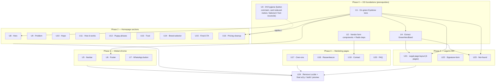

# feat: Migrate the Let's Dog website onto brand-guide v2 design system

## Summary

The `brand-guide-letsdog` skill and its design system were upgraded to **v2** (2026-06-01) and validated against the live `/prijzen` page. Only `/prijzen` is currently on the design system (DS); **every other surface still uses raw Tailwind with hardcoded brand hex colors**. This plan rebuilds the whole site — except `puppyagenda` (not yet redesigned) — on the DS React components + tokens, applying the v2 brand rules, as a **visual/design-system migration only** (no copy/tone rewrites).

The work splits into three kinds: **(1) build the few missing DS pieces** pages depend on (the on-green `Eyebrow` tone; vendor the contact-form components; a small set of DS-hygiene fixes), **(2) rebuild each surface** on `<Button>` / `<Card>` / `<Eyebrow>` / `<Badge>` / `<Accordion>` + tokens mirroring the `/prijzen` recipe, and **(3) a cross-cutting cleanup + verification pass** (Lucide→Phosphor finalization, accessibility, reduced-motion, full build + Cloudflare preview). Good news from the audit: the repo's `app/ld-tokens.css` and `app/ld-components.css` are already fully in sync with the v2 bundle, so most of the CSS layer already exists — the work is overwhelmingly at the component/markup layer.

There is **no automated test suite**; verification is `npm run build` + visual/behavioral checks on the Cloudflare branch preview, per surface.

---

## Problem Frame

The site looks broadly on-brand today, but under the hood it is pre-DS:

- **Hardcoded hex everywhere.** ~14 files use literal `#75876D` / `#EFE8E4` / `#141414` / `#FFA580` / `#162A0E` / `#DFF0C3` in Tailwind arbitrary values instead of `--ld-*` tokens. This is brittle, blocks the free dark-mode path, and drifts from the DS.
- **Bespoke markup instead of DS components.** Cards, buttons, eyebrows, the FAQ accordion, and the contact modal are all hand-rolled — duplicating (and subtly diverging from) what the DS already provides, and missing DS-baked behavior (focus rings, reduced-motion, Radix a11y).
- **Concrete v2 rule violations** surfaced by the audit: eyebrows on green/forest at ~2.1:1 contrast (a WCAG AA failure on the legal hero + 404); green-filled CTAs built from raw hex; missing `prefers-reduced-motion` guards; sub-16px body text; a mobile menu with no focus trap and a 38px hit target. *(The audit also flagged multiple accents per screen and an off-palette star-gold, but both are now intentionally accepted — see Decisions / KTD4 / KTD10.)*
- **The brand guide changed in ways the site hasn't absorbed:** accent-as-button-background is now *allowed* for the single highest-emphasis CTA (peach variant); the on-green Eyebrow tone is newly specified but **not yet built anywhere**; icons are pinned to Phosphor (the site is on Lucide).

The goal: bring the entire in-scope site to the v2 bar, with `/prijzen` as the reference implementation, without changing routes, copy, SEO/structured data, or behavior.

---

## Scope Boundaries

### In scope (whole site except puppyagenda)
- **Homepage** `app/page.tsx` shell (no changes — clean composition file) + its 9 section components: `hero`, `problem`, `hope`, `how-it-works`, `puppy-phases`, `trust`, `breed-selector`, `final-cta`, and `pricing` (residual cleanup only).
- **Marketing pages**: `over-ons`, `contact` (+ content + form modal), `rassenkeuze`, `veelgestelde-vragen` (FAQ).
- **Global chrome**: `navbar`, `footer`, `whatsapp-button` (appear on every page).
- **Legal + 404**: `legal-page-layout` (skins all 6 legal pages), `signature-form`, `not-found`.
- **DS foundations**: on-green `Eyebrow` tone; vendor the contact-form components; DS-hygiene fixes; optional shared-hero extraction.

### Deferred to Follow-Up Work
- **Update the `brand-guide-letsdog` skill** to reverse the "one accent per screen" rule (decision 2026-06-01, KTD4): edit `references/design.md` §1, `references/components.md` §4, `design-system/USING-IN-CLAUDE-DESIGN.md` (the "One accent per screen" guardrail), and the SKILL.md visual-guardrails summary + changelog. Brand-skill docs only — separate from the website code.
- **`puppyagenda`** — excluded by request (not yet redesigned).
- **Vendoring the other ~10 DS React components** (`alert`, `avatar`, `checkbox`, `dropdown-menu`, `radio-group`, `select`, `switch`, `tabs`, `tooltip`, `sheet`) — no in-scope page needs them; vendor-as-needed later.
- **`how-it-works` client-island split** (server wrapper + thin client toast) — a bundle optimization independent of the reskin.
- **Dark mode activation** — the DS ships full dark tokens, but the site is intentionally light-only; out of scope.
- **Extracting `BeigeSplitHero`** as a shared component across the 4 hero copies — see Open Question 2 (PR #18 deliberately kept them inline).

### Non-goals (outside this effort's identity)
- **Copy / tone-of-voice rewrites** — explicitly visual/design-system only.
- **Route, redirect, metadata, JSON-LD, or sitemap changes** — preserved verbatim; this is a reskin.
- **Markdown legal *content*** (`content/*.md`) — untouched; only `legal-page-layout.tsx` styling changes.
- **Analytics / GA4 / Cookiebot / contact-form backend** (`functions/api/contact.ts`, Postmark) — untouched.

---

## Requirements

Traceability to the v2 brand-guide deltas (BR-*) and the always-on brand rules surfaced by the audit (R-*).

| ID | Requirement |
|----|-------------|
| **BR1** | Typography: National 2 = headings, DM Sans = body. Verify per surface; **reconcile the `'National 2'` (DS) vs `"National2"` (app) font-family registration** so DS components resolve the display face. |
| **BR2** | Accent-as-button-background allowed for the highest-emphasis CTA (`peach` variant, ink text). **Multiple accent colors per page are allowed** — per a 2026-06-01 owner decision reversing the v2 "one accent per screen" rule (KTD4); per-accent legibility rules (ink/white text, AA) still hold. |
| **BR3** | On-green/inverse `Eyebrow` tone (white) — **new in v2, not yet built**; build it, then adopt on every green/forest surface. |
| **BR4** | Adopt the DS component vocabulary (Card full spec, layout primitives, Button) + Phosphor icon pin + the Next.js wiring recipe. |
| **BR5** | `asChild` Button fix (already in code) — remove the stale "never accent as button background" JSDoc comment. |
| **R1** | No hardcoded brand hex — use `--ld-*` tokens (`bg-[var(--ld-green)]`, etc.) or DS component classes. |
| **R2** | Buttons: primary = ink, never green; on green → `onGreen`; `brand` (green) only on light; CTAs use `<Button>`, not raw `<Link>`. |
| **R3** | Accessibility floor: body contrast ≥4.5:1, UI ≥3:1; hit targets ≥44px mobile / ≥32px desktop; `--ld-sh-focus` on all interactive; labels above inputs; icon-only buttons have `aria-label`; color never the sole signal. |
| **R4** | Motion: token durations + `prefers-reduced-motion` honored; no bounce/spring. |
| **R5** | Spacing/radius/shadow from tokens (`--ld-s-*`, `--ld-r-*`, `--ld-sh-*`); no off-scale magic numbers or custom shadow strings. |
| **R6** | Icons: Phosphor Regular, 24px, imported from `@phosphor-icons/react/dist/ssr` (static-export safe). |
| **R7** | Preserve invariants: every page ends on a light section (footer `rounded-t` transition); global `scroll-padding-top: 6rem`; `OptimizedImage` for photos / `next/image` for logos; FAQ `faq-data.ts` as derived single source incl. JSON-LD; SEO/JSON-LD stays in server `page.tsx`. |

---

## Key Technical Decisions

**KTD1 — Mirror the `/prijzen` conversion recipe.** Server `page.tsx` imports `pageMetadata` + DS components from `@/components/ui` + the section component; sections import Phosphor from `@phosphor-icons/react/dist/ssr`; CTA links use `<Button asChild><a/Link>…</Button>` (single child — Radix `Slot` rule); `Card featured` for highlight; section-background hex → `bg-[var(--ld-*)]`. *(Source: documented in `docs/solutions/integration-issues/design-system-into-nextjs-static-export.md` and the live `components/sections/pricing.tsx`.)*

**KTD2 — Build the on-green Eyebrow tone first (BR3).** Add `.ld-eyebrow--on-green { color: var(--ld-on-green); }` to `app/ld-components.css` and a `tone?: "default" | "onGreen"` prop to `components/ui/eyebrow.tsx`. This is the #1 prerequisite: it unblocks the hero, pricing, legal hero, 404 hero, and footer. Freeze its API before dependents adopt it. (Retires the ad-hoc `className="text-white/70"` override currently in `pricing.tsx`.)

**KTD3 — Icons → Phosphor (R6, BR4).** All 14 Lucide-importing files migrate to Phosphor Regular (24px) via `/dist/ssr`. Migrate per page as each converts; remove `lucide-react` in the final unit. Name-map where glyphs differ: `Quote→Quotes`, `Award→Medal`/`Certificate`, `ChevronDown→` (auto-removed by the DS Accordion), `ChevronRight→CaretRight`. Inline brand SVGs (WhatsApp, TikTok, Instagram) stay — no Phosphor equivalent.

**KTD4 — Multiple accents per page are allowed (decision 2026-06-01).** The v2 "max one accent per screen" rule is **reversed** at the owner's direction — the site (especially the homepage) may use several accent colors together. So the audit's one-accent flags on the hero (lime H1 span + peach CTA), FAQ (peach numbers + lime tiles), rassenkeuze (lime section + peach badge), contact (lime tiles), and over-ons are **no longer violations**: keep the existing accent compositions and just move the literal hex onto `--ld-*` tokens / DS components. Per-accent legibility rules still apply (e.g. peach-as-button-bg uses ink text for AA). **The `brand-guide-letsdog` skill must be updated to match — see Deferred to Follow-Up Work.**

**KTD5 — Eyebrows stay brand-green on light (decision 2026-06-01).** Keep today's green eyebrow look rather than shifting to muted gray. U1 adds a `tone="brand"` Eyebrow variant (→ `--ld-green`) for light surfaces. **Tone-by-surface rule for every unit:** eyebrows on light surfaces use `tone="brand"`; eyebrows on green/forest use `tone="onGreen"` (white); the muted default is reserved for low-emphasis contexts. Contrast caveat: green `#75876D` caps text ≈ 3.86:1 (below AA 4.5:1 at ~12px) — accepted as the existing look, no regression vs today.

**KTD6 — Normalize container width.** Replace `max-w-7xl` (1280px) with `--ld-container` (1200px) on all heroes during conversion. Visibly narrows pages ~80px; verify hero compositions still balance.

**KTD7 — Vendor DS components as-needed.** Vendor only what in-scope pages use: the contact-form bundle (`Field`, `Input`, `Textarea`, `Label`, `Dialog`) + `@radix-ui/react-dialog` & `@radix-ui/react-label` (U2); `Toast` + `@radix-ui/react-toast` only if `how-it-works` adopts it (U11). The `.ld-*` CSS for all of these already exists in `app/ld-components.css`, so vendoring is just the `.tsx` wrapper + the Radix dep.

**KTD8 — Extract `GreenHeroBand`; keep `BeigeSplitHero` inline.** The green hero band is near-identical in `legal-page-layout.tsx` and `not-found.tsx` → extract one shared component (U4). The beige split-hero (4 copies) has per-page variation and was deliberately kept inline in PR #18 → leave inline (confirmed 2026-06-01).

**KTD9 — Motion (R4).** Use token durations + `prefers-reduced-motion`. Add a global `@media (prefers-reduced-motion: reduce)` suppression for `.ld-card`/hover transitions in `app/ld-components.css` (a DS-level gap). For the contact modal, switch from Framer Motion `AnimatePresence` to the CSS-animated Radix `Dialog`, which handles reduced-motion natively **and** sidesteps the documented AnimatePresence stable-key unmount bug.

**KTD10 — Keep the star-gold as a documented exception (confirmed 2026-06-01).** `trust.tsx` uses `#F5C518`, not in the palette. Decision: keep gold and document it as an intentional rating exception (stars read as gold conventionally), rather than recoloring to peach or adding a token.

**KTD11 — Verify via `next build` + Cloudflare preview, per surface.** No test suite. Treat `npm run build` as the source of truth (the Turbopack dev overlay caches render errors); restart the dev server after any render-error fix; keep branch names ≤28 chars; the contact form's Postmark POST only runs on the Cloudflare preview, not `next dev`.

---

## High-Level Technical Design

Phase ordering is driven by two prerequisites — the on-green Eyebrow tone (U1) and the vendored form components (U2) — plus the DS-hygiene fixes (U3). Everything else fans out per surface and converges on a final verification pass.

**Delivery shape:** one PR per phase (or per unit for the heavy ones — contact, FAQ, legal), each verified on its own Cloudflare preview before merge. Phase 0 should land first and as one PR so the foundations are stable before the fan-out.

---

## Decisions (resolved 2026-06-01)

All four open decisions are settled; they shaped the units below.

1. **Eyebrows stay brand-green on light** (KTD5) — add a `tone="brand"` Eyebrow variant (`--ld-green`) so conversion preserves the green look instead of shifting to muted. Eyebrows on green/forest use the white `onGreen` tone. (Accepts the ~3.86:1 small-text contrast — same as today.)
2. **Keep `BeigeSplitHero` inline** (KTD8) — extract only `GreenHeroBand`. The homepage green-hero band that fades to beige on scroll is explicitly preserved.
3. **Keep the star-gold `#F5C518`** as a documented rating exception (KTD10).
4. **Multiple accents per page are allowed** (KTD4) — the v2 "one accent per screen" rule is reversed at the owner's direction. No per-surface accent reduction: keep the existing colorful compositions (especially on the homepage) and just tokenize the hex. The `brand-guide-letsdog` skill is to be updated to match (Deferred to Follow-Up Work).

---

## Implementation Units

> Convention: each unit is one atomic commit. Effort tags from the audit: **S** ≈ ≤2h · **M** ≈ half-day · **L** ≈ 1–2 days. Because there is no test runner, **Verification** lists observable outcomes to confirm on the Cloudflare preview + `npm run build`, not test files.

### Phase 0 — DS foundations

### U1. Add Eyebrow tones (on-green + brand)
- **Goal:** Give `<Eyebrow>` a white `onGreen` tone for green/forest surfaces (BR3) **and** a green `brand` tone for light surfaces (KTD5). Unblocks U4, U6, U8, U16, U21, U23 + every section with a green eyebrow.
- **Requirements:** BR3, KTD5, R3 (contrast).
- **Dependencies:** none.
- **Files:** `app/ld-components.css` (add `.ld-eyebrow--on-green`, `.ld-eyebrow--brand`), `components/ui/eyebrow.tsx` (add `tone` prop).
- **Approach:** New classes `.ld-eyebrow--on-green { color: var(--ld-on-green); }` and `.ld-eyebrow--brand { color: var(--ld-green); }`. Add `tone?: "default" | "brand" | "onGreen"` to the component, mapping to the classes (default stays `--ld-text-muted`). Keep `--ld-tracking-caps` + uppercase + National 2 600 intact. Freeze the prop name + the three tone values before dependents adopt them.
- **Patterns to follow:** existing `components/ui/eyebrow.tsx`; the `pricing.tsx` ad-hoc white override this replaces.
- **Test scenarios:** `onGreen` reads ≥4.5:1 on `--ld-green`/`--ld-forest` (full white on `#75876D` ≈ 4.7:1). `brand` renders green `#75876D` on light (matches today's eyebrows; ~3.86:1 — accepted per KTD5). Default tone unchanged.
- **Verification:** `npm run build` clean; a green eyebrow on a light section + a white eyebrow on a green section both render in preview.

### U2. Vendor the contact-form DS components + Radix deps
- **Goal:** Make `Field`, `Input`, `Textarea`, `Label`, `Dialog` available in-repo (KTD7). Unblocks U19.
- **Requirements:** BR4, R3.
- **Dependencies:** none.
- **Files:** new `components/ui/field.tsx`, `input.tsx`, `textarea.tsx`, `label.tsx`, `dialog.tsx`; `components/ui/index.ts` (barrel exports); `package.json` (+`@radix-ui/react-dialog`, `@radix-ui/react-label`).
- **Approach:** Copy the 5 wrappers from the v2 bundle (`design-system/react/components/ui/`). The `.ld-input` / `.ld-field` / `.ld-dialog` / `.ld-overlay-bg` / `.ld-x` CSS already exists in `app/ld-components.css` — no CSS work. Mark Radix-driven files `"use client"`. Run `npm run build` to typecheck (the bundle ships un-typechecked).
- **Patterns to follow:** the vendored `components/ui/accordion.tsx` (Radix wrapper precedent), `components/ui/button.tsx`.
- **Test scenarios:** Each component renders standalone; `<Input>` shows `--ld-sh-focus` on `:focus-visible`; `<Dialog>` traps focus, closes on Esc, restores focus to trigger; `<Field error>` renders `--ld-danger` text.
- **Verification:** `npm run build` typechecks all 5; a throwaway mount of each renders without console errors.

### U3. DS hygiene: button comment, card reduced-motion, National 2 font reconcile
- **Goal:** Close three small DS-level gaps the audit found.
- **Requirements:** BR5, BR1, R4.
- **Dependencies:** none.
- **Files:** `components/ui/button.tsx` (JSDoc only), `app/ld-components.css` (card reduced-motion), `app/ld-tokens.css` + `app/globals.css` (font-family reconcile).
- **Approach:** (a) Replace the stale "Never use an accent as a button background" comment with the v2 rule (BR5 — code already correct). (b) Add `@media (prefers-reduced-motion: reduce) { .ld-card { transition: none; } }` (KTD9). (c) **Reconcile National 2** (BR1): the app registers `@font-face` family `"National2"` (no space, OTF) as `--font-heading`, while DS tokens reference `'National 2'` (with a space) as `--ld-font-display`. Confirm which family the `.ttf`/`.otf` files actually register and make `--ld-font-display` resolve to a loaded face (either register `'National 2'` from the existing OTFs or point the token at `"National2"`). Same failure class as the DM Sans hashing bug.
- **Patterns to follow:** the next/font binding note in `docs/solutions/integration-issues/design-system-into-nextjs-static-export.md`.
- **Test scenarios:** DS-rendered headings (e.g. a `<Card>` title) and app headings render in the *same* National 2 face — no system-font fallback. Card hover transition suppressed under reduced-motion.
- **Verification:** Visually compare a DS heading vs an app `<h2>` in preview; toggle OS reduced-motion and confirm no card transition.

### U4. Extract a shared `GreenHeroBand` component
- **Goal:** One tokenized green-hero component for legal + 404 (KTD8). Unblocks U21, U23.
- **Requirements:** BR3, R1, R3.
- **Dependencies:** U1.
- **Files:** new `components/shared/green-hero-band.tsx`.
- **Approach:** Extract the duplicated `bg-green + Eyebrow(onGreen) + white H1 + lead` band into props (`eyebrow`, `title`, `lead`). Use `--ld-green`, `--ld-on-green`, and the U1 Eyebrow tone. Fixes the ~2.1:1 eyebrow contrast at the source.
- **Patterns to follow:** `legal-page-layout.tsx` hero (lines ~18–30), `not-found.tsx` hero (lines ~23–33).
- **Test scenarios:** Eyebrow + lead on green read at ≥4.5:1; H1 is National 2 white; renders identically for a legal page and the 404.
- **Verification:** `npm run build`; visual parity check on a legal page + `/404` preview.

---

### Phase 1 — Global chrome

### U5. Navbar → DS
- **Goal:** Rebuild the navbar on DS Button + tokens; fix mobile-menu a11y (R2, R3).
- **Requirements:** R1, R2, R3, R6.
- **Dependencies:** none (Button vendored).
- **Files:** `components/layout/navbar.tsx`.
- **Approach:** "Inloggen" → `<Button variant="secondary"/ghost>`; "Start vandaag" → `<Button variant="brand" pill>`. Replace 12 hex values + the `#65775D` magic hover with tokens/DS hover. Add a focus trap + `aria-modal` to the mobile menu; bump hamburger to ≥44px (`p-3`/`w-11 h-11`). Lucide `Menu`/`X` → Phosphor 24px. Keep the `after:` underline animation (token color).
- **Patterns to follow:** `pricing.tsx` Button usage; DS `Sheet` is an option for the mobile menu if a hand trap is undesirable.
- **Test scenarios:** Opening the mobile menu moves focus into it and traps it; Esc/scrim closes and restores focus to the toggle; hamburger target ≥44px; CTAs show focus rings; scrolled/!scrolled background uses `--ld-beige`.
- **Verification:** Keyboard-only walkthrough of the mobile menu on a narrow preview; `npm run build`.

### U6. Footer → DS
- **Goal:** Tokenize the forest footer; adopt `Eyebrow tone="onGreen"` for section headers.
- **Requirements:** R1, R3, BR3, R5.
- **Dependencies:** U1.
- **Files:** `components/layout/footer.tsx`.
- **Approach:** `bg-[#162A0E]` → `bg-[var(--ld-forest)]`; "Navigatie"/"Beleid" headers → `<Eyebrow tone="onGreen">`; `border-white/10` and white-opacity text via `--ld-on-forest`; wrap in `Container`. **Radius decision:** `rounded-t-[2.5rem]` (40px) has no token — keep as a documented exception or step to `--ld-r-xl` (28px). Keep inline social SVGs.
- **Patterns to follow:** `components/ui/layout.tsx` `Container`; U1 Eyebrow.
- **Test scenarios:** Section-header eyebrows legible on forest (≥4.5:1); footer still presents the light→dark `rounded-t` transition that the every-page-ends-light invariant relies on; social links keep their focus ring.
- **Verification:** Visual check on 2–3 pages (footer is global); `npm run build`.

### U7. WhatsApp button → tokens
- **Goal:** Token cleanup; drop the needless client boundary.
- **Requirements:** R3, R5.
- **Dependencies:** none.
- **Files:** `components/shared/whatsapp-button.tsx`.
- **Approach:** `shadow-lg` → `shadow-[var(--ld-sh-3)]`; remove the unused `"use client"` (no hooks). **Keep `#25D366`** — it's the WhatsApp brand color, intentionally not a DS token; extract as a local `WHATSAPP_GREEN` constant + comment. Confirm `aria-label` (present) and ≥44px target (present).
- **Patterns to follow:** n/a (leaf component).
- **Test scenarios:** `Test expectation: none — purely cosmetic + a server/client annotation change; verify the button still renders, links out, and keeps its focus ring on preview.`
- **Verification:** `npm run build`; button visible + clickable on any page preview.

---

### Phase 2 — Homepage sections

### U8. Hero → DS
- **Goal:** Rebuild the hero on DS; resolve the dual-accent violation (BR2).
- **Requirements:** BR1, BR2, BR3, R1, R2, R4.
- **Dependencies:** U1.
- **Files:** `components/sections/hero.tsx`.
- **Approach:** Peach CTA `<Link>` → `<Button variant="peach" asChild pill>`; caps label → `<Eyebrow tone="onGreen">` (green hero bg); **keep the lime H1 span *and* the peach CTA** (both accents allowed, KTD4) — just tokenize them; `text-[6rem]` → `--ld-fs-80`; ~14 hex → tokens; wire motion to tokens + `prefers-reduced-motion`; fix the `#ff9060` off-palette hover (handled by the DS peach hover).
- **Patterns to follow:** `pricing.tsx` peach CTA.
- **Test scenarios:** Lime H1 span + peach CTA both render (multiple accents OK); eyebrow legible (white) on green; CTA hover uses `--ld-peach-deep`; reduced-motion disables the hover lift; H1 in National 2; the green hero still fades into the beige section on scroll (preserved).
- **Verification:** Visual + reduced-motion toggle on preview; `npm run build`.

### U9. Problem → DS
- **Goal:** Adopt `<Card>` + `<Eyebrow>`; Phosphor icons; token shadows.
- **Requirements:** R1, R4, R5, R6, BR4.
- **Dependencies:** none.
- **Files:** `components/sections/problem.tsx`.
- **Approach:** 3 custom card `
`s → `<Card>` (hover); eyebrow `
` → `<Eyebrow>`; custom `shadow-[…]` → `--ld-sh-2/3`; Lucide `Search/Moon/HelpCircle` → Phosphor; lime icon tile → `--ld-lime` token; motion tokens.
- **Patterns to follow:** `pricing.tsx` Card; KTD3 icon mapping.
- **Test scenarios:** Cards use DS shadow/hover (token-based, reduced-motion safe); icons render at 24px Phosphor; single accent (lime) on screen.
- **Verification:** Visual diff vs current; `npm run build`.

### U10. Hope → DS
- **Goal:** Green CTA → `<Button variant="brand">`; Badge + Eyebrow; fix a duplicate-text a11y issue.
- **Requirements:** R1, R2, R3, R4, R6, BR4.
- **Dependencies:** none.
- **Files:** `components/sections/hope.tsx`.
- **Approach:** Raw green `<Link>` → `<Button variant="brand" asChild>`; floating badge → `<Badge>`; eyebrow → `<Eyebrow>`; 5 Lucide → Phosphor; mark the duplicated badge text `aria-hidden` (it repeats the link's `aria-label`); `shadow-xl` → token; hover-scale gated by `motion-safe`.
- **Patterns to follow:** KTD3; `components/ui/badge.tsx`.
- **Test scenarios:** Screen reader announces the puppyagenda link once (not twice); brand button on light has focus ring + token hover; reduced-motion disables the image hover-scale.
- **Verification:** SR/aria check; visual; `npm run build`.

### U11. How-it-works → DS
- **Goal:** `<Card>` + `<Eyebrow>` + Phosphor; tokenize/replace the bespoke toast.
- **Requirements:** R1, R4, R5, R6, BR4.
- **Dependencies:** none (Toast vendoring optional).
- **Files:** `components/sections/how-it-works.tsx`; optionally new `components/ui/toast.tsx` + `package.json` (+`@radix-ui/react-toast`).
- **Approach:** 3 step cards → `<Card>`; eyebrow → `<Eyebrow>`; 3 Lucide → Phosphor; toast → either vendor `<Toast>` (KTD7) or keep bespoke but move to token colors + add reduced-motion. Keep `"use client"` (toast state). Client-island split is deferred.
- **Patterns to follow:** `pricing.tsx`; KTD9 motion.
- **Test scenarios:** Toast keeps `role="status"`/`aria-live="polite"`; toast transition degrades to opacity-only under reduced-motion; step cards token-shadowed.
- **Verification:** Trigger the iOS-badge toast on preview; reduced-motion check; `npm run build`.

### U12. Puppy-phases → DS
- **Goal:** `<Badge>` + `<Card>` + Phosphor; fix shadow/spacing/motion tokens.
- **Requirements:** R1, R4, R5, R6, BR4.
- **Dependencies:** none.
- **Files:** `components/sections/puppy-phases.tsx`.
- **Approach:** week label → `<Badge tone="green">`; phase cards → `<Card>` (decide whether to keep the `backdrop-blur` glass layer — not a token); `CheckSquare` Lucide → Phosphor; `shadow-[…]` → `--ld-sh-2`; `duration-500` → `--ld-d-slow`; add `prefers-reduced-motion` to the image crossfade + card scale. Keep `"use client"` (IntersectionObserver). Confirm `sticky top-28` still clears the navbar.
- **Patterns to follow:** KTD3, KTD9.
- **Test scenarios:** Scroll-activated phase switching still works; reduced-motion suppresses crossfade/scale; sticky column not clipped by the fixed navbar.
- **Verification:** Scroll-through on preview; reduced-motion check; `npm run build`.

### U13. Trust → DS
- **Goal:** `<Card>` + `<Eyebrow>` + `<Divider>` + Phosphor; resolve star-gold.
- **Requirements:** R1, R3, R4, R5, R6, KTD10.
- **Dependencies:** none.
- **Files:** `components/sections/trust.tsx`.
- **Approach:** testimonial + cert cards → `<Card hover>`; 2 eyebrows → `<Eyebrow>`; stat separator → `<Divider>`; Lucide `Quote/Award/Star` → Phosphor (`Quotes`/`Medal`/`Star`); **keep star-gold `#F5C518` as a documented exception (KTD10)**; fix `border-[#141414]/8` (≈invisible) → `--ld-border`; token shadows; keep `next/image` for the NVGH logo.
- **Patterns to follow:** KTD3, KTD10.
- **Test scenarios:** Separator border visible (≥3:1); cards token-shadowed + reduced-motion safe; star treatment matches the chosen decision.
- **Verification:** Visual; `npm run build`.

### U14. Breed-selector → DS
- **Goal:** Smallest section — Button + Eyebrow + Phosphor.
- **Requirements:** R1, R2, R6.
- **Dependencies:** none.
- **Files:** `components/sections/breed-selector.tsx`.
- **Approach:** green `<Link>` → `<Button variant="brand" pill asChild>` (drops the `px-7 py-3.5` magic sizing + `#65775D` hover); eyebrow → `<Eyebrow>`; `ArrowRight` Lucide → Phosphor.
- **Patterns to follow:** KTD1, KTD3.
- **Test scenarios:** `Test expectation: none — straight component swap; verify the CTA renders with focus ring + token hover, eyebrow legible, on preview.`
- **Verification:** Visual; `npm run build`.

### U15. Final-CTA → DS
- **Goal:** Peach CTA + Eyebrow; remove competing hand-rolled hover/shadow/transition.
- **Requirements:** R1, R2, R4, R5.
- **Dependencies:** none.
- **Files:** `components/sections/final-cta.tsx`.
- **Approach:** peach `<Link>` → `<Button variant="peach" pill asChild>` (removes `hover:bg-[#ff9060]`, `shadow-lg/xl`, `hover:-translate-y-0.5` that would fight the DS button); eyebrow → `<Eyebrow>`; dot color + bg → tokens; wrap in `SectionWrapper` for consistent padding.
- **Patterns to follow:** `pricing.tsx`; KTD1.
- **Test scenarios:** No double transform/transition on the CTA; single peach accent; eyebrow muted on beige.
- **Verification:** Visual; `npm run build`.

### U16. Pricing section cleanup
- **Goal:** Finish the reference component — clear residual hex; adopt the U1 Eyebrow tone.
- **Requirements:** R1, BR3.
- **Dependencies:** U1.
- **Files:** `components/sections/pricing.tsx` (+ `app/prijzen/page.tsx` if any residue).
- **Approach:** `text-[#FFA580]` → `text-[var(--ld-peach)]`; section `bg-[#75876D]` → `bg-[var(--ld-green)]`; consolidate `text-[#141414]/60…` opacities toward `--ld-text-muted`/`--ld-text-subtle`; replace the `className="text-white/70"` eyebrow override with `tone="onGreen"`; confirm the `font-heading` alias resolves to National 2 after U3.
- **Patterns to follow:** U1, U3.
- **Test scenarios:** `Test expectation: none — token cleanup on the already-converted reference; verify no visual change on /prijzen preview.`
- **Verification:** Pixel-parity check on `/prijzen`; `npm run build`.

---

### Phase 3 — Marketing pages

### U17. Over-ons → DS
- **Goal:** Reskin to DS while preserving the PR #18 structure.
- **Requirements:** R1, R2, R3, R5, R6, BR4, R7.
- **Dependencies:** none.
- **Files:** `app/over-ons/page.tsx`.
- **Approach:** 4 CTAs → `<Button>` (brand/ghost as appropriate); 4 eyebrows → `<Eyebrow>`; 3 hero cert chips + "Elien · oprichtster" tag → `<Badge>`; 4 method cards + 2 cert cards + closing CTA card → `<Card>`; peach pull-quote border + lime tile → tokens (keep both colors, KTD4); `#E8DDD6` tint → `--ld-beige-deep`; `max-w-7xl` → container (KTD6); Lucide → Phosphor. **Preserve:** the 3 badges, `#verhaal` anchor, the 4-card "Onze methode" grid, horizontal cert cards, `next/image` NVGH logo (spaced filename), the two-button closing CTA, and `personLd` JSON-LD.
- **Patterns to follow:** `docs/brainstorms/2026-05-31-over-ons-faq-redesign-requirements.md` (structure intent); KTD1.
- **Test scenarios:** Page still ends on a light section (footer transition); `#verhaal` deep-link lands below the navbar; structure matches the brainstorm; JSON-LD intact.
- **Verification:** Visual section-by-section; anchor deep-link; `npm run build`.

### U18. Rassenkeuze → DS
- **Goal:** Reskin around the iframe; resolve dual-accent.
- **Requirements:** R1, R2, BR2, R5, R6.
- **Dependencies:** none.
- **Files:** `app/rassenkeuze/page.tsx`.
- **Approach:** hero CTA → `<Button>`; 2 hero pills + floating tag → `<Badge>`; eyebrows → `<Eyebrow>`; 6 cards → `<Card>`; **keep the lime section bg + the peach badge** (multiple accents OK, KTD4) — tokenize the lime to `--ld-lime`; custom shadows → tokens; iframe corner `rounded-2xl` → `--ld-r-lg`; `#E8DDD6` → `--ld-beige-deep`; Lucide `ArrowRight/Sparkles` → Phosphor. Leave iframe `loading`/`allow` attributes untouched.
- **Patterns to follow:** KTD1, KTD4.
- **Test scenarios:** iframe still embeds + loads; cards token-shadowed; the lime section + peach badge both render (tokenized).
- **Verification:** Visual + iframe loads on preview; `npm run build`.

### U19. Contact → DS (highest-risk unit)
- **Goal:** Replace the hand-rolled modal with the DS `Dialog`; move the form onto `Field`/`Input`/`Textarea`/`Label`; fix focus ring + error colors + reduced-motion.
- **Requirements:** R1, R2, R3, R4, R6, BR4.
- **Dependencies:** U2.
- **Files:** `app/contact/contact-content.tsx`, `app/contact/contact-form-modal.tsx` (`app/contact/page.tsx` unchanged).
- **Approach:** Swap the `motion.div` modal (hand-rolled focus trap + scroll lock + Esc) for `<Dialog open onOpenChange>` (Radix handles all three + restores focus). Wrap the 3 fields in `<Field error>` + `<Input>`/`<Textarea>` + `<Label>` (labels already above — preserve). Replace `outline-none focus:border-[#75876D]` with the DS `--ld-sh-focus` (R3). Replace `border-red-400`/`text-red-600` with `--ld-danger` via `Field error`. Submit/CTAs → `<Button>`. Keep the 3 lime icon tiles (multiple accents OK, KTD4) — tokenize to `--ld-lime`. **Preserve:** honeypot field, `aria-required`/`aria-describedby`, `trackEvent`, the `open`/`onClose` interface, and the Postmark POST. Resolves the AnimatePresence stable-key risk (KTD9) by leaving Framer Motion.
- **Patterns to follow:** U2 components; `docs/solutions/ui-bugs/framer-motion-animatepresence-stable-key.md`.
- **Test scenarios:** Open → focus moves into dialog → Tab cycles within it → Esc closes → focus returns to trigger; invalid email shows `--ld-danger` error text + `aria-describedby` wiring; all fields show the focus ring; honeypot still blocks bots; **successful submit posts to Postmark (verify on the Cloudflare preview — `functions/` don't run under `next dev`)**; reduced-motion shows no spring.
- **Verification:** Full keyboard + screen-reader pass of the dialog; real submit on the CF preview; `npm run build`.

### U20. FAQ → DS
- **Goal:** Replace the custom `FaqItem`/`useState` accordion with the vendored DS `Accordion`, preserving the derived-data contract.
- **Requirements:** R1, R3, R4, R6, BR2, BR4, R7.
- **Dependencies:** none (Accordion vendored).
- **Files:** `app/veelgestelde-vragen/faq-content.tsx` (`faq-data.ts` unchanged; `page.tsx` JSON-LD unchanged).
- **Approach:** Delete `FaqItem`; render `<Accordion type="single" collapsible>` (the `/prijzen` pattern). category chips → `<Badge tone="lime">` (peach numbers + lime chips both fine, KTD4); CTAs → `<Button variant="brand">`; "Categorieën" → `<Eyebrow>`; `text-[15px]` → 16px; `leading-[1.05]` → token; custom shadows → tokens; `ChevronDown` auto-removed by the DS Accordion, `ChevronRight` → Phosphor. **Preserve:** the gapless 01–12 numbering, per-category counts, slug-based section ids + overview-card hrefs, empty-category filtering, the `{" "}` SWC whitespace guards, and the `FAQPage` JSON-LD sync. If no other client state remains, drop `"use client"` (server component → smaller bundle).
- **Patterns to follow:** `app/prijzen/page.tsx` Accordion; `docs/brainstorms/2026-05-31-over-ons-faq-redesign-requirements.md`.
- **Test scenarios:** Accordion open→close→**reopen** works on a clean hard reload (Radix presence — guards the documented AnimatePresence bug class); `aria-expanded`/`aria-controls` correct; numbering stays gapless with an empty category; overview-card jump-links land below the navbar; `FAQPage` JSON-LD still matches the rendered Q&A.
- **Verification:** Interaction + deep-link + view-source JSON-LD check on preview; `npm run build`.

---

### Phase 4 — Legal & 404

### U21. Legal-page-layout → DS (skins all 6 legal pages)
- **Goal:** Tokenize the `react-markdown` overrides; fix the critical hero contrast. Highest leverage in the plan.
- **Requirements:** R1, R3, BR1, BR3, R5, R7.
- **Dependencies:** U1 (and U4 if extracting the hero).
- **Files:** `components/shared/legal-page-layout.tsx` (6 legal `page.tsx` wrappers unchanged).
- **Approach:** Either adopt `<GreenHeroBand>` (U4) or fix inline: eyebrow `text-white/60` (~2.1:1, **AA fail**) → `Eyebrow tone="onGreen"` (full white ≈4.7:1); lead `text-white/70` (~3.3:1) → `--ld-on-green`. In the markdown overrides: hex → tokens; **add `font-heading` to the `h3` override** (currently DM Sans — BR1); cap body line-length toward ~62ch (legal prose); link hover `#65775D` → `--ld-green-ink`; table radius → `--ld-r-md`.
- **Patterns to follow:** U1, U4; `docs/solutions/developer-experience/react-markdown-needs-remark-gfm-for-tables.md`.
- **Test scenarios:** Hero eyebrow + lead pass AA on green; h2 **and** h3 render National 2; GFM tables still render in the beige card; one change visibly updates all 6 legal pages.
- **Verification:** Spot-check 2–3 legal pages on preview (incl. a table page like cookieverklaring); contrast check; `npm run build`.

### U22. Signature-form → tokens
- **Goal:** Token cleanup + min font size.
- **Requirements:** R1, BR1.
- **Dependencies:** none.
- **Files:** `components/shared/signature-form.tsx`.
- **Approach:** `text-[15px]` → 16px; `text-[#141414]/70` → `--ld-text-muted`; `border-[#141414]/30` → `--ld-border`; optional `<dl>/<dt>/<dd>` semantics for the label/blank pairs.
- **Patterns to follow:** n/a.
- **Test scenarios:** `Test expectation: none — print/display reskin; verify the ip-overdrachtsverklaring page still renders the Naam/Datum/Handtekening rows on preview + print.`
- **Verification:** Visual + print-preview; `npm run build`.

### U23. Not-found (404) → DS
- **Goal:** Reskin the branded 404; fix the eyebrow-on-green contrast.
- **Requirements:** R1, R2, R3, BR3, R6.
- **Dependencies:** U1 (and U4 if extracting the hero).
- **Files:** `app/not-found.tsx`.
- **Approach:** Adopt `<GreenHeroBand>` (U4) or fix inline (eyebrow `text-white/60` → onGreen); primary CTA → `<Button variant="brand" pill asChild>`; quick-link pill hover → `variant="secondary"` (avoid stacking green surfaces); `transition-all` → targeted token transition; `ArrowRight` Lucide → Phosphor (24px).
- **Patterns to follow:** U4; KTD1, KTD3.
- **Test scenarios:** Eyebrow legible on green; CTA + pills have focus rings; page ends on the light section.
- **Verification:** Visit `/some-404` on preview; keyboard pass; `npm run build`.

---

### Phase 5 — Cleanup & verification

### U24. Remove Lucide + final cross-cutting verification
- **Goal:** Finalize the icon migration and run the whole-site verification pass.
- **Requirements:** R3, R4, R6, R7, KTD11.
- **Dependencies:** all page/section units (U5–U23).
- **Files:** `package.json` (remove `lucide-react`); any straggler imports surfaced by grep.
- **Approach:** `grep -rn "lucide-react" app components` → expect zero; remove the dep. Then a cross-cutting sweep: (a) **a11y** — contrast on every green/forest surface, focus rings on all interactive, hit targets, icon-only `aria-label`s; (b) **motion** — reduced-motion across hero/cards/modal/accordion/puppy-phases; (c) **invariants (R7)** — every page ends light (footer transition), `scroll-padding-top: 6rem` survives, anchor deep-links land correctly, `OptimizedImage`/`next/image` split intact; (d) **dark mode not accidentally activated**; (e) full `npm run build` + a click-through of every page on the Cloudflare preview.
- **Patterns to follow:** KTD11; the trigger→verify matrix in `docs/website-spec-maintenance.md`.
- **Test scenarios:** No `lucide-react` references remain and the bundle drops it; build is green; every in-scope page renders correctly on preview with no console errors; spot contrast checks pass; reduced-motion is honored site-wide.
- **Verification:** `npm run build`; full preview click-through; (optionally) re-run the spec MCP `audit_url` per the maintenance doc.

---

## Risks & Mitigations

| # | Risk | Mitigation |
|---|------|------------|
| R-1 | **Partial-migration coexistence** — converted (token) + unconverted (hex) pages live together during rollout. | The token layer is additive (no global element rules — proven by `/prijzen`). Safe by construction. Convert + verify one surface per commit. |
| R-2 | **Shared-component blast radius** — navbar/footer/legal-layout changes hit many pages at once. | Verify U5/U6 across 2–3 pages and U21 across multiple legal pages, not just one. Land Phase 0 + chrome early and watch the preview broadly. |
| R-3 | **No test suite** — only build + visual verification. | `npm run build` after every unit; per-surface Cloudflare preview; the per-unit Verification scenarios above are the checklist. |
| R-4 | **Contact modal → Radix Dialog (U19)** is the riskiest conversion (focus, scroll-lock, form, reduced-motion, Postmark). | Preserve the `open`/`onClose` interface, honeypot, aria, and `trackEvent`; test the real submit on the CF preview (not `next dev`); keyboard + SR pass before merge. |
| R-5 | **FAQ data/JSON-LD regression (U20)** when swapping to the DS Accordion. | Keep `faq-data.ts` as the single derived source; verify gapless numbering, slug ids, empty-category filtering, and `FAQPage` JSON-LD; test open→close→reopen on a clean reload. |
| R-6 | **U1 Eyebrow-tone API churn** — many units depend on it. | Build + freeze the `tone` prop name/class in U1 before any dependent adopts it. |
| R-7 | **Icon visual shift** — Lucide→Phosphor changes glyph shapes; some name-maps are approximate (`Award→Medal`). | Per-page visual review of every swapped icon; pick the closest Phosphor glyph deliberately. |
| R-8 | **National 2 font mismatch (U3)** — DS `'National 2'` vs app `"National2"` could leave DS headings on a system fallback. | Reconcile registration in U3; visually compare a DS heading vs an app heading before fanning out. |
| R-9 | **`max-w-7xl`→1200px (KTD6)** narrows every hero ~80px. | Verify hero compositions still balance per page; it's a deliberate, reversible per-hero change. |

---

## System-Wide Impact

- **Every page**: navbar (U5), footer (U6), whatsapp (U7), and the DS-foundation fixes (U1/U3) touch all pages. Verify broadly, not on one page.
- **6 legal pages**: all driven by `legal-page-layout.tsx` (U21).
- **No backend/SEO surface changes**: routes, redirects, `pageMetadata`, JSON-LD, sitemap, `_headers`/`_redirects`, analytics, and the contact Postmark function are all preserved. This is a pure visual/component reskin.
- **`app/globals.css`** is touched only for the (already-present) `scroll-padding-top` invariant awareness; the `@theme inline` font alias is reconciled in U3.
- **Affected parties**: end users (visual polish + a11y fixes), future devs (consistent DS surface, less hex drift). No ops/data impact.

---

## Verification Strategy (no test runner)

1. **Per unit**: `npm run build` (source of truth — the Turbopack dev overlay caches render errors; restart dev after any render-error fix) + the unit's Verification scenarios on the Cloudflare branch preview (branch name ≤28 chars).
2. **Behavioral units** (U5 menu, U19 dialog, U20 accordion) get explicit keyboard + screen-reader passes.
3. **Contact form** is verified on the Cloudflare preview only (the `functions/` Postmark relay does not run under `next dev`).
4. **Final pass (U24)**: whole-site click-through, contrast/motion/invariant sweep, Lucide removal confirmed, optional spec `audit_url`.

---

## Sources & Research

- **Brand guide v2** (`brand-guide-letsdog` skill, 2026-06-01): `references/design.md`, `references/components.md`, `design-system/tokens.css`, `design-system/components.css`, `design-system/USING-IN-CLAUDE-DESIGN.md`.
- **DS integration constraints**: `docs/solutions/integration-issues/design-system-into-nextjs-static-export.md` (Radix Slot single-child, Phosphor `/dist/ssr`, next/font token binding, additive wiring, `next build` as truth).
- **Recently-redesigned structure to preserve**: `docs/brainstorms/2026-05-31-over-ons-faq-redesign-requirements.md` + `docs/plans/2026-05-31-003-feat-over-ons-faq-redesign-plan.md`.
- **Convention learnings**: `docs/solutions/ui-bugs/framer-motion-animatepresence-stable-key.md`, `docs/solutions/ui-bugs/swc-jsx-expression-whitespace-collapse.md`, `docs/solutions/conventions/in-page-anchor-offset-fixed-navbar.md`, `docs/solutions/conventions/optimized-image-variant-widths-two-places.md`, `docs/website-spec-maintenance.md`.
- **Live reference implementation**: `app/prijzen/page.tsx` + `components/sections/pricing.tsx`.
- **Audit** (this session): full per-surface gap reports + DS inventory/drift across all in-scope files; repo state as of 2026-06-01 (`components/ui/` = 7 of 23 components; `app/ld-tokens.css`/`app/ld-components.css` in sync with the v2 bundle; `lucide-react` used in 14 files; Phosphor + the needed base Radix deps already installed).
