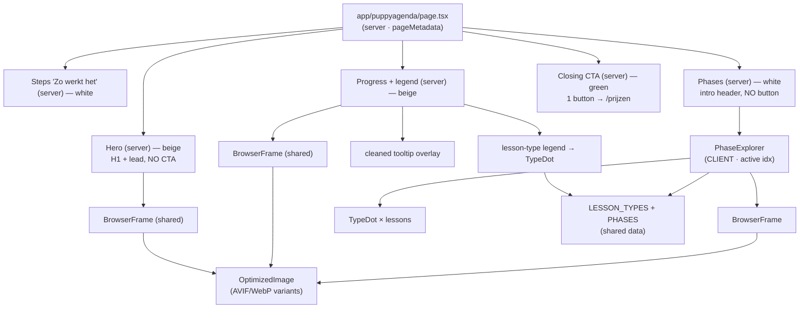

# feat: Rebuild /puppyagenda on the Productshowcase design (DS / brand-guide v2)

## Summary

Replace `app/puppyagenda/page.tsx` with the hi-fi **"Option 02 — Productshowcase"** layout from the design handoff: a beige hero leading with the real Puppyagenda app screenshot, a "zo werkt het" 3-step strip, a progress band (voortgang screenshot + onboarding tooltip + lesson-type legend), an **interactive curriculum phase-explorer**, and a green closing CTA. The page is built on the design system already wired into the repo (`app/ld-tokens.css` + `app/ld-components.css` + `components/ui/*`), reuses the global navbar/footer, and adds three net-new building blocks: a `BrowserFrame`, a lesson-type `TypeDot`, and the `PhaseExplorer` (the page's only interactive client component).

This is the complement to the active [brand-guide v2 migration plan](2026-06-01-001-feat-brand-guide-v2-site-migration-plan.md), which rebuilt the whole site on the DS **except** puppyagenda ("excluded by request — not yet redesigned"). This plan brings puppyagenda to the same v2 bar, mirroring that plan's conventions (1200px container, Phosphor icons, Eyebrow tones, the cascade-layers and SWC-whitespace gotchas).

There is **no automated test suite**; verification is `npm run build` + visual/behavioral checks on the local preview and the Cloudflare branch preview.

---

## Problem Frame

The current `/puppyagenda` is a pre-DS page: a green hero band, a 4-feature grid, a scroll-driven `PuppyPhases` component, and a beige image+CTA block built from hardcoded hex. The handoff supersedes it entirely with a product-led "Productshowcase" page that puts the real app UI front and centre and lets visitors browse the full curriculum interactively.

Everything the rebuild needs already exists in the repo: the `ld-*` tokens and `.ld-*` component CSS are in sync with the v2 bundle, and `Button` / `Eyebrow` / `Badge` wrappers (with the `tone` API and `blue`/`lime` chip tones this page needs) are vendored. So the work is overwhelmingly at the component/markup layer — assembling five sections and three primitives from existing tokens — plus one small additive change to the image-optimization build script so the app screenshots can be served as AVIF/WebP.

---

## Scope Boundaries

### In scope
- Replace `app/puppyagenda/page.tsx` with the five-section Productshowcase layout, Dutch copy verbatim from the handoff.
- Three net-new components: `BrowserFrame` (shared), `TypeDot` (puppyagenda), `PhaseExplorer` (puppyagenda client island) + the curriculum/lesson-type data.
- Add the three client-provided app screenshots and serve them via `OptimizedImage`; extend `scripts/optimize-images.mjs` to also process PNG sources.
- Clean the onboarding-tooltip image (remove its baked-in dark scrim) and overlay it on the voortgang frame.

### Non-goals (explicit — do not do these)
- **Do not re-add any of the removed CTAs.** Per owner direction (2026-06-02) the page has **exactly one** CTA — "Bekijk de abonnementen" → `/prijzen`, in the closing green band. The two hero buttons ("Bekijk de abonnementen", "Bekijk een preview"), the phases-header "Bekijk het hele programma" button, and the closing-band "Gratis account" button from the handoff are all intentionally **dropped**.
- **Do not rebuild the handoff's `TopBar`/`Footer`.** The global `components/layout/navbar.tsx` + `footer.tsx` (applied in the root layout) are reused as-is.
- No route, redirect, `pageMetadata`, structured-data, sitemap, `_headers`/`_redirects`, or analytics changes (the current page carries no page-specific JSON-LD; keep it that way).
- No copy/tone rewrites beyond using the handoff's Dutch copy.

### Deferred to follow-up work
- **Curriculum content accuracy.** The handoff flags the lesson→phase mapping as a best-guess ("Confirm against the real curriculum before shipping"). It ships verbatim from the handoff; **accuracy is a pre-merge content check** the owner does on the preview, not a code task.
- **Live product embeds.** Static screenshots are fine for launch; swapping in live app embeds is a later option.
- **Tooltip-image fallback.** If a clean crop can't isolate the white card (see U1/KTD5), ship the original image and the owner will redo the asset later.

---

## Requirements

### Page structure & layout
- R1. `app/puppyagenda/page.tsx` renders the five sections top-to-bottom — Hero (beige), Steps "Zo werkt het" (white), Progress + legend (beige), Curriculum phase-explorer (white), Closing CTA (green) — with Dutch copy verbatim from the handoff, reusing the global navbar/footer.
- R2. Page content sits in the DS **1200px container**; per-section backgrounds, vertical paddings, type scale, radii, and shadows match the handoff and are sourced from `--ld-*` tokens (no hardcoded brand hex except the functional lesson-type swatches).
- R3. Responsive: the two-column hero and progress grids collapse to single column on tablet/mobile; the explorer's `320px / 1fr` selector-and-detail split stacks, and its inner `1.3fr / .85fr` detail grid becomes one column; all hit targets ≥44px.

### Curriculum explorer
- R4. The phase-explorer is a client component holding a single `active` phase index (default 0). Clicking a week-ruler segment **or** a phase selector sets it; the detail pane (week/age chips, phase title, blurb, lesson list, app frame, info card) reflects the active phase. The week ruler fills bars at index ≤ active in brand green.
- R5. Lesson types (video / lezen / audio / gezondheid) are colour- and icon-coded per the app's coding, driven from **one shared source** used by both the progress legend and the explorer lesson lists.

### Calls to action
- R6. The page has **exactly one** CTA: "Bekijk de abonnementen" in the closing green band, linking to `/prijzen` (`Button variant="onGreen" asChild`). No hero CTAs, no phases-header button, no "Gratis account" button.

### Images
- R7. The three app screenshots are served through `OptimizedImage` (committed AVIF/WebP variants); `scripts/optimize-images.mjs` is extended to generate variants for the PNG screenshots, keeping the existing `[384, 512, 768, 1280]` width set.
- R8. The onboarding-tooltip image is cleaned of its dark dimmed scrim/sliver and rendered as a floating overlay on the voortgang frame (radius + subtle light `--ld-border` + `--ld-sh-3`). Fallback: if a clean crop isn't achievable, ship the original.

### Design-system fidelity & accessibility
- R9. CTAs use `Button`; eyebrows use `Eyebrow` (`tone="brand"` on light surfaces); pill chips use `Badge` (`blue`/`lime`/neutral). Bespoke layouts (browser frame, type dot, explorer card, legend cards, numbered steps) are token-styled custom elements — **not** `Card` with overridden padding. Icons come from `@phosphor-icons/react/dist/ssr`.
- R10. Motion uses token durations + `prefers-reduced-motion`; every interactive element shows the `--ld-sh-focus` ring; no bounce/spring/overshoot.

### Preservation
- R11. Route (`/puppyagenda/`), `pageMetadata`, sitemap, structured data (none), and analytics are unchanged. The image change follows the trigger→verify matrix in `docs/website-spec-maintenance.md`.

---

## Key Technical Decisions

**KTD1 — Mirror the `/prijzen` DS recipe.** Server `page.tsx` exports `pageMetadata` and composes the section components; sections import Phosphor from `@phosphor-icons/react/dist/ssr`; the single CTA link is `<Button variant="onGreen" asChild><Link href="/prijzen">…</Link></Button>` (one child — Radix `Slot` rule). *(Source: `docs/solutions/integration-issues/design-system-into-nextjs-static-export.md`, live `components/sections/pricing.tsx`.)*

**KTD2 — DS 1200px container.** Use the DS container (`components/ui/layout.tsx` `Container` / `.ld-container`) per the handoff and the parent migration's KTD6. Accept that the page is ~80px narrower than today's not-yet-migrated `max-w-7xl` navbar/footer until that migration lands — a transient, self-correcting delta, not a regression.

**KTD3 — Bespoke layouts are token-styled custom elements, not DS `Card`.** The explorer's master/detail card needs `padding:0` + `overflow:hidden` + a `320px 1fr` grid, and the legend/step tiles need custom internals — but `.ld-card` sets `padding`, and **unlayered `.ld-*` rules beat Tailwind utilities** (equal specificity, no-layer wins), so a `className="p-0"` override on `<Card>` silently fails. Build these as plain token-styled `<div>`s. Use the DS `Button`/`Eyebrow`/`Badge` only where they don't fight the layout (they don't set the properties these layouts need). *(Source: `docs/solutions/developer-experience/tailwind-utilities-vs-unlayered-ds-classes.md`.)*

**KTD4 — Screenshots via `OptimizedImage`; extend the build script for PNGs.** Screenshots are large raster images (esp. the above-the-fold hero shot) that benefit from AVIF/WebP — the same path the repo uses for photos. Extend `scripts/optimize-images.mjs` to also process the puppyagenda PNG sources while **excluding `google-play-badge.png`** (a badge that intentionally stays on `next/image`). Keep the `[384, 512, 768, 1280]` widths — they already match `VARIANT_WIDTHS` in `OptimizedImage`, so no width-sync edit is needed; verify the rendered `<picture>` srcset actually points at the generated files. *(Source: `docs/solutions/conventions/optimized-image-variant-widths-two-places.md`.)*

**KTD5 — Clean the tooltip by cropping the source, clip corners in CSS.** The onboarding-tooltip PNG was captured over a dimmed in-app overlay, so it carries a dark scrim/sliver the owner dislikes. Crop the source to the white card's bounding box **before** generating variants; render with `border-radius` + `overflow:hidden` so the cropped corners clip cleanly. The exact crop box is an execution-time detail (inspect the image). Fallback per owner: if the crop can't cleanly isolate the card, ship the original and note it.

**KTD6 — Exactly one CTA (owner direction 2026-06-02).** The hero has **no** buttons (the global navbar's "Start vandaag"/"Inloggen" remain the above-the-fold actions); the phases section header is intro-only (eyebrow + H2, left-aligned, no trailing button); the closing green band has the single "Bekijk de abonnementen" → `/prijzen`. This removes every `app.letsdog.nl` link from the page, so `CTATracker` (which tracks app/keuzehulp/agenda links) does not fire here — expected.

**KTD7 — One client island.** Only `PhaseExplorer` is `"use client"` (it holds the `active` index). Every other section is a server component. Lesson-row hover is pure CSS (`hover:bg-[var(--ld-bg-sunken)]`), not JS, so no extra client boundaries.

**KTD8 — SWC whitespace guard.** Next 16 + Turbopack (SWC) drops the space after a JSX `{expression}`. The hero H1 colours "per week" with a `<span>`; use an explicit `{" "}` wherever a space between an inline element/expression and adjacent text must render, and verify in the rendered DOM. *(Source: `docs/solutions/ui-bugs/swc-jsx-expression-whitespace-collapse.md`.)*

**KTD9 — No SEO/analytics surface change.** Keep `pageMetadata({ title, description, path: "/puppyagenda/" })`; add no structured data (consistent with the current page and the parent plan's preservation rule). Follow `docs/website-spec-maintenance.md` for the new images only.

---

## High-Level Technical Design

Page = a server component composing five section components. Three sections render a `BrowserFrame` around an `OptimizedImage`; the legend and the explorer's lesson lists both read the shared lesson-type/curriculum data. `PhaseExplorer` is the single client island.



**Delivery shape:** one feature branch / PR (the `/new-feature` flow), verified on its Cloudflare preview before merge. Build order is foundations (assets → primitives → explorer) then sections then a verification pass.

---

## Output Structure

New and changed files:

```
app/puppyagenda/page.tsx                          # REPLACED — server, metadata, composes sections
components/shared/browser-frame.tsx               # new — faux browser chrome + OptimizedImage body
components/sections/puppyagenda/
  ├── curriculum.ts                               # new — PHASES + LESSON_TYPES (shared data)
  ├── type-dot.tsx                                # new — lesson-type badge
  ├── phase-explorer.tsx                          # new — CLIENT island (active phase index)
  ├── hero.tsx                                    # new — O2 hero (no CTA)
  ├── steps.tsx                                   # new — "Zo werkt het"
  ├── progress.tsx                                # new — voortgang frame + tooltip + legend
  ├── phases.tsx                                  # new — intro header + <PhaseExplorer/>
  └── closing-cta.tsx                             # new — green band, single CTA → /prijzen
scripts/optimize-images.mjs                       # MODIFIED — also process PNG screenshots (skip badge)
public/images/pa-agenda.png                       # new — client screenshot
public/images/pa-voortgang.png                    # new — client screenshot
public/images/pa-tooltip.png                      # new — client screenshot, scrim cropped
public/images/optimized/pa-*.{avif,webp}          # new — generated + committed variants
```

The component layout is a scope declaration, not a constraint — co-locating the puppyagenda sections under `components/sections/puppyagenda/` keeps the feature tidy; the implementer may flatten if it reads better.

---

## Implementation Units

> No test runner. **Verification** lists observable outcomes to confirm via `npm run build` + the local/Cloudflare preview, not test files. Purely-presentational units use `Test expectation: none — [reason]`.

### U1. App-screenshot assets + image-pipeline PNG support
- **Goal:** Land the three screenshots as `OptimizedImage`-served assets, with the tooltip scrim removed. Foundation for every section that shows app UI.
- **Requirements:** R7, R8.
- **Dependencies:** none.
- **Files:** `public/images/pa-agenda.png`, `public/images/pa-voortgang.png`, `public/images/pa-tooltip.png`, `public/images/optimized/pa-*` (generated), `scripts/optimize-images.mjs`.
- **Approach:** Copy the handoff's `source/shots/*.png` into `public/images/` with `pa-` prefixes (no spaces). **Crop `pa-tooltip.png`** to the white onboarding card, dropping the dimmed-background margin and the bottom "Eerste nachten" sliver (KTD5; exact box determined by inspecting the image — fallback: keep original). Extend the script's source filter to also match `.png`, excluding `google-play-badge.png` (e.g. a small skip-set), then run `npm run optimize:images`. Keep `WIDTHS = [384, 512, 768, 1280]` unchanged (already matches `OptimizedImage`'s `VARIANT_WIDTHS` — KTD4). Commit the generated `pa-*` variants.
- **Patterns to follow:** `scripts/optimize-images.mjs` existing JPEG flow; `docs/solutions/conventions/optimized-image-variant-widths-two-places.md`.
- **Test scenarios:** `Test expectation: none (asset/tooling).` Verify: `public/images/optimized/` gains `pa-agenda-{384,512,768,1280}.{avif,webp}` (and voortgang/tooltip, capped at native width); the badge gets no new variants; the cropped tooltip shows no dark scrim at 1:1.
- **Verification:** `npm run optimize:images` reports the new sources; generated `pa-*` variant files exist for all widths; cropped tooltip inspected.

### U2. Shared primitives + curriculum data
- **Goal:** Build the reusable building blocks the sections compose.
- **Requirements:** R5, R9.
- **Dependencies:** U1 (for live image render).
- **Files:** `components/shared/browser-frame.tsx`, `components/sections/puppyagenda/type-dot.tsx`, `components/sections/puppyagenda/curriculum.ts`.
- **Approach:** `BrowserFrame` — token-styled `<div>` (radius 16, 1px `--ld-border`, `--ld-sh-3`, white bg, `overflow:hidden`): a 38px sunken title bar (`--ld-bg-sunken`, 1px bottom border) with three traffic-light dots + a faux address pill (`lock-simple` Phosphor icon + `app.letsdog.nl/agenda`), and a body that renders an `OptimizedImage` (`w-full block`, intrinsic `width`/`height` from the native px to avoid CLS). Props: `src`, `alt`, optional `priority`. `TypeDot` — a `size×size` rounded-square (radius 9) using the lesson type's swatch bg + a Phosphor **fill** icon at ~50% size in the type's ink colour. `curriculum.ts` — exports `LESSON_TYPES` (video→`Play`/`#FBE3DB`/`#B5482B`, lezen→`FileText`/`#E6ECE3`/`#46603C`, audio→`Headphones`/`#E3ECF6`/`#2F5C86`, gezondheid→`HeartStraight`/`#F3DAD3`/`#7A2A2A`) and `PHASES` (the four phases + lessons, verbatim from the handoff).
- **Patterns to follow:** `components/shared/optimized-image.tsx` (raw path + intrinsic sizing); KTD3 (token-styled, not `<Card>`); handoff `source/pa-shared.jsx` for exact values.
- **Test scenarios:** `Test expectation: none (presentational primitives).` Verify on a throwaway mount: `BrowserFrame` shows chrome + screenshot, no dark edges; `TypeDot` renders each of the four type colours with the correct fill icon.
- **Verification:** `npm run build` typechecks; throwaway render shows the frame + four type dots correctly.

### U3. PhaseExplorer (interactive client component)
- **Goal:** The centrepiece — a week ruler + master/detail card that switches between the four phases.
- **Requirements:** R4, R5, R9, R10.
- **Dependencies:** U2.
- **Files:** `components/sections/puppyagenda/phase-explorer.tsx`.
- **Approach:** `"use client"`; `useState` `active` (0–3, default 0). **Week ruler:** four equal segments (6px bars + week-range labels); bars at index ≤ `active` filled `--ld-green`, rest `--ld-beige-deep`; clicking sets `active` (200ms colour transition); active label ink/600, others subtle/500. **Master/detail card:** token-styled `<div>` (radius 20, 1px border, `overflow:hidden`), CSS grid `320px 1fr`. Left rail (`--ld-bg-sunken`): four phase `<button>`s, each a 44px rounded icon tile (green-soft idle → solid green/white active) + "FASE 0N" overline + title; active button gets white bg, green border, `--ld-sh-1`, trailing green `CaretRight`. Right detail: grid `1.3fr .85fr` — left = lime week chip + neutral age chip (`Badge`), 32px phase title, blurb, "LESSEN IN DEZE FASE" eyebrow, lesson list (`TypeDot` + label + right-aligned type name, CSS row hover); right = `BrowserFrame` (pa-agenda) + a green-soft info card ("Zo ziet je week eruit"). Selector/detail buttons are real `<button>`s (focus ring, keyboard). Make the ruler segments and selector buttons interactive controls (≥44px tap targets).
- **Patterns to follow:** handoff `PhaseExplorer` in `source/pa-shared.jsx`; KTD7 (CSS hover); `components/ui/badge.tsx` (`tone="lime"`/neutral).
- **Test scenarios:**
  - Clicking each of the four ruler segments updates the detail pane to that phase; bars fill cumulatively to the active index.
  - Clicking each phase selector button updates the detail pane and moves the active treatment (white bg + green border + caret) to it.
  - Lesson rows show the hover background on pointer (CSS), and each row's `TypeDot` + right-aligned type label match the lesson's type.
  - Keyboard: Tab reaches every ruler segment and selector; focus ring visible; Enter/Space activates; `prefers-reduced-motion` removes the colour/scale transitions.
- **Verification:** Interaction walkthrough on the preview (click + keyboard); reduced-motion toggle; `npm run build`.

### U4. Page scaffold + Hero + Steps
- **Goal:** Replace the old page with the new server shell and the first two sections.
- **Requirements:** R1, R2, R6 (hero has no CTA), R9, R10, R11.
- **Dependencies:** U1, U2.
- **Files:** `app/puppyagenda/page.tsx` (replace), `components/sections/puppyagenda/hero.tsx`, `components/sections/puppyagenda/steps.tsx`.
- **Approach:** `page.tsx` — server component, keep/refresh `pageMetadata({ title, description, path: "/puppyagenda/" })`, render the sections in order inside the DS `Container`. **Hero** (beige, grid `.92fr 1.08fr`, 56px gap, `64px 0 76px`): left = H1 `clamp(38px,4.6vw,60px)` with "per week" in `--ld-green` (guard the space with `{" "}` per KTD8) + lead paragraph — **no button row** (KTD6); right = `BrowserFrame` (pa-agenda, `priority`) with the floating blue "Je bent in week 8" `Badge tone="blue"` (`MapPin` fill icon, `--ld-sh-2`) overlapping top-right. **Steps** (white, 1px top border, `64px 0`): `Eyebrow tone="brand"` "Zo werkt het" + 3-column grid of `NumberCircleOne/Two/Three` (34px, brand green) + title + body, verbatim copy.
- **Patterns to follow:** `app/prijzen/page.tsx` (server page + metadata); `components/sections/how-it-works.tsx` (3-step grid, token classes); KTD1, KTD2, KTD8.
- **Test scenarios:** `Test expectation: none (static layout).` Verify: page builds and renders hero + steps; hero shows the agenda frame + blue chip and **no buttons**; H1 renders "Alles wat je moet doen, per week klaargezet." with a visible space before "per week" and after "week" (check rendered DOM, not source); eyebrow is brand green.
- **Verification:** `npm run build`; preview shows hero + steps; DOM `textContent` confirms the H1 spacing.

### U5. Progress section (voortgang frame + cleaned tooltip + legend)
- **Goal:** The "altijd overzicht" band.
- **Requirements:** R1, R2, R5, R8, R9.
- **Dependencies:** U1 (cleaned tooltip), U2 (`BrowserFrame`, `TypeDot`).
- **Files:** `components/sections/puppyagenda/progress.tsx`.
- **Approach:** Beige, grid `1.05fr .95fr`, 56px gap, `84px 0`. Left: `BrowserFrame` (pa-voortgang) with the **cleaned** `pa-tooltip` image floating bottom-right, overlapping (`right:-26px; bottom:-28px; width:230px`), radius 14 + `overflow:hidden` (clip cropped corners) + 1px `--ld-border` + `--ld-sh-3`. Right: `Eyebrow tone="brand"` "Altijd overzicht" + H2 `clamp(28px,3.2vw,42px)` "Zie precies waar je staat" + body + a 2×2 legend grid of white token-styled cards (1px border, radius 12, padding) each with a 30px `TypeDot` + label, iterating `LESSON_TYPES`.
- **Patterns to follow:** handoff `O2Progress` in `source/pa-opt2.jsx`; KTD3, KTD5.
- **Test scenarios:** `Test expectation: none (static layout).` Verify: voortgang frame renders; the tooltip overlay shows the white card with **no dark border/scrim**; the legend shows all four lesson types with correct swatch colours/icons.
- **Verification:** `npm run build`; preview shows the cleaned tooltip overlay and the 4-cell legend.

### U6. Phases section + Closing CTA
- **Goal:** Mount the explorer and close the page with the single CTA.
- **Requirements:** R1, R2, R4, R6, R9, R10.
- **Dependencies:** U3.
- **Files:** `components/sections/puppyagenda/phases.tsx`, `components/sections/puppyagenda/closing-cta.tsx`, `app/puppyagenda/page.tsx` (wire both in).
- **Approach:** **Phases** (white, 1px top border, `80px 0`): an **intro-only** header — `Eyebrow tone="brand"` "De vier fases" + H2 "Van voorbereiding tot ontdekkingsfase" (max-width 560), left-aligned, **no trailing button** (KTD6) — then `<PhaseExplorer/>` (`margin-top:40px`). **Closing CTA** (green `--ld-green`, `76px 0`): left = white H2 "Begin vandaag met je puppyagenda" + 90%-opacity white body; right = the single `Button variant="onGreen" asChild` → `<Link href="/prijzen">Bekijk de abonnementen</Link>`. **No "Gratis account" button.**
- **Patterns to follow:** handoff `O2Phases`/`O2Cta`; `components/sections/final-cta.tsx` (Button asChild + Link); KTD1, KTD6.
- **Test scenarios:** `Test expectation: none (layout) — behavioral coverage of the explorer is U3.` Verify: phases header shows eyebrow + H2 and **no button**; the explorer mounts and works in place; the closing band shows **exactly one** button linking to `/prijzen` and **no** "Gratis account".
- **Verification:** `npm run build`; preview: phases header button absent, explorer works, closing band has one CTA → `/prijzen`.

### U7. Responsive, accessibility, motion & build/preview verification
- **Goal:** Confirm the whole page across breakpoints and the cross-cutting invariants.
- **Requirements:** R3, R10, R11.
- **Dependencies:** U4, U5, U6.
- **Files:** touch-ups only across the section files as issues surface.
- **Approach:** Verify the responsive collapse (hero/progress → single column; explorer `320px 1fr` stacks and inner `1.3fr .85fr` → one column; ruler stays usable; tap targets ≥44px). Confirm `--ld-sh-focus` rings on the explorer controls and the CTA, `prefers-reduced-motion` honored, no bounce. Confirm the page ends on the footer's light→dark transition (global footer). Run the `docs/website-spec-maintenance.md` image checklist (variants committed, srcset references them). Re-check the SWC `{" "}` spots in the rendered DOM. **Curriculum accuracy is the owner's pre-merge content check on the preview** (not a code change).
- **Patterns to follow:** `docs/website-spec-maintenance.md`; `docs/solutions/ui-bugs/swc-jsx-expression-whitespace-collapse.md`.
- **Test scenarios:**
  - At ≤768px: hero and progress are single column; the explorer selector stacks above the detail; the detail's two columns become one; no horizontal scroll.
  - The `<picture>` srcset for each screenshot contains the generated `pa-*` AVIF/WebP widths (not just files on disk).
  - Keyboard-only pass: all explorer controls + the CTA are reachable with visible focus rings.
  - Reduced-motion: ruler/selector transitions and any hover lifts are suppressed.
- **Verification:** `npm run build`; `preview_resize` mobile/tablet/desktop; srcset check in the DOM; keyboard + reduced-motion pass; Cloudflare branch preview click-through.

---

## Risks & Dependencies

| # | Risk | Mitigation |
|---|------|------------|
| R-1 | **Tooltip crop can't cleanly isolate the white card** (rounded corners pick up dimmed-background bits). | Crop to the card bbox + clip corners with CSS `border-radius`/`overflow:hidden`. Owner-approved fallback: ship the original and leave a note (U1/KTD5). |
| R-2 | **AVIF q50 softens the text-heavy screenshots.** | Screenshots render downscaled (≈1086px native → ≈600px display), so downsampling already softens; verify crispness on preview and bump quality only if needed. WebP q78 is the safety net. |
| R-3 | **Cascade-layers gotcha** — a Tailwind utility silently fails to restyle a `.ld-*` component. | Build bespoke layouts as token-styled `<div>`s, not `<Card>` with overridden padding; use DS components only via variant props (KTD3). Confirm with computed styles if a utility "does nothing". |
| R-4 | **SWC drops the space after `{expr}`** in the hero H1. | Explicit `{" "}` around the "per week" span; verify in rendered DOM, not source (KTD8). |
| R-5 | **Transient container-width delta** — 1200px page under a still-1280px navbar until the v2 migration lands. | Deliberate and self-correcting (KTD2); the parent plan standardizes everything on 1200px. |
| R-6 | **Curriculum content is a best-guess** (handoff caveat). | Ships verbatim; owner does a pre-merge content check on the preview (deferred, R-listed). |
| R-7 | **`functions/` / preview parity** — no test suite. | `npm run build` after each unit (Turbopack dev overlay caches render errors — restart after a render-error fix); per-unit preview checks; Cloudflare branch name ≤28 chars. |

**Dependencies:** the DS (`ld-tokens.css`/`ld-components.css` + `components/ui/*`) and Phosphor are already installed; the three client screenshots come from `docs/design_handoff_puppyagenda_productshowcase/source/shots/`.

---

## System-Wide Impact

- **`scripts/optimize-images.mjs`** is a shared build tool — the change is additive (processes more source files) and guarded to skip the one badge PNG; no effect on existing JPEG variants.
- **No SEO/analytics surface change:** route, `pageMetadata`, sitemap, structured data (none), `_headers`/`_redirects`, GA4/Cookiebot, and the contact function are untouched. This is a single-page content/visual rebuild.
- **Global chrome unchanged:** navbar, footer, WhatsApp button are reused as-is; the page must still end on the footer's light→dark transition.
- **Affected parties:** end users (a clearer, product-led puppyagenda page); future devs (one more page on the DS, closing the gap the v2 migration left open). No ops/data impact.

---

## Verification Strategy (no test runner)

1. **Per unit:** `npm run build` (source of truth) + the unit's Verification outcomes on the local preview (`preview_start`).
2. **Behavioral unit (U3):** explicit click + keyboard + reduced-motion passes for the explorer.
3. **Images:** confirm the rendered `<picture>` srcset references the generated `pa-*` variants (not just that files exist), per the two-files learning.
4. **Final (U7):** responsive sweep at mobile/tablet/desktop, focus-ring/motion/invariant checks, and the `docs/website-spec-maintenance.md` image checklist — then the Cloudflare branch preview, where the **owner does the curriculum-accuracy content check** before merge.

---

## Sources & Research

- **Design handoff (origin):** `docs/design_handoff_puppyagenda_productshowcase/README.md` + `source/pa-shared.jsx`, `source/pa-opt2.jsx`, `source/tokens.css`, `source/shots/*.png`.
- **Parent migration (conventions to mirror):** `docs/plans/2026-06-01-001-feat-brand-guide-v2-site-migration-plan.md` (KTD6 container, KTD3 Phosphor, Eyebrow tones, verification posture; puppyagenda explicitly deferred there).
- **DS wiring constraints:** `docs/solutions/integration-issues/design-system-into-nextjs-static-export.md` (Radix Slot single-child, Phosphor `/dist/ssr`, additive layer, `next build` as truth).
- **Convention learnings:** `docs/solutions/developer-experience/tailwind-utilities-vs-unlayered-ds-classes.md`, `docs/solutions/conventions/optimized-image-variant-widths-two-places.md`, `docs/solutions/ui-bugs/swc-jsx-expression-whitespace-collapse.md`, `docs/solutions/conventions/in-page-anchor-offset-fixed-navbar.md`, `docs/website-spec-maintenance.md`.
- **Live reference implementations:** `app/prijzen/page.tsx` + `components/sections/pricing.tsx` (DS recipe); `components/shared/optimized-image.tsx`; `components/ui/{button,eyebrow,badge}.tsx`.
