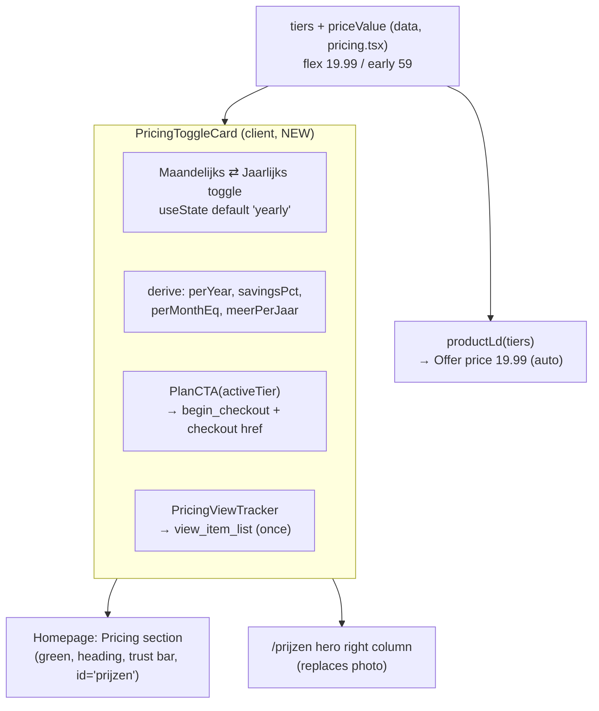

# feat: Interactive Maandelijks/Jaarlijks pricing toggle + €19,99 monthly price

## Summary

Replace the side-by-side two-card pricing block with a single **interactive toggle card** (Maandelijks ⇄ Jaarlijks, default Jaarlijks) matching the supplied screenshots, and reuse that one card module in two places: the **prijzen-page hero** (right column, replacing the photo) and the **homepage** pricing section (replacing the current two cards). Raise the monthly price **€12,99 → €19,99** and propagate it everywhere, deriving every secondary figure (per-year total, savings %, "meer per jaar" nudge) from a single `priceValue` so they can never drift. Existing checkout links, product IDs, and analytics events are reused unchanged.

This is **client-only static-site work** — no server surface, no auth-adjacent data, no checkout/Mollie changes.

---

## Problem Frame

The current pricing UI (`components/sections/pricing.tsx`) renders both tiers as two cards side-by-side inside a full-width green `<section>`, shared by the homepage and `/prijzen`. The desired design is a **compact single card with a Maandelijks/Jaarlijks toggle** that fits in a hero column. Separately, the monthly price has changed to €19,99, and the screenshots already show several *derived* figures (€239,88/jaar, €180,88 meer per jaar) — one of which, the **"Bespaar 62%"** badge, is stale: 62% is the old €12,99 math; at €19,99 the saving is ~75%. Hardcoding these invites exactly this drift, so the plan derives them.

The price also appears in non-component surfaces (FAQ copy, `llms.txt`, JSON-LD) that must stay in sync, and the legal/policy markdown was verified to cite cancellation *terms* but **no euro figure**, so it needs no numeric edit.

---

## Scope Boundaries

### In scope
- New interactive toggle pricing card (client component) — default **Jaarlijks**.
- Reuse on **homepage** (replaces the two-card grid inside the existing `Pricing` section, keeping its heading + trust bar + `id="prijzen"`) and **prijzen-page hero** (replaces the photo + "Vanaf €4,92 per maand" badge).
- Remove the below-the-fold pricing section on `/prijzen`.
- Keep the `/prijzen` "Vragen over prijzen" FAQ, restyled as a visually distinct section.
- Monthly price €12,99 → €19,99 across all surfaces; all derived figures computed from `priceValue`.

### Non-goals (do not touch)
- Checkout URLs, product IDs (1978 / 592), Mollie, the `app.letsdog.nl` purchase/sign_up events.
- Annual pricing (€59 first year / €99 ongoing / €4,92 p.m.) — unchanged.
- Legal/policy markdown numbers (verified: terms only, no euro figure).
- The analytics *mechanics* in `plan-cta.tsx` / `pricing-view-tracker.tsx` / `cta-tracker.tsx` — reused as-is.

### Deferred to Follow-Up Work
- Whether the homepage pricing **section chrome** (eyebrow "Lidmaatschap" + heading "Kies hoe je wilt starten" + trust bar) should also be slimmed — kept as-is here; revisit if the homepage feels heavy with the new compact card.

---

## Key Technical Decisions

**KTD1 — Single source of truth + derived display.** `tiers[].priceValue` (a `number`) is authoritative. The card computes per-year (`priceValue × 12`), the "meer per jaar" delta (`monthlyPerYear − earlyFirstYearValue`), per-month-equivalent (`earlyFirstYearValue / 12`), and the savings % at render time. `priceMain` strings stay as the display label only. *Rationale: the stale "Bespaar 62%" is precisely what hardcoding causes.*

**KTD2 — Savings % basis.** `savingsPct = round((monthlyPerYear − earlyFirstYearValue) / monthlyPerYear × 100)` → `round((239.88 − 59)/239.88 × 100) = round(75.4) = 75` → **"Bespaar 75%"**. This matches the brand's prior *intro-first-year* basis (the old 62% used the same formula at €12,99). *Alternative considered:* an ongoing-price basis vs €99 → `(239.88 − 99)/239.88 = 59%` (more conservative/honest for year 2+). Chosen the intro basis for continuity with the existing convention; **flagged for user** — a one-line formula swap if they prefer 59%.

**KTD3 — Default toggle state = Jaarlijks.** The best-value / "Meest gekozen" plan, per screenshot 1. `useState<"monthly" | "yearly">("yearly")`.

**KTD4 — Reuse `PlanCTA` and `PricingViewTracker` verbatim.** `PlanCTA` already renders `<Button variant={highlighted ? "peach" : "secondary"}>` and fires `begin_checkout` from the tier — so rendering `<PlanCTA tier={activeTier} />` preserves both the peach accent and the analytics with zero new code. The €19,99 `priceValue` flows into `begin_checkout` automatically. *Analytics is preserved by construction, not re-implemented.*

**KTD5 — Component split.** New client `PricingToggleCard` is the **bare** interactive card (toggle pill + active-plan card + `PlanCTA` + `PricingViewTracker`). The homepage keeps a server `Pricing` **section** wrapper (green bg, eyebrow, heading, trust bar, `id="prijzen"`) that now renders `<PricingToggleCard />` instead of the two-card grid. The prijzen hero renders `<PricingToggleCard />` directly in its right column. *Rationale: "just like on the pricing page" = the same card module; homepage section chrome retained for context.*

**KTD6 — Tracker travels with the card.** `PricingViewTracker` is rendered *inside* `PricingToggleCard`, so `view_item_list` fires once per page wherever the card mounts. Its `closest("section")` resolves on both placements (homepage `Pricing` section; prijzen hero `<section>`). One card per page → no double-fire.

**KTD7 — Peach via the DS variant, never a utility.** The highlighted CTA uses `Button variant="peach"` (already how `PlanCTA` works). Do **not** add `bg-[var(--ld-peach)]` to a DS button — unlayered `.ld-*` classes beat Tailwind utilities (documented in `docs/solutions/developer-experience/tailwind-utilities-vs-unlayered-ds-classes.md`).

**KTD8 — FAQ separation via `--ld-green-soft`.** Restyle the `/prijzen` FAQ section from `bg-white` to `bg-[var(--ld-green-soft)]` for clear visual separation from the beige hero, with minimal accordion recolor. *Alternative:* full `--ld-green` (bolder, needs on-green accordion text/border recolor) — note as an easy upgrade if they want it stronger.

**KTD9 — Preserve `id="prijzen"`.** The homepage section keeps `id="prijzen"` so deep-links (`#prijzen`, e.g. the final-CTA button) and the `cta-tracker` same-site pricing match keep working.

---

## High-Level Technical Design

The only behavioral state is the 2-way toggle; everything else is derived render. Analytics leaves (`PlanCTA`, `PricingViewTracker`) are unchanged and simply receive the active tier / sit inside the section.

---

## Derived Pricing Math (reference for the implementer)

| Figure | Formula | Value at €19,99 / €59 | Where shown |
|---|---|---|---|
| Monthly price | `flex.priceValue` | €19,99 /maand | Maandelijks view |
| Monthly → per year | `flex.priceValue × 12` | €239,88 per jaar | Maandelijks sub |
| "meer per jaar" nudge | `flex.priceValue×12 − early.priceValue` | €180,88 | Maandelijks nudge |
| Yearly intro | `early.priceValue` | €59 /eerste jaar | Jaarlijks view |
| Yearly list (strike) | `early.listPriceValue` (NEW field = 99) | €99,00 | Jaarlijks strike |
| Yearly → per month | `early.priceValue / 12` | €4,92 per maand | Jaarlijks sub |
| Savings badge | `round((flex×12 − early)/(flex×12)×100)` | **75%** | Toggle "Bespaar N%" |

Format euros Dutch-style (comma decimal, `€` prefix, drop `,00` only where the current copy does — €59 not €59,00; €99,00 keeps cents to match the screenshot strike). A small `formatEUR` helper keeps this consistent.

---

## Implementation Units

### U1. Update tier data: €19,99 + list price field

**Goal:** Make `tiers` carry the new monthly price and the annual list (strike) price as data.
**Files:** `components/sections/pricing.tsx`
**Approach:** `flex`: `priceMain "€12,99" → "€19,99"`, `priceValue 12.99 → 19.99`. `early`: add `listPriceMain: "€99,00"` + `listPriceValue: 99` to the `Tier` type and the early tier (the strike price; currently only prose in `priceSub`). Leave `productId`, `ctaHref`, `billingPeriod` untouched. This unit is data-only — display, JSON-LD (`parsePrice(priceMain)`), and `begin_checkout` (`priceValue`) all read from here.
**Patterns to follow:** existing `Tier` shape; keep optional fields optional.
**Test scenarios:**
- `productLd(tiers)` Offer for Flexibel serializes `price: "19.99"`, `priceCurrency: "EUR"` (assert in build output / a small unit assertion on `parsePrice`).
- `early.listPriceValue` present and `= 99`; `flex.priceValue === 19.99`.
- `productId` values unchanged (1978 / 592) — regression guard.
**Verification:** `npm run build` green; grep shows no remaining `12,99` / `12.99` in `pricing.tsx`.

### U2. Build `PricingToggleCard` (client toggle module)

**Goal:** The interactive single card matching the screenshots.
**Files:** `components/sections/pricing-toggle-card.tsx` (new), `components/sections/pricing-toggle-card.test.tsx` (new — if a test runner is present; otherwise cover via the build + preview DOM assertions in Verification).
**Approach:** `"use client"`. `useState<"monthly"|"yearly">("yearly")`. Render: (a) a segmented **toggle pill** "Maandelijks | Jaarlijks · Bespaar {savingsPct}%" as an accessible button group (`role="group"`, each option a `<button>` with `aria-pressed`); (b) the **active plan card** (`<Card featured={activeTier.highlighted}>`) with name, description, price block (strike `listPriceMain` + `priceMain` + unit for yearly; `priceMain` + `/maand` for monthly), the derived sub-line, the "meer per jaar" nudge (monthly only), the features list, `<PlanCTA tier={activeTier} />`, and the footer note; (c) the "Meest gekozen" `<Badge tone="peach">` on the yearly view. Mount `<PricingViewTracker />` once inside. Derive all figures from `priceValue` via a local `formatEUR` helper (KTD1/KTD2). **Use explicit `{" "}` around any interpolated number adjacent to text** (SWC/Turbopack whitespace-collapse, `docs/solutions/ui-bugs/swc-jsx-expression-whitespace-collapse.md`).
**Patterns to follow:** `PlanCTA` (peach accent + analytics), `PricingCard` markup in the current `pricing.tsx` (features list, check icons, footer), `Badge`/`Card`/`Eyebrow` DS usage.
**Test scenarios:**
- Default render shows the **yearly** plan (Early Member, €59, strike €99,00, "Meest gekozen", €4,92 p/m sub).
- Click "Maandelijks" → shows €19,99 /maand, "= €239,88 per jaar", "Je betaalt €180,88 meer per jaar — kies Jaarlijks", CTA label "Start Maandelijks".
- Click "Jaarlijks" → returns to Early Member view, CTA label "Claim Early Member Prijs".
- Toggle pill shows "Bespaar 75%" (derived, not literal 62%).
- Active CTA `href` matches the active tier (`…add-to-cart=1978` monthly / `=592` yearly).
- a11y: toggle options are real buttons, keyboard-operable, `aria-pressed` reflects state.
- `formatEUR(59)` → "€59"; `formatEUR(99)` → "€99,00"; `formatEUR(239.88)` → "€239,88" (matches existing copy conventions).
**Verification:** preview DOM assertions (snapshot after simulated toggle clicks); computed background of the highlighted CTA = `rgb(255,165,128)`.

### U3. Swap homepage `Pricing` section to the toggle card

**Goal:** Homepage pricing section uses the new module, keeping its chrome + anchor.
**Files:** `components/sections/pricing.tsx`
**Approach:** Replace the two-card grid (`PricingCard` map) inside the `Pricing` `<section id="prijzen">` with a single centered `<PricingToggleCard />`. Keep the eyebrow, heading, trust bar, `id="prijzen"`, and green background. Remove the now-unused `PricingCard` and the per-card `trustItems`-as-cards plumbing only if fully dead (keep the trust bar). `app/page.tsx` is unchanged (still `<Pricing />`).
**Patterns to follow:** existing `Pricing` section wrapper; `max-w` centering.
**Test scenarios:**
- Homepage renders exactly one pricing card (the toggle card), centered, on green.
- `#prijzen` anchor still resolves to this section (id preserved); deep-link from final-CTA "Start de cursus vandaag" scrolls here.
- Trust bar ("Veilig betalen via Mollie", "Geen verborgen kosten", "Opzegbaar in accountinstellingen") still present.
**Verification:** preview snapshot of homepage `#prijzen`; click final-CTA `#prijzen` link → scrolls to section.

### U4. Restructure the prijzen page

**Goal:** Pricing in the hero, below-fold pricing gone, FAQ kept + visually distinct.
**Files:** `app/prijzen/page.tsx`
**Approach:** In the upper beige hero grid: keep the left text column (H1, subtext, pills) untouched; **replace the right image column** (`OptimizedImage` + the "Vanaf €4,92 per maand" `Badge`) with `<PricingToggleCard />`. **Remove** the `<Pricing />` lower section (and its import if now unused — but `tiers` import stays for `productLd`). **Restyle** the FAQ `SectionWrapper` from `bg-white` to `bg-[var(--ld-green-soft)]` (KTD8); verify accordion legibility on the new bg. Drop the now-unused `OptimizedImage` import if nothing else uses it on the page.
**Patterns to follow:** the existing hero grid (`grid lg:grid-cols-2 items-center`); `SectionWrapper` usage.
**Test scenarios:**
- Prijzen hero right column shows the toggle card (no photo, no "Vanaf €4,92 per maand" badge).
- Left hero text + pills unchanged.
- No second pricing section below the hero.
- FAQ accordion present, on `--ld-green-soft`, all four Q&A readable and expandable.
- Page still renders `productLd(tiers)` JSON-LD with €19,99 Flexibel offer.
**Verification:** `npm run build`; preview snapshot of `/prijzen` (hero card + FAQ only); axe/contrast check on the FAQ section.

### U5. Sync price copy on non-component surfaces

**Goal:** No stale €12,99 anywhere.
**Files:** `app/veelgestelde-vragen/faq-data.ts`, `public/llms.txt`, `lib/structured-data.ts`
**Approach:** `faq-data.ts:51` "Flexibel €12,99/maand" → "€19,99/maand" (this also updates the FAQPage JSON-LD, which mirrors it). `llms.txt:12` "Flexibel (EUR 12,99/maand)" → "EUR 19,99/maand". `structured-data.ts:67` comment "€12,99 -> 12.99" → "€19,99 -> 19.99" (comment accuracy only; `parsePrice` is unchanged). Confirm the prijzen-page metadata/badge "Vanaf €4,92 per maand" (annual equivalent) stays.
**Test scenarios:**
- Repo-wide grep for `12,99` / `12.99` returns zero hits after this unit.
- FAQ page renders "€19,99/maand"; its FAQPage JSON-LD `acceptedAnswer` text contains €19,99.
**Verification:** `grep -rn "12[.,]99" components app content lib public` → empty.

### U6. Verify end-to-end + cross-surface consistency

**Goal:** Prove the toggle, prices, and analytics work on both pages.
**Files:** none (verification unit).
**Approach:** Local headless preview for DOM/interaction/visual; **Cloudflare preview** for scroll/visibility analytics (`view_item_list`) and `begin_checkout`/`cta_clicked`, which don't fire reliably in headless (`docs/solutions/developer-experience/preview-throttles-intersection-observer-and-smooth-scroll.md`). Expect blank screenshots on scroll-reveal sections — assert via DOM, or trigger-then-wait (`docs/solutions/developer-experience/preview-screenshots-blank-on-scroll-reveal.md`).
**Test scenarios:**
- Toggle interaction on both homepage `#prijzen` and `/prijzen` hero.
- `begin_checkout` payload `value`/`items[].price` = 19.99 when monthly active, 59 when yearly active (verify on Cloudflare preview via a `gtag`/`posthog` spy + synthetic click).
- `view_item_list` fires once per page with correct `source` (`homepage` / `prijzen_page`).
- `cta_clicked` fires with `link_destination:"checkout"` for the sg-host href.
**Verification:** documented evidence (snapshots + event payloads) before opening the PR.

---

## System-Wide Impact

- **Two pages change**: homepage (`Pricing` section internals) and `/prijzen` (hero + removed section + FAQ restyle).
- **Anchor `#prijzen`** preserved (KTD9) → navbar/hero/final-CTA deep links unaffected.
- **Analytics preserved by reuse** (KTD4/KTD6): `begin_checkout`, `view_item_list`, `cta_clicked` — *analytics is a risky path → run `/ce-code-review` before the PR.*
- **JSON-LD** `Product/Offer` price auto-updates to 19.99 (via `priceMain`); **FAQPage** JSON-LD updates via `faq-data.ts`.
- **`llms.txt`** agent index updated.
- **No** checkout/product/Mollie/app-side event changes.

---

## Risks & Mitigations

| Risk | Mitigation |
|---|---|
| Analytics regression (tier wiring / value) | Reuse `PlanCTA` + `PricingViewTracker` unchanged; only data values change; `/ce-code-review` at PR; verify payloads on Cloudflare preview. |
| `view_item_list` now fires near-immediately on `/prijzen` (pricing above fold) | Acceptable — still a real impression; documented. Tracker's `closest("section")` resolves in the hero. |
| Tall toggle card breaks the prijzen hero column / mobile stack | Verify responsive at mobile/tablet/desktop; card is single-column and should fit; adjust hero grid `items-start` if needed. |
| Savings % honesty (intro vs ongoing basis) | KTD2 documents both; 75% derived; one-line swap to 59% if user prefers. |
| Peach utility silently lost on DS button | Use `Button variant="peach"` only (KTD7). |
| JSX whitespace collapse around interpolated numbers | Explicit `{" "}` separators (U2). |
| Dead code left after removing two-card grid | Remove `PricingCard` / unused imports in U3/U4; build + lint catch stragglers. |

---

## Verification Plan (summary)

1. `npm run build` green after each structural unit.
2. **Local preview** (headless): toggle interaction, derived figures in DOM, computed peach CTA, `#prijzen` anchor, `/prijzen` structure, FAQ contrast.
3. **Cloudflare preview** (real browser): `view_item_list`, `begin_checkout` (value 19.99/59 per toggle), `cta_clicked` checkout.
4. Repo grep: no `12,99` / `12.99` remain.
5. Visual: homepage `#prijzen` + `/prijzen` hero screenshots (trigger-then-wait for scroll-reveal).

---

## Sequencing & Commit Strategy

The branch (`claude/great-mayer-4bb334`) already carries **6 verified-but-uncommitted homepage copy edits** (hero eyebrow→"Online puppytraining", hero subcopy rewrite, "Opzegbaar in de app" removed from hero + final-CTA, problem heading→"uitdagend", "Bekijk de cursus"→peach). None touch the pricing component, so they're independent.

**Recommended:** one branch, two logical commits in one PR —
1. **Commit 1** (now): the 6 homepage copy edits (already built + verified).
2. **Commits 2…N**: the pricing units U1→U6.
3. Single PR → preview → `/ce-code-review` (analytics path) → merge.

*Alternative:* split the copy edits into their own fast PR first if you want that copy live immediately — trivial to do, at the cost of a second review cycle. Default is the bundled PR above unless you say otherwise.
