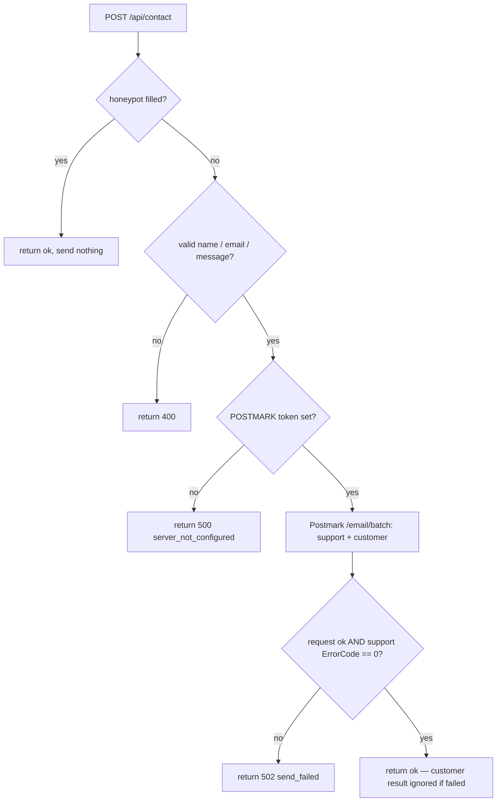

# feat: Contact-form customer confirmation email

## Summary

The contact form currently relays each submission to `support@letsdog.nl` only.
This plan adds a second, customer-facing email so the submitter also receives a
Dutch, on-brand confirmation with a copy of their own message. The work is one
change to the Cloudflare Pages Function ([`functions/api/contact.ts`](functions/api/contact.ts)),
sending both emails through Postmark's batch endpoint. The submitter copy is
best-effort: it never weakens or blocks the support notification, which stays the
source of truth.

Copy direction is **Option A** (chosen): a lean transactional confirmation —
branded header + footer + the echoed message, no marketing paragraph or CTA.

---

## Problem Frame

People who fill in the contact form get no acknowledgement in their own inbox.
They have no record of what they sent and no confirmation it arrived, which reads
as less trustworthy than it is (the form already works and replies land within one
working day). Sending the submitter a copy closes that loop. Because the recipient
address is user-supplied, the new email must be additive and failure-isolated: a
typo'd address must never stop the team from receiving the message.

---

## Requirements

Customer confirmation:
- R1. Submitting the contact form sends the submitter a confirmation email that
  contains a copy of their own message.
- R2. The confirmation is in Dutch, addressed to the submitter by name, and
  on-brand per Option A (branded header + footer, no marketing CTA).

Non-regression & robustness:
- R3. The existing support notification is unchanged in content and remains the
  source of truth; its delivery is not weakened by the new email.
- R4. Failure to deliver the customer confirmation (e.g. invalid recipient) does
  not fail the request or block the support notification.
- R5. Honeypot and input-validation behaviour are unchanged — bots and invalid
  input still send nothing.
- R6. The Postmark token stays server-side; no secret reaches the client, and
  user input is HTML-escaped in both emails.

---

## Key Technical Decisions

- Batch send: switch the single `POST /email` call to Postmark's `POST /email/batch`
  with a two-element array ordered `[support, customer]`. One round trip, and the
  per-message `ErrorCode` results let us treat the support message as critical and
  the customer message as best-effort.
- Error posture: if the batch request itself fails (network or non-200) or the
  support message returns a non-zero `ErrorCode`, return 502 — unchanged from
  today. A non-zero `ErrorCode` on the customer message is ignored; the endpoint
  still returns `{ ok: true }`. This is the mechanism behind R3 and R4.
- From display name: the customer message uses From `Let's dog <noreply@letsdog.nl>`
  (display name wrapped around `CONTACT_FROM`) for inbox trust; the support
  notification keeps the bare `CONTACT_FROM` it uses today.
- Reply-to: the customer confirmation sets `ReplyTo` to `CONTACT_TO` (default
  `support@letsdog.nl`) so a reply reaches the same inbox the submission did — no
  new env var. The page's public address is `mail@letsdog.nl`; routing replies
  there instead would mean a new `CONTACT_REPLY_TO` env, deferred.
- Copy stays inline HTML + plain text (no Postmark Templates) to match the current
  Function and keep it dependency-free. Reuse the existing `escapeHtml` for the
  echoed name and message. Copy must hold the brand rules: lowercase "Let's dog",
  "je/jouw", no emoji, no exclamation marks, no em-dashes.

---

## High-Level Technical Design

The request flow after the change, with the new batch step and best-effort branch:

---

## Implementation Units

### U1. Send a customer confirmation from the contact Function

- Goal: After a valid submission, send the submitter a Dutch Option-A confirmation
  with a copy of their message, alongside the unchanged support notification.
- Requirements: R1, R2, R3, R4, R5, R6.
- Dependencies: none.
- Files: [`functions/api/contact.ts`](functions/api/contact.ts).
- Approach:
  - Build the customer message bodies next to the existing support bodies. Subject:
    `We hebben je bericht ontvangen`. Plain-text and HTML mirror each other.
  - HTML structure (inline styles, table-free is fine for this simple layout):
    brand-green header band with the `Let's dog` wordmark; white body with
    `Hoi {name},` + the acknowledgement paragraph + a beige (`#EFE8E4`) box labelled
    "Jouw bericht" containing the escaped message + `Tot snel,` / `Team Let's dog`;
    a forest (`#162A0E`) footer band with the "Je ontvangt deze e-mail omdat je het
    contactformulier op letsdog.nl hebt ingevuld." line and
    `Let's dog BV · Naarderstraat 317 · 1272 NK Huizen · Nederland`.
  - Body copy (acknowledgement paragraph): *"Bedankt voor je bericht. We hebben het
    goed ontvangen en je hoort binnen 1 werkdag van ons. Hieronder staat een kopie
    van wat je ons stuurde."*
  - Replace the single `fetch` to `/email` with one `fetch` to `/email/batch`, body =
    JSON array `[supportMessage, customerMessage]`. Support message keeps its current
    fields (To `CONTACT_TO`, From `CONTACT_FROM`, ReplyTo = submitter, existing
    subject/bodies). Customer message: To = submitter, From = `Let's dog <${from}>`,
    ReplyTo = `CONTACT_TO`, the new subject/bodies. Both `MessageStream: "outbound"`.
  - After the response: keep the existing network/non-200 guard → 502. Then parse the
    JSON array and read the support result (index 0); if its `ErrorCode` is non-zero,
    return 502. Ignore the customer result (index 1). Otherwise return `{ ok: true }`.
- Patterns to follow: the existing `escapeHtml`, `json()` helper, validation, honeypot,
  and `MessageStream: "outbound"` already in the file — mirror their style; no new deps.
- Execution note: make the support-path refactor (single → batch, same one email)
  first and confirm it still behaves, then add the customer message — so a regression
  in the support notification is easy to isolate.
- Test scenarios (no unit-test harness in this repo; verify on the Cloudflare branch
  preview with `POSTMARK_SERVER_TOKEN` set in Preview scope):
  - Valid submission → submitter receives the Dutch confirmation with their message
    echoed; `support@` receives the unchanged notification. (Covers R1, R2, R3)
  - Format-valid but undeliverable submitter address that Postmark rejects → `support@`
    still receives the notification; endpoint returns `{ ok: true }`; no error shown to
    the user. (Covers R4)
  - Honeypot (`company`) filled → nothing sent, `{ ok: true }`. (Covers R5)
  - Missing/over-long/invalid name, email, or message → 400, nothing sent. (unchanged)
  - `POSTMARK_SERVER_TOKEN` unset → 500 `server_not_configured`. (unchanged)
  - `<script>`/HTML in name or message → escaped in both the support and customer
    emails; no markup injected. (Covers R6)
  - Header inspection: customer From shows `Let's dog`, ReplyTo = `support@`; support
    message From/ReplyTo unchanged.
- Verification: on the branch preview, submit the form and confirm both inboxes receive
  the correct email, the copy is on-brand, and `npm run build` passes (it typechecks
  `functions/**/*.ts`).

### U2. Update the contact-form note in CLAUDE.md

- Goal: keep the project doc accurate now that the Function emails the customer too.
- Requirements: supports R1 (documentation accuracy).
- Dependencies: U1.
- Files: [`CLAUDE.md`](CLAUDE.md).
- Approach: in the "Important Notes" contact-form line (and the contact bullet under
  Analytics if relevant), note that the Function now sends a best-effort customer
  confirmation in addition to the support notification, via Postmark batch.
- Test expectation: none — documentation only.
- Verification: the note matches the implemented behaviour in U1.

---

## Risks & Dependencies

- Postmark sender verification: `CONTACT_FROM` (`noreply@letsdog.nl`) must be a
  Postmark-verified sender. The display-name variant uses the same address, so no
  extra verification is needed.
- Cloudflare-only execution: `functions/` does not run under `next dev`, so this is
  verified on the branch preview, not locally. `POSTMARK_SERVER_TOKEN` must be set in
  Preview scope for the test send to work.
- Abuse surface: the form already emails `support@` on every submit, and the new email
  only echoes the submitter's own message to the address they typed (honeypot gates
  bots), so abuse value is low. Per-IP rate-limiting is out of scope — Pages Functions
  have no built-in state without KV.
- Postmark batch contract: the response is a JSON array with a per-message `ErrorCode`,
  ordered to match the request. The parse depends on that ordering; low risk, but
  re-check if Postmark changes batch semantics.

---

## Scope Boundaries

In scope:
- Customer confirmation email (Option A copy) sent from the contact Function.
- The CLAUDE.md doc note.

### Deferred to Follow-Up Work
- Legal-doc currency work — answered separately this session (no tracked to-do exists;
  currency can't be verified from the repo because 4 of 6 legal docs carry no
  "Laatst bijgewerkt" date). User chose "answer only", so no build changes here.
- A configurable `CONTACT_REPLY_TO` env (route customer replies to `mail@letsdog.nl`
  instead of `support@`).
- Per-IP rate-limiting on the form.
- A unit-test harness for the Function (the repo is a static site with none today).
- Richer email variants (Option B brand paragraph / Option C self-help links) — a copy
  swap if wanted later.

---

## Sources / Research

- [`functions/api/contact.ts`](functions/api/contact.ts) — current single-send relay:
  honeypot, validation, `escapeHtml`, `json()`, `MessageStream: "outbound"`.
- [`app/contact/contact-form-modal.tsx`](app/contact/contact-form-modal.tsx) — client
  POST to `/api/contact`; success copy promises a reply "binnen 1 werkdag".
- [`app/contact/contact-content.tsx`](app/contact/contact-content.tsx) — `mail@letsdog.nl`
  is the deliberate public contact address shown on the page (distinct from the
  `support@` relay target); not a bug, left unchanged.
- Brand guide (`brand-guide-letsdog`): lowercase "Let's dog", "je/jouw", no emoji /
  exclamation marks / em-dashes; sign-off "Team Let's dog"; legal footer
  "Let's dog BV · Naarderstraat 317 · 1272 NK Huizen · Nederland".
- Postmark batch endpoint `POST /email/batch`: JSON-array body, HTTP 200 with a
  per-message `ErrorCode` result array in request order.
- [`CLAUDE.md`](CLAUDE.md): `POSTMARK_SERVER_TOKEN` is a secret; `CONTACT_TO` defaults
  to `support@letsdog.nl`, `CONTACT_FROM` to `noreply@letsdog.nl`; Function verified on
  the Cloudflare preview.
