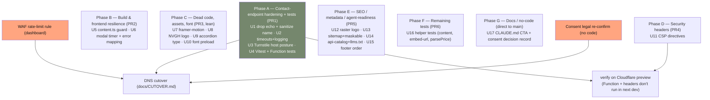

# fix: Remediate full-site code + security review findings

## Summary

Resolve the 22 findings from the 2026-06-23 full-site code + security review (1 P1, 10 P2, 11 P3), sequenced into PR-sized phases. Lead with hardening the one server endpoint (`functions/api/contact.ts`) **and co-landing its tests** before cutover to real traffic; batch the mechanical cleanups, the SEO/metadata corrections, and the standards/docs fixes. The review artifacts live at `docs/reviews/2026-06-23-website-review/` — `report.md` and `findings.json` are the source of truth for finding numbers (`#1`…`#22`).

---

## Problem Frame

The redesigned marketing site is on `main` and deployed to the Pages preview alias but has **not** yet flipped to the production custom domains (Phase 5 cutover, see `docs/CUTOVER.md`). A full-site review found the codebase well-built and well-defended overall, with risk concentrated in one place: the contact endpoint can be abused as a **branded-email amplifier** (attacker controls both the confirmation recipient and the echoed body, gated only by one Turnstile solve, no rate limit). The pre-cutover window is the right time to close that before real traffic arrives, and to clear the secondary reliability, performance, SEO, and standards findings while the surface is small.

A prior plan (`docs/plans/2026-06-15-001-feat-contact-confirmation-email-plan.md`) **explicitly deferred** rate-limiting on the assumption that the confirmation "only echoes the submitter's own message to the address they typed." Finding #1 is the violation of that assumption — the attacker controls the recipient, so the assumption no longer holds, which re-opens the decision.

---

## Requirements

### Contact-endpoint abuse & hardening
- R1. The contact endpoint cannot deliver attacker-controlled *content* to an arbitrary recipient: the reflected `message` echo is removed from the confirmation copy and `name` is newline-sanitized everywhere it is interpolated. Volume abuse is throttled per-IP via a Cloudflare WAF rule. The per-recipient distributed-delivery residual (one confirmation per Turnstile solve per source IP, to an attacker-chosen address) is **documented, not closed** — see Risks; per-recipient closure is deferred (KTD1). [#1]
- R2. The contact Worker fails closed and is observable: both external `fetch` calls time out, every failure path logs a structured line, and Turnstile enforcement cannot silently fall back to the always-pass test secret on any production-reachable host — including the production Pages alias `website-letsdog.pages.dev`. [#5, #6, #8]
- R3. Response security headers gain `object-src 'none'`, `base-uri 'self'`, and `form-action 'self'` (defense-in-depth) without violating the `_headers` merge invariant (`/*` sets only security headers, never `Cache-Control`). [#3]
- R4. The pre-consent analytics posture is recorded honestly as a **pending-re-confirm** residual risk (not a closed decision), naming the legal instruments at stake and requiring sign-off from someone with legal authority before cutover; no behavioral change. [#2]

### Reliability & correctness
- R5. A missing or renamed legal markdown file fails the build with a clear, slug-named error rather than a bare `ENOENT`. [#7]
- R6. The contact modal never disables submit on a live dialog via a stale reset timer, and surfaces server field-level validation errors (`name`/`email`/`message`) instead of a single generic failure. [#9, #15]

### Code health & performance
- R7. The unused `framer-motion` animation path is removed from the client bundle. [#4]
- R8. Every referenced image is space-free and optimized (the NVGH logo moves to `OptimizedImage`), and the `accordion` ref type-safety hole is closed. [#10, #13]
- R9. The National2 heading font no longer causes an unhinted FOUT — a `<link rel="preload">` hint ships (U10). The deeper woff2-subset pass is deferred. [#14]

### SEO / metadata / agent-readiness
- R10. Structured data, sitemap, manifest, the api-catalog, and `llms.txt` accurately reflect the site: raster Organization logo, current `lastModified`, a maskable icon, the `POST /api/contact` endpoint documented, all canonical pages + the consultation product listed, and a curriculum phase summary so the puppycursus phases are discoverable without JS. [#12, #16, #17, #20, #21, #22]
- R11. Footer navigation matches the canonical order documented in `CLAUDE.md`. [#18]

### Testing & docs
- R12. The contact-Function logic is covered by automated tests that **co-land with the hardening** (same PR as the Phase A changes), and the pure helpers (`buildEmbedUrl`, front-matter parse, `parsePrice`) are covered, all runnable without a deploy and without breaking `next build`'s typecheck. [#11]
- R13. `CLAUDE.md` matches the live navbar CTA. [#19]

---

## Key Technical Decisions

- **#1 mitigation = WAF rule + drop the echo + sanitize `name` (not an in-code rate-limiter):** add a Cloudflare WAF/rate-limit rule on `POST /api/contact` (dashboard, no code) and remove the reflected `message` block from the confirmation body. The echo is the phishing payload primitive; removing it plus a WAF throttle is the fastest risk reduction and avoids standing up KV state now. **Honest residual:** per-IP WAF does not bound a *per-recipient* distributed campaign (many IPs, one confirmation each, to one victim). That residual is documented (Risks) and its closure — a KV/Durable-Object per-recipient counter — is the deferred follow-up, so the brand owner can make an informed call rather than assume the WAF closes #1 fully.
- **Confirmation email stays, but neutral + sanitized:** keep the customer confirmation (good UX, independent of the support send) but drop the "Jouw bericht: …" reflected block. Newline-sanitize `name` (`replace(/[\r\n]/g, " ")`) before interpolating it into both the confirmation greeting and the **support** plain-text body (the support body currently interpolates `name`/`email` unescaped — a plain-text field-injection vector). Support notification content (batch index 0) is otherwise unchanged.
- **Turnstile host posture → fail-closed for unknown hosts, prod alias stays enforced:** replace the exact-match `Set.has()` allowlist with a predicate that allows the test-secret fallback **only** for `localhost` and *branch-preview* hosts (`hostname.endsWith(".pages.dev")` **and** `hostname !== "website-letsdog.pages.dev"`). The production Pages alias `website-letsdog.pages.dev` must remain enforced — a naive `*.pages.dev` wildcard would silently demote it and disable Turnstile on the live pre-cutover deployment. Everything else requires a real secret. (#8)
- **CSP: ship the three free directives now:** add `object-src 'none'; base-uri 'self'; form-action 'self'`. These are defense-in-depth (the contact form submits via `fetch`, governed by `connect-src`, not `form-action`) but cheap and zero-maintenance. The full `script-src`/`connect-src` allowlist stays de-scoped per the documented owner decision. (#3)
- **Consent posture unchanged but recorded honestly:** keep GA4 + PostHog firing pre-consent (owner's call), but record it as a **pending re-confirm**, not a closed decision: name the instruments (ePrivacy Directive Art. 5(3) for pre-consent cookies/tracking; GDPR Art. 6 lawful basis), require sign-off from someone with legal authority (not only the brand owner), and log the outcome dated. The one-line code revert stays documented in `components/analytics/ga4.tsx`. (#2)
- **`framer-motion` removed entirely:** `components/shared/reveal.tsx` is the sole importer and has zero callsites (verified). Delete the file, the dead `globals.css` keyframes, and the dependency. (#4)
- **Test runner = Vitest; bootstrap it in Phase A and keep `next build` green:** the contact-Function tests co-land with U1–U3 (PR1) so the hardened branches are pinned as they land. Because `tsconfig.json` includes `**/*.ts` and `next build` typechecks it, add a `tsconfig.test.json` that excludes `*.test.ts` from the Next build (or add `vitest/globals` to `compilerOptions.types`) so test files don't break the production build. Test `onRequestPost` with a hand-built `Request` + structurally-typed inline `env` (the private `Env`/`PagesContext` interfaces need no export) and a stubbed global `fetch`. (#11)
- **`buildEmbedUrl` extracted to `lib/embed-url.ts`:** rather than exporting a helper from a `"use client"` component for test reasons, move it to a pure lib module imported by both the component and the test. `parsePrice` is exported from `lib/structured-data.ts` as-is. (#11)
- **CLAUDE.md updated to match code** for the navbar CTA — code (`Start vandaag` → `/prijzen`) is the source of truth after the copy-deck refresh. (#19)
- **Phase G is direct-to-main, not a PR:** U17 touches only `CLAUDE.md` (+ optionally `docs/CUTOVER.md`). Per the project convention ("pure-docs commits skip the branch + PR flow"), commit it directly rather than opening a PR.

---

## High-Level Technical Design

Phase dependency and sequencing (phases = PRs, except Phase G which is a direct-to-main docs commit). Phase A + its co-landed tests and the WAF rule + the consent re-confirm are the cutover-gating items:

Phases B–G are independent of each other and can land in any order or in parallel. Only Phase A is cutover-gating among the code phases; the WAF rule and the consent re-confirm are the two non-code cutover gates.

---

## Implementation Units

Units are grouped into phases (each phase = one PR/branch, except Phase G = direct-to-main docs commit). All file paths are repo-relative. The contact Function and `_headers` do **not** run under `next dev` — verify those units on the Cloudflare branch preview.

### Phase A — Contact-endpoint hardening + tests (PR1, before cutover)

**Pre-work gate:** before starting U1, get explicit brand-owner (Elien) sign-off that a neutral, echo-free confirmation is acceptable. If a compromise is wanted (e.g. echo subject/name only), resolve it now — not mid-PR — since Phase A is cutover-gating.

#### U1. Remove the reflected echo and sanitize `name`
- **Goal:** eliminate the attacker-controlled-content primitive (#1).
- **Requirements:** R1
- **Dependencies:** none
- **Files:** `functions/api/contact.ts`
- **Approach:** drop the "Jouw bericht" block that replays `message` to the submitter — both `customerText` (~line 163) and `customerHtml` (~line 187). Keep a neutral confirmation. Newline-sanitize `name` (`name.replace(/[\r\n]/g, " ")`) before interpolating it into the confirmation greeting **and** into `supportText` (~line 144), where `name`/`email` are currently interpolated unescaped into the plain-text body (a field-injection vector for the support inbox). Leave the **support** submission content otherwise intact (the team must still see the full message). The HTML bodies already use `escapeHtml`.
- **Patterns to follow:** existing `escapeHtml` usage and the batch structure.
- **Test scenarios (in U4):** confirmation body contains no submitted `message`; a `name` with `\r\n` is flattened in both confirmation and support bodies; support body still contains the full message; honeypot path still returns `{ok:true}` and sends nothing.
- **Verification:** on a Cloudflare preview, submit and confirm the confirmation no longer echoes the message and a newline-laden name can't inject fake fields; support inbox still gets the full message.

#### U2. Add fetch timeouts and structured logging
- **Goal:** stop a hung upstream from stalling the Worker; make failures observable (#5, #6).
- **Requirements:** R2
- **Dependencies:** none
- **Files:** `functions/api/contact.ts`
- **Approach:** pass `signal: AbortSignal.timeout(...)` to both external calls — ~5s on Turnstile siteverify (~line 75), ~10s on Postmark `/email/batch` (~line 204). Both existing `catch` blocks already fail closed. Add `console.error("[contact] <reason>", ...)` in the three failure points (Turnstile catch, Postmark fetch catch, Postmark parse/`supportOk=false`), including `postmarkRes.status` on the non-2xx branch. Cloudflare Workers Logs captures these.
- **Patterns to follow:** the existing fail-closed `try/catch` structure.
- **Test scenarios (in U4):** Turnstile fetch aborts → 400 `captcha`, no Postmark call; Postmark fetch aborts → 502; Postmark non-2xx → 502 with logged status.
- **Verification:** preview submit succeeds; induced upstream failure returns the right status within the timeout rather than hanging.

#### U3. Harden the Turnstile host posture (keep the prod alias enforced)
- **Goal:** no production-reachable host can silently fall back to the test secret (#8).
- **Requirements:** R2
- **Dependencies:** none
- **Files:** `functions/api/contact.ts`
- **Approach:** replace the exact-match `TURNSTILE_ENFORCED_HOSTS` `Set` lookup (~lines 60-64, 120-121) with an `isPreviewOrLocalHost(hostname)` predicate: `hostname === "localhost" || (hostname.endsWith(".pages.dev") && hostname !== "website-letsdog.pages.dev")`. The test-secret fallback is allowed only when that predicate is true; **every other host** — apex, www, and the production Pages alias `website-letsdog.pages.dev` — requires a real `TURNSTILE_SECRET_KEY` and returns 500 if unset. A naive `*.pages.dev` wildcard must NOT be used: it would demote the production alias and disable Turnstile on the live pre-cutover deployment. Comment the carve-out and cross-reference `lib/prod-hosts.ts`.
- **Patterns to follow:** existing `new URL(request.url).hostname` derivation.
- **Test scenarios (in U4):** `letsdog.nl` no secret → 500; `website-letsdog.pages.dev` no secret → 500 (the regression to prevent); `fix-x.website-letsdog.pages.dev` no secret → test secret, proceeds; `localhost` → test secret.
- **Verification:** a real branch preview (`<branch>.website-letsdog.pages.dev`) still submits with the test pair; the bare prod alias does not.

#### U4. Bootstrap Vitest and pin the hardened contact-Function branches
- **Goal:** cover the prod-only contact logic in the same PR that hardens it, without breaking `next build` (#11, R12).
- **Requirements:** R12
- **Dependencies:** U1, U2, U3
- **Files:** `package.json` (`vitest` devDep + `test` script), `vitest.config.ts`, `tsconfig.test.json` (or a `types` entry), `functions/api/contact.test.ts`
- **Approach:** add Vitest (Node env). **Keep `next build` green:** `tsconfig.json` includes `**/*.ts`, so add a `tsconfig.test.json` that excludes `*.test.ts` from the Next build typecheck (or set `vitest.config.ts` `globals:true` + add `"vitest/globals"` to `compilerOptions.types`). Test `onRequestPost` with a hand-built `Request` + an inline structurally-typed `env` object (no need to export the private `Env`/`PagesContext`) and a stubbed global `fetch` for Turnstile + Postmark.
- **Execution note:** write these tests alongside U1–U3 so the new branches are pinned as they land.
- **Patterns to follow:** standard Vitest; no Next-specific harness needed.
- **Test scenarios:** Covers R12 (Function half). honeypot → 200, no `fetch`; missing field → 400; enforced host + no secret → 500; prod alias + no secret → 500 (U3); Turnstile `success:false` → 400; Postmark non-2xx → 502; `[{ErrorCode:0}]` → 200; non-array/short/`ErrorCode!=0`/unparseable → 502; confirmation body has no echoed message + name newline-flattened (U1); abort paths (U2).
- **Verification:** `npm test` passes; `npm run build` still typechecks cleanly with the test file present.

### Phase B — Build & frontend resilience (PR2)

#### U5. Guard the legal-content read with a slug-named error
- **Goal:** turn a missing/renamed `content/<slug>.md` from a bare build `ENOENT` into a named failure (#7).
- **Requirements:** R5
- **Dependencies:** none
- **Files:** `lib/content.ts`
- **Approach:** wrap `fs.readFileSync` (~line 24) in a `try/catch` that rethrows naming the slug + expected path. Build-time only.
- **Patterns to follow:** existing module-scope read; identical happy path.
- **Test scenarios (in U16):** known slug loads; missing slug throws a slug-named error.
- **Verification:** temporarily reference a non-existent slug locally; confirm `next build` names it; revert.

#### U6. Fix the modal reset-timer race and map server field errors
- **Goal:** never disable submit on a live dialog via a stale timer; surface field-level errors (#9, #15).
- **Requirements:** R6
- **Dependencies:** none
- **Files:** `app/contact/contact-form-modal.tsx`
- **Approach:** store the `handleOpenChange` `setTimeout` handle (~line 128) in a `useRef`; clear it on re-entry and in an effect cleanup so a close→reopen within 250ms can't wipe a fresh token. On a non-OK `/api/contact` response (~line 157-162), parse the JSON body and map `error: "name"|"email"|"message"` to `setErrors(...)` with field copy (focus first), reserving the generic branch for 5xx/network/502.
- **Patterns to follow:** existing `errors` + `Field` wiring; existing single-use-token `resetTurnstile()`.
- **Test scenarios:** happy submit → success; close→reopen within 250ms keeps the token + enabled submit; 400 `email` → email field error; 502 → generic banner + Turnstile reset. (Component-level — likely manual until a component-test setup exists; see testing gaps.)
- **Verification:** manual on preview — rapid close/reopen leaves submit usable; a server-rejected email highlights the email field.

### Phase C — Dead code, assets, font (PR3, lean)

#### U7. Remove dead `reveal.tsx`, its CSS, and framer-motion
- **Goal:** drop the unused animation bundle (#4).
- **Requirements:** R7
- **Dependencies:** none
- **Files:** `components/shared/reveal.tsx` (delete), `app/globals.css` (remove dead `.animate-fade-in*` + `@keyframes`, ~lines 87-110), `package.json` (remove `framer-motion`)
- **Approach:** re-run a repo-wide `framer-motion` grep first (guard against an in-flight branch adding an import), then delete. Verified today: sole importer, zero callsites.
- **Test scenarios:** Test expectation: none — pure removal. Clean `next build`, no broken imports, no `framer-motion` in the bundle.
- **Verification:** `npm run build` succeeds; grep confirms no `framer-motion`/`reveal` imports remain.

#### U8. Rename the NVGH logo and migrate to OptimizedImage
- **Goal:** space-free filename + AVIF/WebP (#10).
- **Requirements:** R8
- **Dependencies:** none
- **Files:** `public/images/NVGH Logo.jpeg` → `public/images/nvgh-logo.jpeg`, `components/sections/trust.tsx` (~line 152), `app/over-ons/page.tsx` (~line 217), `public/images/optimized/`
- **Approach:** rename kebab-case; update both refs; `npm run optimize:images`; commit variants; switch both consumers to `<OptimizedImage src="/images/nvgh-logo.jpeg" … />`.
- **Patterns to follow:** existing `OptimizedImage` usages in the same files.
- **Test scenarios:** Test expectation: none (asset/markup). Verify a `<picture>` with AVIF/WebP renders.
- **Verification:** preview shows the logo on the trust strip + over-ons; DOM shows `<source type="image/avif">`.

#### U9. Close the accordion ref type hole
- **Goal:** replace `ref as any` (#13).
- **Requirements:** R8
- **Dependencies:** none
- **Files:** `components/ui/accordion.tsx` (~line 11)
- **Approach:** type the `AccordionPrimitive.Root` ref as `React.ElementRef<typeof AccordionPrimitive.Root>`, matching the sibling primitives.
- **Test scenarios:** Test expectation: none (type-only). Typecheck passes; FAQ accordion still works.
- **Verification:** build typechecks; FAQ accordion expands/collapses on preview.

#### U10. Add the National2 font preload hint
- **Goal:** remove the unhinted heading FOUT — the cheap half of #14 (R9).
- **Requirements:** R9
- **Dependencies:** none
- **Files:** `app/layout.tsx` (and confirm the `@font-face` weights in `app/globals.css`)
- **Approach:** add `<link rel="preload" as="font" type="font/otf" href="<National2 weight URL>" crossOrigin="anonymous" />` in the layout `<head>` for the heading weight(s) actually used. The deeper woff2-subset conversion stays deferred (Scope Boundaries).
- **Patterns to follow:** how DM Sans is preloaded by `next/font`; mirror for the local OTF.
- **Test scenarios:** Test expectation: none (perf hint). Verify the built `<head>` carries the preload and headings stop FOUT-ing.
- **Verification:** preview `view-source` shows the preload; Lighthouse/manual shows reduced heading FOUT.

### Phase D — Security headers (PR4)

#### U11. Add the three CSP directives
- **Goal:** `object-src`, `base-uri`, `form-action` (#3).
- **Requirements:** R3
- **Dependencies:** none
- **Files:** `public/_headers`
- **Approach:** extend the `Content-Security-Policy` line in `/*` to `frame-ancestors 'self'; object-src 'none'; base-uri 'self'; form-action 'self'`. Stay within the merge invariant (`/*` = security headers only). These are defense-in-depth: the contact form uses `fetch` (governed by `connect-src`), not a native form submission, so `form-action` constrains no current flow — it guards future native forms.
- **Patterns to follow:** the existing `/*` block + its merge-invariant comment.
- **Test scenarios:** Test expectation: none (config). `curl -sI` on the preview shows all four directives, no duplicated header.
- **Verification:** preview `curl -sI` shows the extended CSP; browse + submit with console open — no CSP violations.

### Phase E — SEO / metadata / agent-readiness (PR5)

#### U12. Use a raster Organization logo in JSON-LD
- **Goal:** logo rich-result eligibility (#12).
- **Requirements:** R10
- **Dependencies:** none
- **Files:** `lib/structured-data.ts` (~line 20)
- **Approach:** replace the SVG `logo` URL with an `ImageObject` (or raster URL) pointing to an existing PNG (e.g. `${SITE_URL}/apple-icon.png` or a 512 icon) with width/height. Confirm the raster exists in `public/`.
- **Test scenarios (in U16):** Organization JSON-LD `logo` points to a raster URL.
- **Verification:** Rich Results Test / manual JSON-LD inspection shows a valid raster logo.

#### U13. Fix the sitemap lastmod and add a maskable manifest icon
- **Goal:** current `lastModified`; non-clipping maskable icon (#20, #22).
- **Requirements:** R10
- **Dependencies:** none
- **Files:** `app/sitemap.ts` (~line 11), `app/manifest.ts` (~line 20), `scripts/generate-icons.mjs`, `public/` icons
- **Approach:** stop hardcoding a stale `LAST_MODIFIED` — set it to the build date or drop per-route `lastModified` if untrustworthy. For maskable: the manifest currently points the same `icon-512.png` at both `any` and `maskable`, and `generate-icons.mjs` emits one 512 at `markRatio 0.6`. Decide explicitly — either add an `iconPng(512, ~0.8)` → `public/icons/icon-512-maskable.png` output and reference it for `purpose:"maskable"`, or accept the existing 0.6-safe-zone icon as adequately maskable and keep the split pointing at one file deliberately (with a comment). Don't leave it hedged.
- **Patterns to follow:** existing `generate-icons.mjs` output + `manifest.ts` entries.
- **Test scenarios:** Test expectation: none (metadata/assets). Built `sitemap.xml` lastmod is current; manifest validates.
- **Verification:** built `/sitemap.xml` shows a sensible lastmod; manifest validates with the chosen maskable approach.

#### U14. Document the contact endpoint and complete llms.txt (incl. curriculum)
- **Goal:** machine-discoverability parity, and expose the curriculum cheaply (#16, #21, and the low-cost half of #17).
- **Requirements:** R10
- **Dependencies:** none
- **Files:** `public/.well-known/api-catalog`, `public/llms.txt`
- **Approach:** add a linkset `item` for `POST /api/contact` titled to mark it human/Turnstile-gated. In `llms.txt`, add the missing `ip-overdrachtsverklaring` page, the €39,50 consultation product, and a short summary of the six puppycursus phases (titles + week labels) so the curriculum is discoverable without JS — the plan's low-effort alternative to a static PhaseExplorer render. Keep the api-catalog content-type rule intact.
- **Patterns to follow:** existing linkset entries + `llms.txt` structure; pull phase data from `components/sections/puppyagenda/curriculum.ts`.
- **Test scenarios:** Test expectation: none (content). api-catalog still parses as JSON + lists the endpoint; `llms.txt` page list matches `sitemap.ts` and includes the phases.
- **Verification:** preview `curl` of the api-catalog (content-type + endpoint); `llms.txt` lists all pages + curriculum.

#### U15. Align footer navigation order
- **Goal:** footer matches canonical order (#18).
- **Requirements:** R11
- **Dependencies:** none
- **Files:** `components/layout/footer.tsx` (~lines 8-14)
- **Approach:** reorder the main `navLinks` to the canonical order (Rassenkeuze hulp, Puppycursus, Prijzen, Over ons, FAQ, Contact), keeping `Homepage` in its intended slot. Confirm against the navbar.
- **Patterns to follow:** navbar link order in `components/layout/navbar.tsx`.
- **Test scenarios:** Test expectation: none (static order). Footer renders in canonical order.
- **Verification:** footer order on preview matches the navbar.

### Phase F — Remaining tests (PR6)

#### U16. Pure-helper tests
- **Goal:** cover the deployable-without-a-Function helpers (#11, R12 helper half).
- **Requirements:** R12
- **Dependencies:** U4 (Vitest already bootstrapped), and a small extract: move `buildEmbedUrl` to `lib/embed-url.ts`
- **Files:** `lib/embed-url.ts` (new, extracted from `app/rassenkeuze/rassenkeuze-embed.tsx`), `app/rassenkeuze/rassenkeuze-embed.tsx` (import it), `lib/content.test.ts`, `lib/embed-url.test.ts`, `lib/structured-data.test.ts`
- **Approach:** extract `buildEmbedUrl` to a pure lib module (behavior-preserving) imported by both the component and the test — avoids exporting from a `"use client"` file. Export `parseFrontMatter`/`parsePrice` if needed for direct testing.
- **Patterns to follow:** the Vitest setup from U4.
- **Test scenarios:** Covers R12 (helper half).
  - `content.test.ts`: POSIX, BOM prefix, CRLF, no front-matter, title-only; missing slug throws a slug-named error (U5).
  - `embed-url.test.ts`: empty search → fresh-quiz URL with `source=website`; incoming `source` stripped + forced; deep-link params forwarded.
  - `structured-data.test.ts`: `parsePrice('€19,99')==='19.99'`, `'€59'==='59.00'`, `'Gratis'==='0.00'`.
- **Verification:** `npm test` passes; `npm run build` still typechecks with the extraction + test files.

### Phase G — Docs / no-code (direct to main, not a PR)

#### U17. Sync CLAUDE.md CTA and record the consent decision
- **Goal:** remove the CTA docs/code drift (#19) and record the consent posture honestly (#2, R4).
- **Requirements:** R4, R13
- **Dependencies:** none
- **Files:** `CLAUDE.md`, `docs/CUTOVER.md`
- **Approach:** commit **directly to main** (pure-docs, per the project convention — no PR). Update the CLAUDE.md navigation/CTA description to match the live navbar (`Start vandaag` → `/prijzen`; `Inloggen` → `app.letsdog.nl`). Record the pre-consent analytics posture as a **pending re-confirm** (not a closed decision): name the legal instruments (ePrivacy Art. 5(3); GDPR Art. 6), point to the one-line revert in `components/analytics/ga4.tsx`, and add a `docs/CUTOVER.md` checklist item requiring sign-off from someone with legal authority — logged + dated — before the domains flip.
- **Patterns to follow:** existing CLAUDE.md "Navigation Order" + "Analytics & Consent" sections.
- **Test scenarios:** Test expectation: none (docs).
- **Verification:** CLAUDE.md CTA text matches `navbar.tsx`; the consent re-confirm gate is in `docs/CUTOVER.md`.

---

## Scope Boundaries

In scope: the 22 review findings as mapped above.

### Deferred to Follow-Up Work
- **Per-recipient rate-limiter (the real #1 closure):** a KV/Durable-Object counter keyed on the lowercased recipient email, throttling confirmations per address per window. This is what actually bounds the per-recipient distributed-delivery residual that per-IP WAF leaves open (see Risks). Deferred per KTD1 (WAF + echo-removal first); flagged so the brand owner can choose to pull it forward.
- **Full static PhaseExplorer fallback (#17 deep part):** a server/client split rendering all six phases in static HTML. U14 covers the cheap llms.txt curriculum summary; the full static render is a standalone SEO task with measurement, not worth the new abstraction now.
- **National2 woff2 subset (#14 deep part):** converting the OTF to a subset WOFF2. The cheap `preload` hint is in scope (U10).
- **Full content-CSP (`script-src`/`connect-src` allowlist):** de-scoped by the documented owner decision; revisit if the threat model changes.
- **CI gates (Lighthouse, bundle-size, image-optimization check):** surfaced as testing gaps; a later CI hardening pass.

### Out of scope (not work)
- **HSTS `includeSubDomains; preload`, CAA, `*.pages.dev` noindex:** cutover-gated, already tracked in `docs/CUTOVER.md`.
- **Residual-risk items folded during review** (escapeHtml single-quote, `server_not_configured` code, Postmark length guard, pageMetadata relative-canonical, beige-hero duplication, etc.): assessed non-actionable or consciously deferred.

---

## Risks & Dependencies

- **Per-recipient distributed abuse residual (#1).** Per-IP WAF + echo removal does **not** bound a campaign that rotates source IPs to send one confirmation each to a single victim. The content primitive is gone, but the site can still deliver one neutral branded email per Turnstile solve per IP to an attacker-chosen address. Documented, not closed; per-recipient KV is the deferred closure. The brand owner should accept this residual knowingly or pull the KV limiter forward.
- **WAF rule is not in the repo.** It's a dashboard config — not auditable in git, not CI-verified, mutable by anyone with dashboard access. Mitigate by pinning the exact rule spec in `docs/CUTOVER.md` as a literal checklist item (see Operational Notes); consider Terraform-Cloudflare later.
- **Brand-owner sign-off on the echo removal (U1).** Removing the echo is a user-visible UX change. Get sign-off **before** Phase A begins, not mid-PR — Phase A is cutover-gating and a late "keep some echo" request would force a U1 redesign.
- **Preview-only verification.** `functions/api/contact.ts` and `public/_headers` don't run under `next dev`. Phases A and D must be verified on the Cloudflare branch preview (real submit; `curl -sI` for headers). Dependency: branch-preview auto-build enabled. U3's preview carve-out is what keeps that verification path working.
- **`next build` typecheck vs test files (U4).** `tsconfig.json` includes `**/*.ts`; without the `tsconfig.test.json` exclusion (or `vitest/globals` types), the first `*.test.ts` breaks the production build. U4 must land the tsconfig handling in the same change as the first test file.
- **CSP regressions (U11).** `base-uri`/`form-action` could block an unforeseen flow. Mitigated by same-origin/fetch posting; verify on preview with the console open before merge.
- **framer-motion removal (U7).** Re-run the repo-wide grep before deleting the dependency.

---

## Operational / Rollout Notes

- **WAF rate-limit rule (cutover gate, ops).** Create a Cloudflare rate-limit rule and record its exact spec in `docs/CUTOVER.md` as a literal checklist item — e.g. zone `letsdog.nl`, expression `http.request.uri.path eq "/api/contact" and http.request.method eq "POST"`, action block/managed-challenge, threshold N requests / 60s / IP. Note explicitly that this is **per-IP** and does not bound per-recipient abuse (see Risks).
- **Abuse monitoring (cutover-adjacent).** Configure a Cloudflare alert on anomalous `POST /api/contact` rates — both 200-spikes (successful amplification) and 400/`captcha`-spikes (token farming). Without it, the per-recipient residual surfaces only via Postmark bounce/abuse reports, days late. The U2 structured logs feed this.
- **Consent legal re-confirm (cutover gate, no code).** Add a `docs/CUTOVER.md` item requiring sign-off from someone with legal authority on the pre-consent analytics posture — naming the ePrivacy/GDPR instruments and logging the dated outcome — before the production domains flip (R4).
- **Verification matrix.** After Phases A/D: contact-form smoke test + `curl -sI` header check on the preview. After metadata phases: re-run the spec MCP `audit_url` per the maintenance doc. Update `docs/CUTOVER.md` after the header/CSP and metadata changes.

---

## Sources / Research

- Review artifacts (in repo): `docs/reviews/2026-06-23-website-review/report.md`, `findings.json`, `metadata.json` (review run `20260623-185746-wholesite`) — the source of truth for finding numbers `#1`…`#22`.
- Prior decision context: `docs/plans/2026-06-15-001-feat-contact-confirmation-email-plan.md` (deferred rate-limiting + Postmark batch index independence), `docs/plans/2026-05-30-001-feat-website-spec-compliance-plan.md` (CSP/HSTS scope decisions, consent decision #1).
- Conventions: `docs/solutions/conventions/transactional-confirmation-email-postmark-batch.md`, `docs/solutions/conventions/turnstile-on-cloudflare-pages-function.md`, `docs/solutions/conventions/cloudflare-pages-extensionless-content-type-api-catalog.md`, `docs/solutions/design-patterns/client-side-query-params-static-export.md`.
- Cutover-gated items + post-cutover checklist: `docs/CUTOVER.md`.

---

## Cross-Project Learnings to Capture (post-implementation)

Write these to the Let's Dog cross-knowledge hub **after the relevant code lands** (each should describe the actually-shipped mitigation), via `/cross-project-learnings-letsdog` or by saying "this is a cross-project learning". Flagged here so a fresh build session doesn't lose them.

- **Transactional-email amplification (capture after Phase A).** Don't reflect user-supplied content back to a user-supplied recipient in transactional email — it turns a confirmation into a branded-phishing/spam amplifier. Mitigate by not echoing arbitrary content to an unauthenticated recipient + rate-limiting (per-IP WAF now; per-recipient is the real bound). Update hub contract `contracts/postmark-transactional-email.md` (**owner: Puppy Agenda — coordinate**). Applies to any LD app emailing user-supplied addresses (BreedSelector results emails, Puppy Agenda).
- **Turnstile fail-closed host posture on Cloudflare Pages (capture after Phase A / U3).** The test-secret fallback allowlist must be fail-closed for unknown hosts AND must exclude the production Pages alias (`website-letsdog.pages.dev`) from the `*.pages.dev` preview wildcard, or Turnstile silently disables itself on the live pre-cutover deploy. Update `docs/solutions/conventions/turnstile-on-cloudflare-pages-function.md`; promote to the hub if PA/BS use Turnstile on Cloudflare.
- **`next build` typechecks all `.ts` (capture after Phase A / U4).** Cloudflare Pages Functions and `*.test.ts` files are caught by the Next build typecheck (tsconfig `include` is repo-wide); isolate test types via a `tsconfig.test.json` exclusion or a `vitest/globals` types entry so adding tests doesn't break `next build`. Website `docs/solutions/`; promote to the hub if other LD apps share the Next.js + Cloudflare Pages stack.
