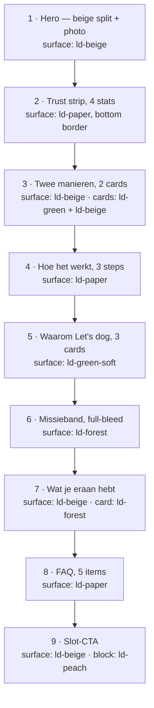

# Partners Page and Nav Swap - Plan

## Goal Capsule

- **Objective:** Ship `/partners/` — a nine-section marketing page built from the supplied mockup, rendered in the site's current component and token style — and swap the top-nav FAQ slot for Partners.
- **Authority hierarchy:** The mockup owns the copy (verbatim, per R2). This plan owns the technical approach. `CLAUDE.md` owns repo conventions and wins over both on styling and workflow. Jur owns brand, wording, legal and go-live.
- **Execution profile:** Branch + PR via `/new-feature`, verified on the Cloudflare branch preview before merge. Merge with a merge commit, not squash.
- **Stop conditions:** Stop and ask if implementation would require changing any mockup string, or if a section cannot be built without a new shared component.
- **Tail ownership:** `/new-feature` owns branch, PR, and merge. The loop task and LOG entry are closed in the werkmap (see Documentation and Operational Notes).

---

## Product Contract

### Summary

Add `/partners/` to the marketing site: a page for ambassadeurs and UGC-makers that reproduces the supplied mockup's nine sections and its Dutch copy exactly, rebuilt on the site's existing design tokens, UI primitives, and section-composition pattern. Replace FAQ with Partners in the top navbar and wire the new route into the footer, sitemap, and `llms.txt`.

### Problem Frame

Let's dog wants creators — people with an audience to share a code with, and people who film content the brand can use — to have a page to land on and a single way to make contact. Nothing on the site addresses them today; the only creator-facing artifact is a standalone HTML mockup on Jur's desktop.

The mockup was authored against the Let's dog palette, so its colours already resolve to the repo's `--ld-*` tokens. Its structure, however, is a self-contained page: it ships its own announcement bar, header nav, footer, and a flat green hero that this site retired for marketing pages when `/over-ons` and `/veelgestelde-vragen` moved to the beige split-hero. Porting it is therefore a re-composition against existing patterns, not a paste.

The top nav is full at six items. FAQ is the item that loses least by moving down: it is already linked from the footer and from the 404 page, and it is the least commercial of the six.

### Requirements

**Page content and fidelity**

- R1. `/partners/` renders the mockup's nine sections in the mockup's order: hero, trust strip, "Twee manieren", "Hoe het werkt", "Waarom Let's dog", missieband, "Wat je eraan hebt", FAQ, slot-CTA.
- R2. Every visible string is reproduced verbatim from the mockup, in Dutch, including headings, body copy, card labels, FAQ questions and answers, and button text. No rewriting, shortening, or reordering of sentences.
- R3. The page draws its colours, type scale, spacing, and radii from the repo's `--ld-*` tokens and Tailwind utilities. No CSS is copied from the mockup's stylesheet.
- R4. The hero uses the beige split-hero pattern already shipped on `/over-ons`, `/contact`, `/prijzen`, and `/rassenkeuze`, with a photograph in the image column.
- R5. The three "Waarom Let's dog" cards use Phosphor icons in their tinted tiles instead of the mockup's emoji. The tile colours (green-soft, blue, lime) and the card text are unchanged.
- R6. The mockup's announcement bar, header nav, and footer are not ported.

**Navigation and discoverability**

- R7. The desktop and mobile navbars show Partners in the slot FAQ occupied. The other five links keep their order.
- R8. `/veelgestelde-vragen/` stays reachable from the footer.
- R9. The footer's Navigatie column lists Partners.
- R10. `/partners/` is listed in `app/sitemap.ts` and in `public/llms.txt`.

**SEO and analytics**

- R11. The page exports metadata built by `pageMetadata()` with a self-referential canonical at the apex `/partners/` URL.
- R12. The five FAQ entries feed both the visible accordion and the page's FAQPage JSON-LD from one array, so the two cannot drift.
- R13. A click on the `creators@letsdog.nl` CTA emits `cta_clicked` through `trackEvent`.

### Scope Boundaries

- The `/veelgestelde-vragen/` page, its data, and its JSON-LD are untouched. The five partner questions live on `/partners/` only.
- `app/not-found.tsx` keeps its current quick-links list. It is a "where did you mean to go" list of primary destinations that already diverges from the navbar; Partners is not one, and removing FAQ from the navbar does not make the 404's FAQ link wrong.
- No new shared component is extracted. The beige split-hero stays inline per KTD2.
- No copy, pricing, or legal change. Anything the mockup asserts commercially is Jur's call, reproduced as given.

#### Deferred to Follow-Up Work

- Migrating `/partners/` to brand-guide v2. The v2 site migration (loop task T-1) is approved but not started, so this page is built in the current style and joins that migration's surface area. See Risks and Dependencies.

### Open Questions

- Is `creators@letsdog.nl` a live, monitored mailbox? Every CTA on the page funnels there and there is no form fallback. **Deferred** — the page ships either way, but the funnel is dead until the mailbox exists.
- Is `public/images/community.jpeg` the right hero photograph? It is currently unused and already has committed AVIF/WebP variants, so swapping to another existing photo is free. **Deferred** — Jur's call; any existing photo works without a build step, a brand-new photo needs `npm run optimize:images` and its variants committed.

---

## Planning Contract

### Key Technical Decisions

- KTD1. **Route `/partners/`, nav label "Partners", title "Partners — Let's dog".** (session-settled: user-directed — chosen over `/samenwerken/`: URL, nav label and title agree, at the cost of a mismatch with the page's own body copy, which keeps saying "Samenwerken" because R2 fixes the wording.) Governs R7, R11.
- KTD2. **The hero is a beige split hero, copied inline rather than extracted.** (session-settled: user-directed — chosen over the mockup's flat green band: the green band was retired for marketing pages and now survives only on legal pages and the 404.) The four existing copies were deliberately left un-abstracted because they diverge (pills vs. badges vs. a category card; CTA vs. anchor vs. modal trigger) — see KTD8 in `docs/plans/2026-06-01-001-feat-brand-guide-v2-site-migration-plan.md`. Mirror `app/over-ons/page.tsx`, `app/contact/contact-content.tsx`, or `app/rassenkeuze/page.tsx`, not `app/prijzen/page.tsx`, whose hero uses raw hex instead of tokens. Governs R4.
- KTD3. **The mockup's announcement bar, header nav, and footer are dropped.** (session-settled: user-directed — chosen over a page-local announcement bar: no other page has one, and its three lines repeat the hero eyebrow and the trust strip directly below it.) Governs R6.
- KTD4. **Phosphor icons replace the benefit-card emoji.** (session-settled: user-directed — chosen over keeping the emoji: they would be the only emoji on the site and render differently per OS.) Import from `@phosphor-icons/react/dist/ssr`, never the default entry. Governs R5.
- KTD5. **One component file per section under `components/sections/partners/`, assembled by a thin `app/partners/page.tsx`.** This mirrors `components/sections/puppyagenda/`, the repo's precedent for a multi-section page, and keeps each section reviewable on its own. The single-file page style used by `/over-ons` does not scale to nine sections.
- KTD6. **Section surfaces are plain token-styled `div`s wherever the design needs padding or radius other than the design system's defaults; `Card` is used only where the defaults fit.** `.ld-*` CSS is imported unlayered, so a Tailwind padding or radius utility on a `Card` silently loses the cascade — see `docs/solutions/developer-experience/tailwind-utilities-vs-unlayered-ds-classes.md`. `.ld-card` fixes padding at 24px and radius at 20px; the mockup's "Twee manieren" cards, step cards, missieband, and terms card all want more. The benefit cards match the defaults and can use `Card`. Governs R3.
- KTD7. **The page uses the `max-w-7xl` container width throughout, not the `Container` primitive.** Two widths coexist in the repo — `max-w-7xl` on the four hero pages, `--ld-container` at 1200px in the newer sections. The hero must be `max-w-7xl` to match its inline template (KTD2), so the rest of the page follows it rather than mixing both on one page.
- KTD8. **The five FAQ entries live in one exported array that feeds both the accordion and `faqPageLd()`.** Mirrors `app/veelgestelde-vragen/faq-data.ts`, whose header comment records why: Google penalises FAQ structured data that does not mirror the visible text. Governs R12.
- KTD9. **`/partners/` gets its own FAQPage JSON-LD.** `faqPageLd()` in `lib/structured-data.ts` already takes a generic category shape, so this costs one call. Counter-precedent: `/prijzen` has an accordion and no FAQPage markup, so there is no blanket rule — this is a judgement that the partner questions are genuinely FAQ-shaped and worth exposing to crawlers and LLM readers. Governs R12.
- KTD10. **The mailto CTA is tracked by adding a `mailto:` branch to the shared `components/analytics/cta-tracker.tsx`, not by a client island on the page.** The tracker resolves `new URL(anchor.href)` and reads `url.hostname`; a `mailto:` URL has an empty hostname under the WHATWG parser, so it falls through untracked today. A branch there keeps `/partners/` a pure server component and reuses the single dual-fire chokepoint. Two consequences to accept: `link_destination` gains the value `"email"` (a new value on a registered GA4 custom dimension, not a rename), and the existing untracked mailto on `/contact` starts emitting the same event. Governs R13.
- KTD11. **The page is a server component end to end.** `Accordion` carries its own `"use client"` boundary, so rendering it does not force one on the page — `app/veelgestelde-vragen/faq-content.tsx` proves this. KTD10 removes the only other reason a client boundary would have been needed.
- KTD12. **Mockup weights of 600 map to 500 or 700; mockup pixel values are re-derived, not copied.** National2 has no 600 face. The root font-size is 85% below 1440px and 100% above, so a literal pixel value from the mockup renders about 15% small on most laptops. Both rules are in `CLAUDE.md`; the risk is specifically that a ported mockup reintroduces them. Governs R3.

### High-Level Technical Design

The page is a flat composition. The one thing prose carries poorly is the background rhythm — the mockup's own alternation survives the hero swap intact, so it is pinned here rather than re-derived per section during implementation.

Two notes the sequence does not show. The missieband is the only full-bleed section; every other section sits in the `max-w-7xl` container per KTD7. Section 9's peach block is the site's first use of `--ld-peach` as a surface rather than an accent — follow the ink-on-peach rule that `.ld-btn--peach` and `.ld-chip--peach` already encode and keep body text dark, never white.

### Sequencing

Units run in order. U1 establishes a building route so each later section unit has somewhere to land. U7 comes last because pointing the navbar at `/partners/` before the page exists would ship a broken link on any intermediate commit.

---

## Implementation Units

### U1. Route scaffold and metadata

- **Goal:** `/partners/` exists, builds, and carries correct metadata, with no sections yet.
- **Requirements:** R11
- **Dependencies:** none
- **Files:** `app/partners/page.tsx`
- **Approach:** A server component exporting `metadata` from `pageMetadata({ title, description, path: "/partners/" })` and returning an empty fragment. The description is new copy for search results, not mockup copy — R2 governs visible page text, and metadata is not visible page text.
- **Patterns to follow:** `app/over-ons/page.tsx` metadata block.
- **Test expectation:** none — a metadata-only scaffold with no behaviour. Covered by the build check.
- **Verification:** `npm run build` succeeds and emits `out/partners/index.html`; its `<link rel="canonical">` is the apex `/partners/` URL with a trailing slash.

### U2. Hero and trust strip

- **Goal:** Sections 1 and 2 render.
- **Requirements:** R1, R2, R3, R4, R12 (weights)
- **Dependencies:** U1
- **Files:** `components/sections/partners/hero.tsx`, `components/sections/partners/trust-strip.tsx`, `app/partners/page.tsx`
- **Approach:**
  1. Copy the beige split-hero skeleton from `app/over-ons/page.tsx` and carry its `{/* Hero — beige split (kept inline per KTD8) */}` marker comment, which is how this repo signals the pattern.
  2. Text column takes the mockup's eyebrow, H1, and lead paragraph; the two hero CTAs are `Button` with `variant="peach"` and a secondary variant, both `asChild` around a single anchor child.
  3. Image column renders `OptimizedImage` with `src="/images/community.jpeg"`, `priority`, and `preload` — it is the LCP image.
  4. Trust strip is four items on a white surface with a bottom border, each a bold stat over a muted label.
- **Patterns to follow:** `app/over-ons/page.tsx` hero; `components/sections/trust.tsx` for the stat treatment.
- **Test expectation:** none — presentational markup with no logic. The repo has no component-test harness; fidelity is proven visually on the preview.
- **Verification:** Hero copy matches the mockup character for character. The image column renders at both a narrow and a ≥1440px viewport without the text column collapsing.

### U3. Twee manieren and Hoe het werkt

- **Goal:** Sections 3 and 4 render.
- **Requirements:** R1, R2, R3
- **Dependencies:** U1
- **Files:** `components/sections/partners/ways.tsx`, `components/sections/partners/steps.tsx`, `app/partners/page.tsx`
- **Approach:** Both sections are two- and three-column grids collapsing to one column below the `md` breakpoint. Per KTD6 the two "Twee manieren" cards and the three step cards are plain token-styled `div`s — they want 28px radius and roomier padding than `.ld-card` allows, and a Tailwind override would silently no-op. The Ambassadeur card is a green surface with white text and a peach tag; the UGC card is beige with the default border and a peach tag. Step numerals sit in a round green-soft tile.
- **Patterns to follow:** `components/sections/puppyagenda/steps.tsx` for the numbered-step shape; `Badge` with `tone="peach"` for the two tags.
- **Test expectation:** none — presentational markup with no logic.
- **Verification:** Both grids collapse cleanly on mobile. The green card's text passes visual contrast; the peach tags keep dark ink.

### U4. Waarom Let's dog and missieband

- **Goal:** Sections 5 and 6 render.
- **Requirements:** R1, R2, R3, R5
- **Dependencies:** U1
- **Files:** `components/sections/partners/benefits.tsx`, `components/sections/partners/mission-band.tsx`, `app/partners/page.tsx`
- **Approach:** Three benefit cards on a green-soft band, each a `Card` (its defaults match the mockup here) holding a tinted icon tile, an H4, and body copy. Pick three Phosphor icons that read as the mockup's diploma, paw, and heart, imported from the `/dist/ssr` entry per KTD4. The missieband is the page's only full-bleed section: a forest surface with a lime eyebrow, centred heading, two paragraphs at decreasing opacity, and a peach pill carrying the tagline. Per KTD6 the pill is a token-styled `span`, not `Badge` — the mockup's is larger than a chip.
- **Patterns to follow:** `app/over-ons/page.tsx` method cards for the icon-tile shape; `Eyebrow` with `tone="onGreen"` on the forest surface.
- **Test expectation:** none — presentational markup with no logic.
- **Verification:** Icons render server-side, with no hydration warning in the console. The missieband spans the full viewport width at every breakpoint.

### U5. Wat je eraan hebt, FAQ, and FAQPage JSON-LD

- **Goal:** Sections 7 and 8 render, and the five questions are exposed as structured data from the same array the accordion reads.
- **Requirements:** R1, R2, R3, R12
- **Dependencies:** U1
- **Files:** `components/sections/partners/partners-faq-data.ts`, `components/sections/partners/terms-card.tsx`, `components/sections/partners/faq.tsx`, `app/partners/page.tsx`, `lib/structured-data.test.ts`
- **Approach:**
  1. Export the five questions as one typed array shaped to what `faqPageLd()` already accepts, so no new builder is needed (KTD8, KTD9). Carry a header comment recording the visible-text sync contract, as `app/veelgestelde-vragen/faq-data.ts` does.
  2. The terms card is a forest-surfaced rounded block, centred, holding a lead paragraph and a two-column list of four rows, each a peach marker plus text. Per KTD6 it is a token-styled `div`.
  3. The FAQ section renders `Accordion` over the same array. The mockup opens its first item by default — preserve that.
  4. Mount `JsonLd` with `faqPageLd()` at the top of the page fragment, next to where `/over-ons` mounts `personLd()`.
- **Patterns to follow:** `app/veelgestelde-vragen/faq-data.ts` and `app/veelgestelde-vragen/page.tsx` for the data-plus-JSON-LD pairing.
- **Test scenarios:** (extend `lib/structured-data.test.ts`)
  - `faqPageLd()` over the partners array returns a `FAQPage` whose `mainEntity` length equals the number of entries in that array.
  - Each emitted `Question.name` and `acceptedAnswer.text` equals the corresponding `q` and `a` in the source array, so drift between markup and visible copy fails the suite.
  - An empty category array produces a `FAQPage` with an empty `mainEntity` rather than throwing.
- **Verification:** `npm test` passes. The five answers are present in `out/partners/index.html` — grep the built file rather than a preview snapshot, because Radix unmounts collapsed accordion panels and a DOM snapshot will not see them.

### U6. Slot-CTA and mailto tracking

- **Goal:** Section 9 renders, and clicking its CTA emits `cta_clicked`.
- **Requirements:** R1, R2, R3, R13
- **Dependencies:** U1
- **Files:** `components/sections/partners/closing-cta.tsx`, `lib/cta-destination.ts`, `lib/cta-destination.test.ts`, `components/analytics/cta-tracker.tsx`, `docs/analytics-events.md`, `app/partners/page.tsx`
- **Approach:**
  1. Extract the tracker's destination resolution — the host lookup, the checkout path split, the same-site pricing check — into a pure `lib/` helper taking a URL and the current hostname. This is the repo's established way to make analytics logic testable off the browser, the same move as `lib/prod-hosts.ts`.
  2. Add the `mailto:` branch in the helper, returning `"email"`. Keep the existing comment block explaining that `link_location` and `link_destination` are registered GA4 dimensions.
  3. `cta-tracker.tsx` calls the helper and is otherwise unchanged.
  4. The CTA section is a centred peach block inside a beige section, holding a heading, a paragraph, and a dark button linking to the mailto address. Dark ink on peach per the design note in High-Level Technical Design.
  5. Add the `"email"` value to the `cta_clicked` row in `docs/analytics-events.md` and note that the `/contact` mailto now emits it too.
- **Execution note:** Write the helper's tests before moving the branch logic — the extraction has to preserve four existing destinations exactly, and the tests are what prove the refactor was behaviour-preserving.
- **Patterns to follow:** `lib/prod-hosts.ts` for the pure-helper shape; `lib/embed-url.test.ts` for the test shape.
- **Test scenarios:** (`lib/cta-destination.test.ts`)
  - A URL on `app.letsdog.nl` outside `/checkout` resolves to `"app"`.
  - A URL on `app.letsdog.nl` under `/checkout` resolves to `"checkout"`, not `"app"`.
  - URLs on `keuzehulp.letsdog.nl` and `agenda.letsdog.nl` resolve to `"keuzehulp"` and `"agenda"`.
  - A same-site `/prijzen` path, a same-site `/prijzen/` path, and a same-site `#prijzen` hash each resolve to `"pricing"`.
  - A `mailto:` URL resolves to `"email"`.
  - A `mailto:` URL resolves to `"email"` even though its hostname is empty, proving the branch runs before the hostname lookup can discard it.
  - An untracked same-site path, an unrelated external host, and a `tel:` URL each resolve to undefined, so the tracker stays silent.
- **Verification:** `npm test` passes. On the preview, clicking the CTA emits one `cta_clicked` with `link_destination: "email"` in the PostHog debug view, and opens the mail client.

### U7. Site wiring

- **Goal:** The route is reachable and discoverable.
- **Requirements:** R7, R8, R9, R10
- **Dependencies:** U1–U6 (all page content merged, so no commit points the nav at a partial page)
- **Files:** `components/layout/navbar.tsx`, `components/layout/footer.tsx`, `app/sitemap.ts`, `public/llms.txt`, `CLAUDE.md`
- **Approach:** Replace the FAQ entry in the navbar's `links` array with Partners, in place, so the remaining order is unchanged; the array drives both the desktop list and the mobile menu, so one edit covers both. Add Partners to the footer's separate `navLinks` array and leave FAQ there. Add the route to `ROUTES` in `app/sitemap.ts` and a matching line under `## Pagina's` in `public/llms.txt`, following the existing label-link-description shape. Update the Navigation Order block in `CLAUDE.md` so the documented order stops contradicting the code.
- **Patterns to follow:** The trigger row for a new route in `docs/website-spec-maintenance.md`.
- **Test expectation:** none — data-array edits with no logic. Covered by the sitemap verification below.
- **Verification:** `out/sitemap.xml` contains the `/partners/` entry. The navbar shows six items with Partners where FAQ was, on desktop and in the mobile menu. The footer lists both Partners and FAQ.

---

## Verification Contract

| Gate | Command or check | Applies to |
|---|---|---|
| Build | `npm run build` green; `out/partners/index.html` emitted | U1–U7 |
| Unit tests | `npm test` green | U5, U6 |
| Structured data | `faqPageLd()` output present in `out/partners/index.html` and mirroring the visible Q&A | U5 |
| Sitemap | `/partners/` present in `out/sitemap.xml` | U7 |
| Canonical | `out/partners/index.html` canonical is the apex URL with trailing slash | U1 |
| Copy fidelity | Every mockup string diffed against the rendered page; zero deviations | U2–U6 |
| Responsive | Page checked at a narrow viewport, a mid viewport, and ≥1440px — the root font-size changes at 1440px, so one width is not enough | U2–U6 |
| Analytics | `cta_clicked` with `link_destination: "email"` observed once per CTA click on the preview | U6 |
| Preview | All of the above re-checked on `<branch-slug>.website-letsdog.pages.dev` before merge | all |

Two verification traps in this repo: read FAQ answers and JSON-LD out of the built `out/` HTML rather than a preview DOM snapshot, because Radix unmounts collapsed accordion panels; and re-read any computed style after its CSS transition settles, because the headless preview throttles transitions and can report a mid-transition value.

---

## Definition of Done

- All nine sections render at `/partners/`, in mockup order, with every string matching the mockup exactly.
- The navbar shows Partners in place of FAQ on desktop and mobile; FAQ is still reachable from the footer.
- `/partners/` is in the sitemap and in `llms.txt`; the page carries a self-referential canonical and FAQPage JSON-LD.
- Clicking the creators CTA emits one `cta_clicked` with `link_destination: "email"`.
- `npm run build` and `npm test` are green, and every gate in the Verification Contract passed on the Cloudflare branch preview.
- `docs/analytics-events.md` and the Navigation Order block in `CLAUDE.md` reflect the change.
- No scaffolding, placeholder copy, or abandoned section variants remain in the diff.

---

## Risks and Dependencies

- **Brand-guide v2 migration (loop task T-1).** The v2 site migration is approved but unstarted. This page is built in the current style and therefore adds a ninth surface to migrate later. Building it v2-first was rejected: v2 has no shipped surface on this site yet, so the page would have no pattern to copy and would become the migration's pilot by accident.
- **`creators@letsdog.nl` may not exist.** The page has no form fallback, so if the mailbox is not live the entire funnel is dead on arrival. Tracked as an Open Question; confirm before the page is linked from the navbar.
- **Extending `cta-tracker.tsx` changes behaviour on `/contact`.** Its existing mailto starts emitting `cta_clicked`. This is a small, arguably-correct increase in coverage, but it is a change to a shared file and should be named in the PR description rather than discovered in the analytics later.
- **Peach as a surface is new.** `--ld-peach` has only ever been used for small accents, badges, and buttons on this site. A full peach block is untested territory for contrast; the mitigation is the existing ink-on-peach rule from the button and chip styles.

---

## Documentation and Operational Notes

- **Loop bookkeeping (werkmap, not this repo).** This work has no loop task yet. Mint one with `bash scripts/loop/new.sh t "<titel>"` from the werkmap root — never invent a T-number, the script mints under a lock. Close the session with `bash scripts/loop/close.sh "<sessienaam>"` plus a LOG.md entry carrying the `loop-close: OK` line. Loop commits go to the loop repo and never trigger a Pages build.
- **`docs/analytics-events.md`** gains the `"email"` value on the `cta_clicked` row in U6. The spec-maintenance matrix does not cover analytics, but that document's own framing requires it whenever an event or dimension value is added.
- **`docs/website-spec-maintenance.md`** already carries the new-route row this plan follows. Nothing in that file needs editing.
- **`CLAUDE.md`** Navigation Order block is updated in U7, alongside the code it documents.

---

## Sources and Research

- Mockup: `~/Desktop/samenwerken-mockup.html` (outside the repo; the source of every string this page renders).
- Beige split-hero rationale — KTD8 in `docs/plans/2026-06-01-001-feat-brand-guide-v2-site-migration-plan.md`, reconfirmed in `docs/plans/2026-05-31-003-feat-over-ons-faq-redesign-plan.md`.
- Unlayered `.ld-*` CSS beating Tailwind utilities — `docs/solutions/developer-experience/tailwind-utilities-vs-unlayered-ds-classes.md`. The concrete constraint behind KTD6.
- `Button asChild` requires exactly one child — `docs/solutions/integration-issues/design-system-into-nextjs-static-export.md`. A ported mockup's CTA markup is the classic way to trip this.
- Route changes fan out to hand-maintained mirrors — `docs/solutions/conventions/pricing-tier-change-fans-out-to-multiple-surfaces.md`. Nothing enforces sitemap and `llms.txt` at build time.
- Verification traps — `docs/solutions/developer-experience/preview-throttles-css-transitions.md` and the accordion-unmount note in the fan-out doc above.
- `--ld-peach` surface audit: a repo-wide search found the token used only for accents, badges, and buttons; no section or band has ever been filled with it.
- `public/images/optimized/` already contains `community-{384,512,768,1280}.{avif,webp}`, so the proposed hero photo needs no `optimize:images` run.
